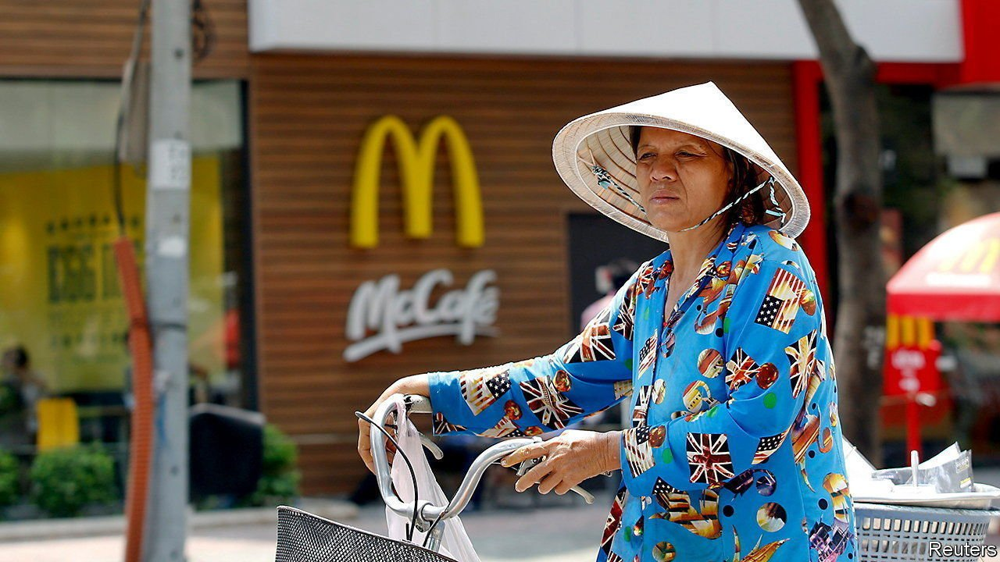

###### The Big Mac index

# What the Big Mac index says about the dollar and the dong 

##### We look at happy meals in unhappy places 

 

> Jul 24th 2021 

WHEN The Economist introduced its  35 years ago, the ubiquitous McDonald’s hamburger cost just $1.60 in America. Now it costs $5.65, according to an average of prices in four cities. The increase comfortably outstrips inflation over the same period.

Indeed, the Big Mac’s birthplace is one of the priciest places to buy it, according to our comparison of over 70 countries around the world (see chart). In Vietnam, for example, the burger costs 69,000 dong. Although that sounds like an awful lot, you can get a lot of dong for your dollar and, therefore, a lot of bang for your buck in Vietnam. You can buy 69,000 dong for only $3 on the foreign-exchange market. And so a Big Mac in Vietnam works out to be 47% cheaper than in America.

 


Good to know. But the index was intended not as a shopper’s guide to burgers but as a tongue-in-cheek guide to currencies. In principle, the value of a currency should reflect its power to buy things, according to the doctrine of “purchasing-power parity”, a term coined by Gustav Cassel, a Swedish economist, in 1918. Since 69,000 dong and $5.65 have the same power to buy a burger, they should be worth the same amount. The fact that you can buy a burger’s worth of dong for 47% less than a burger’s worth of dollars suggests the dong is undervalued.


America’s Treasury certainly thinks so. Twice a year it reports to Congress on countries that might be keeping their currencies artificially cheap to boost exports and steal a competitive edge. In April it confirmed that Vietnam was one of a trio of trading partners, alongside Switzerland and Taiwan, pursuing “potentially unfair” currency practices, based on three tests of its devising. (Vietnam has a “significant” trade surplus with America, a “material” external surplus with the world, and its central bank buys a lot of dollars and other foreign currencies.) In recent months, America’s Treasury has been browbeating Vietnam to mend its ways, a process known as “enhanced engagement”.

On July 19th the two sides reached a deal. Vietnam’s central bank promised not to indulge in competitive devaluation. It also said it would gradually let the currency fluctuate more freely and it would be more open about its interventions in the currency markets. With luck this will avert harmful tariffs or any similar enhancements of the two countries’ engagement.

Lest the Big Mac index contribute to Vietnam’s difficulties, it is worth pointing out that it is common for poor countries to seem cheap relative to rich ones in any simple comparison of prices. Vietnam is not an outlier in this regard. The price of a burger is about what you would expect given the country’s GDP per person. (Taiwan, another country on the Treasury’s naughty step, is a different case. It remains surprisingly cheap, given how prosperous it has become. And Switzerland seems expensive by any measure.)

The cheapest burger we could find is in Lebanon. Although the price of a Big Mac has increased spectacularly to 37,000 Lebanese pounds, the currency has collapsed even more dramatically on the black market, where 22,000 pounds buy a dollar.

As a consequence, the Big Mac costs the equivalent of only $1.68. One reason the burger has remained so cheap may be that Lebanese importers can purchase some of the Big Mac’s ingredients at a more favourable, subsidised exchange rate. They can buy a dollar’s worth of wheat, for example, for 1,500 pounds and other foodstuffs, including cheese, at a rate of 3,900. Lebanon’s currency chaos is both a reflection of its economic disaster and a contributor to it. Even at an artificially low price, a Big Mac is small consolation. ■

