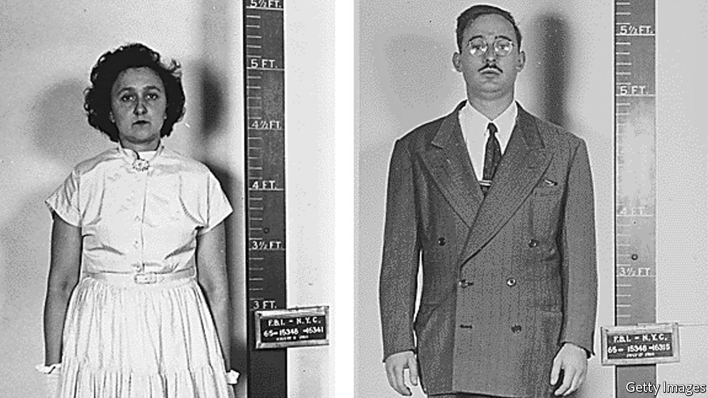

###### On lockdowns, Ethel Rosenberg, public relations, economics, seaweed, translating, space flight

# Letters to the editor 

##### A selection of correspondence 

 

> Jul 24th 2021 

Letters are welcome via e-mail to 

No more lockdowns

I am dismayed that people who oppose lockdown measures have been consistently portrayed as crackpots motivated by conspiracy theories (“”, July 3rd). Each week your pages are filled with evidence of the disastrous impacts of lockdowns and the economic crises that they have created: from extreme poverty, to the strengthening of dictators, to the widening waistlines of a quarter of the population (“”, July 3rd).


Many of us have watched our children disconnect from school, activities and friends. They gained weight like the rest of us, putting them at risk of health problems. They lost interest in sports and other budding interests. More importantly, they lost faith in the future and the worth of investing effort in things that will be perpetually cancelled.

I have gone to anti-lockdown protests and I don't think I am a crackpot. Sure, there are some vocal people from the fringes at these demonstrations, but I and many others have never been tempted by conspiracy theories. We are just normal people who are very concerned about the many negative impacts of stopping people from living a regular life.

ANDREW LEWIS

Paris

You say that the pandemic has been a catastrophe for schoolchildren. Would it not be more accurate to say that humanity’s reaction to covid-19 has been a catastrophe for schoolchildren? The disease itself has largely passed them by.

SEAN MOORHOUSE

Geneva

 


More evidence for the defence

Your review of Anne Sebba’s new book mentioned that much has been written on the execution of Julius and Ethel Rosenberg for spying for the Soviet Union (“”, June 26th). Ms Sebba refers to E.L. Doctorow’s novel “The Book of Daniel”. Published in 1971 and hitherto somewhat forgotten, the book’s narrator reflects on the execution of his parents, sentenced to death for spying for the Soviets. Their last name is Isaacson, but the reference to the Rosenberg situation is obvious.

Daniel looks for the answers a son is bound to look for when he understands that his mother has put her principles above her motherhood, thus making him an orphan. Doctorow tentatively put forward the same view found in Ms Sebba’s work, that Julius was a spy, but Ethel’s role was more ambiguous. This was confirmed in 1995 by the release of decrypted messages from the Venona counter-intelligence programme. For a book written in 1971, it was an uncanny foresight.

JUR SCHUURMAN

Brussels

 


Ethical PR

Bartleby, while limiting a view of public relations to the minor activity of press relations, describes in-house PR managers as falling into three types: the noisy interventionist, the overly discreet and the rather useful (). As with all managers there will be some who are better than others. The aim for employing an in-house PR manager is to build interests and relationships between the organisation and the public. How you do this in a world imperilled with disinformation is important. As outlined in our 60-year-old code of conduct and definition of PR, that means through “trusted and ethical communication”. Perhaps the fourth type of in-house PR manager is the eminently trusted.

PHILIP SHEPPARD

Secretary-general

International Public Relations Association

London

PR people are soft targets and Bartleby neatly skewered them. Yet I couldn’t help but reflect on a quote often attributed to Bill Gates: “If I was down to my last dollar, I would spend it on PR.” I don’t suppose he ever was, but if that reflected his approach things didn’t turn out too badly.

SIMON TIMM

London

 


An evolving discipline

You are to be thanked for vindicating the careers of evolutionary and institutional economists who have spent their lives seeking to explain real-world behaviour and economic outcomes (, June 26th). Some examples of that insightful literature include the notion that fluctuations in share prices are the result of speculative instincts rather than fundamental investing; higher education is more about selling a curriculum by captains of erudition rather than intellectual development; and elections are determined by the “common man”, who votes for governments that support the interests of big business.

J. PATRICK RAINES

Professor of economics emeritus

Belmont University

Nashville

The column’s brief reference to Milton Friedman did him an injustice. For there is, in his “The Methodology of Positive Economics”, an evolutionary argument about leaves on a tree, presented in defence of the “as if” approach that you mentioned and the idea of profit maximisation. Evolutionary approaches in economics are indeed suggestive. But the general direction in which they might lead us is less than clear-cut.

JEREMY SHEARMUR

Dumfries

 


Marine riches

Farming seaweed is far from being a young business (“”, June 26th). C.P. Kelco started in 1929 in San Diego, where 25,000 tons of giant kelp forest were harvested a year close to shore. Processing plants for this valuable industrial and food resource range from Brazil to the Philippines, from Denmark to China. The business faces many challenges, however, as witnessed off Tasmania’s coast, including warmer waters and pollution run-off that are compounding the natural threat cycles from sea urchins. The concept of sustainable farming, much less profitability, must be addressed by anyone interested in harvesting this “new” ocean bounty.

TIM FORESMAN

Former chief scientist of the UN Environment Programme

Elkridge, Maryland

 


Converting language

I read Johnson’s column on the travails of being a translator (). I have been an interpreter (simultaneous, consecutive and whispering) for 60 years, and I can recall one occasion when I was given my due. At a meeting where an Israeli rabbi and the mufti of Rabat addressed an audience I was asked to interpret into French and English. Although this proved difficult, it went well. The rabbi thanked me in Hebrew, adding that surely I had had no problem being a Jew myself. Then the mufti approached me, assuring me that he thoroughly appreciated my co-operation, but was not really surprised since evidently I was a Muslim. Utopia?

ANNELIES GLANDER

Vienna

 


To boldly go

When I was a boy my heroes included Neil Armstrong, John Glenn and Alan Shepard. My grandson has to make do with Jeff Bezos, Richard Branson and Elon Musk (“”, July 19th). Apparently the right stuff has been replaced with the rich stuff.

HENRY GRANGER

Spring Lake, Michigan

