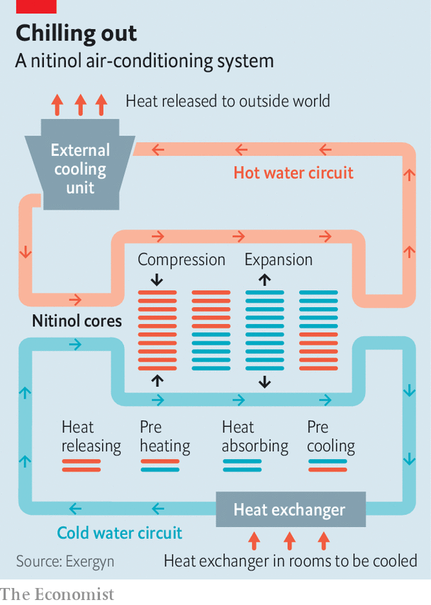

###### Cool ideas

# A new, green air-conditioning system manages without nasty gases 

##### And has few moving parts at its core 

 

> Jul 21st 2021 

IN A WARMING world it helps to stay cool. But doing so also . Most air conditioners use refrigerant gases called hydrofluorocarbons (HFCs). Though these do not deplete Earth’s ozone layer in the way the chlorofluorocarbons they replaced back in the mid-1990s did, they are hundreds of times more effective at trapping heat in the atmosphere than carbon dioxide is. Less-potent greenhouse gases are now being phased in as refrigerants, but these are not without problems of their own. They can be expensive, and some are inflammable.

Researchers have long sought ways to produce cooling systems that do without these troublesome gases, but none has come close to being a direct replacement. A small Irish company, however, now claims to have come up with an answer. Exergyn, based in Dublin, has developed a new type of air conditioning which not only avoids HFCs, but also has the benefit of having few moving parts at its core.


Exergyn has been working secretly on the project for two years, in collaboration with a multinational company which it is not at liberty to name (though its partner is understood to be Carrier, a giant American manufacturer of heating and cooling equipment). The two firms are currently testing a 60kW version, which would have the capacity to cool 15-20 apartments. Exergyn has also begun talks with carmakers and aerospace companies about setting up similar joint-development projects. With cars, and some small aircraft, going electric, it is not just cooling the cabin that manufacturers are having to think about, but also cooling the batteries.

Squeeze me

Exergyn’s system uses a substance called a shape-memory alloy. SMAs, as they are known for short, are a group of materials with the unusual ability to return to a predetermined shape when heated. They are sometimes employed to make spectacle frames, and also in medical implants such as stents. Nitinol, the SMA chosen by Exergyn, is a blend of nickel and titanium.

All SMAs release heat when deformed by compression, and then absorb it when the pressure is released and they return to their original shape. But Exergyn’s version of nitinol displays this property to a remarkable degree. For its prototype, the company produced 4cm-square plates of the alloy, each pierced by holes intended to permit the passage of a heat-carrying liquid or gaseous medium. A range of benign substances can be employed in that role. The firm’s engineers have tested water, brine, glycol and air, all with success.

To build a refrigerator involves assembling these plates into stacks of 50 or more. Four stacks make a unit. The stacks are compressed in turn by hydraulic rams or electric actuators, in a sequence that works a bit like a four-stroke engine, explains Kevin O’Toole, Exergyn’s managing director. At any given moment, one stack is being compressed, one released, one preheated and one pre-cooled.

 


To cool a room involves passing two circuits of the heat-carrying fluid through this four-stack unit. Fluid in a “cold” circuit first travels through a heat exchanger in the room to be cooled down, absorbing warmth as it does so (see diagram). It is then directed by a series of valves and pumps into whichever core is undergoing its relaxation stroke. The relaxing nitinol absorbs the heat burden and the fluid is pumped back to the heat exchanger for the cycle to be repeated.

Heat thus accumulated is removed by the passage through the stack of fluid from the second, “hot”, circuit during the compression stroke. It is then dumped to the outside world via an external cooling unit. Using four stacks permits both the hot and the cold circuits to run continuously.

Tony Ennis, Exergyn’s chairman, reckons this method of cooling is not only more environmentally friendly than an HFC set-up, but will also be less expensive to buy and 30-40% cheaper to run. It will be lighter and smaller, too—an important requirement, not least because air-conditioning units often have to go up lift shafts to be installed. As for reliability, he says the prototype’s performance suggests the unit at its core could operate for more than 40 years without a problem.

When Dr O’Toole, an expert in memory materials, co-founded Exergyn in 2012, his intention was to use nitinol to create a system that would generate electricity from low-grade waste heat. But the challenges presented by HFCs persuaded him that air conditioning would be a quicker way to bring the technology to market. Development is still continuing, but products may be only a few years away.

His thoughts of a generator have not diminished, though. Nor has interest in other products that could use the technology. These include refrigerators, and also heat pumps to extract warmth from the ground for domestic heating. When time allows, Dr O’Toole and his colleagues hope to get to work on those ideas, too. ■

