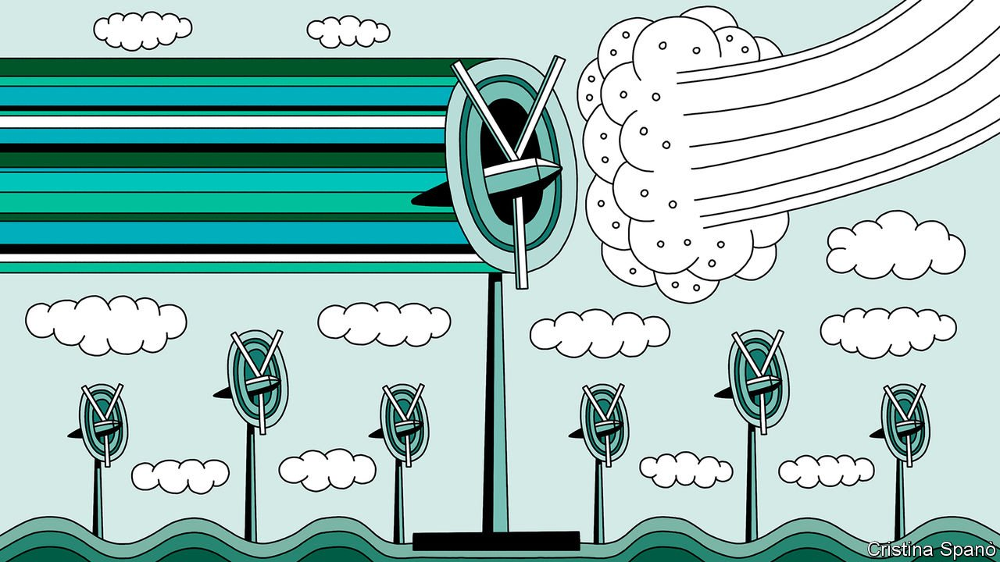
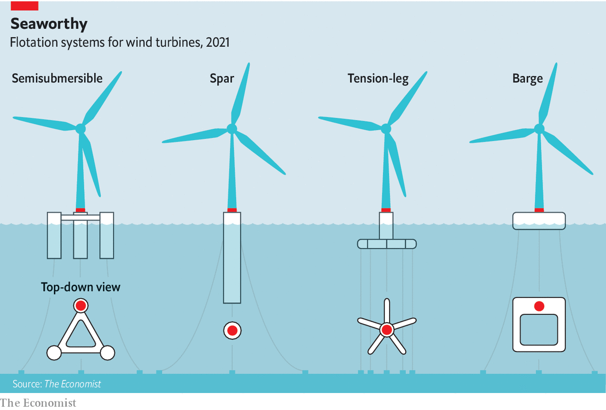

###### Renewable energy

# Floating wind turbines could rise to great heights 

##### But the taller they get, the harder they will be to repair 

 

> Jul 21st 2021 

ON JULY 16TH Royal Dutch Shell, an oil and gas company, and Scottish Power, a subsidiary of Iberdrola, a Spanish electricity utility, made an announcement. They were, they said, jointly submitting proposals to the British authorities to build, off the coast of Scotland, the first large-scale set of floating wind farms in the world. At the moment, the largest floating farm is a six-turbine, 50MW array which is due for completion next month in the North Sea, 15km from Aberdeen. The consortium, by contrast, has said it is thinking in gigawatts (GW).

Offshore wind farms with foundations in the seabed are now part of the energy mix in several places. In the past four years their capacity has nearly doubled, from 19GW to 35GW, and amortised costs have dropped by a third, from $120 per MW-hour to $80. They are, however, of limited deployability, being restricted to waters shallower than about 60 metres.


Unfortunately, 80% of the world’s offshore wind blows over places deeper than that. Making these accessible, says the International Energy Agency, an offshoot of the OECD, would unlock enough power to meet the world’s probable electrical needs in 2040 11 times over. The trick is to build turbines which, though moored to the seabed, will float. If Shell and Scottish Power can pull this trick off, it will be a big step towards tapping that potential.

Blowing in the wind

A decade ago, floating-turbine technology was a fringe affair. The difficulty was not the turbines themselves, but making them float. The oil and gas industry had, since the 1960s, developed a range of floating foundations that could keep titanic objects like drilling rigs stable at sea. But transferring that know-how to wind power was hardly straightforward. First, unlike an oil rig, a wind turbine is lanky and top-heavy, making it prone to tip over. Second, turbines generate powerful gyroscopic forces that would further destabilise a floating machine. It was hard, in those days, to see how these problems could be solved cheaply enough to compete with turbines bolted to the ocean floor—much less with conventional power sources.

No longer. A decade of development has yielded two things: proof that turbines can float and clarity as to how these floating units might look. Engineers achieved this through patient prototyping. They took designs previously tested in university wave pools and scaled them up into small demonstration units off the coasts of Norway, Portugal and Japan.

Each unit, bedecked with sensors, gathered data on variables such as pitch, wind speed and wave height. These data were then folded into designs, for bigger, more stable units. The results, visible today in newer models off the Norwegian and Portuguese coasts, can safely float turbines four times as powerful as their predecessors. Engineers therefore consider the flotation problem solved. “The turbines function nicely. They don’t flip. It can be done,” said Alla Weinstein, a pioneer of the field who is now pursuing permits for a floating wind farm off the coast of California.

Four approaches to flotation have emerged (see diagram). The commonest is a semisubmersible. Principle Power, an American company, is one firm pursuing this. Semisubmersibles come in various designs. Principle’s uses a buoyant steel triangle that has water-filled cans at two of the vertices. These ballast tanks balance the weight of a turbine at the third vertex, with water pumped around inside the triangle to trim its stability.

 


A second tack, pursued by, among others, Equinor, a Norwegian firm, is to stick a turbine on a bottle called a spar that is filled with heavy ballast, to make it float upright. Equinor does this by placing the turbine on top of an 80-metre-high concrete tube containing water, rocks or some other cheap and heavy material.

Two other approaches are less developed, but may prove useful. Glosten, an American engineering firm that has formed a partnership with General Electric, uses a tension-leg platform. This is a starfish-shaped steel structure with a turbine at its hub. The starfish is submerged and yoked to the ocean floor with cables. This arrangement, similar to that for the ultra-deep-water Magnolia rig, drilling in the Gulf of Mexico, holds the turbine upright. And BW Ideol, a Norwegian firm, erects the turbine on a flat concrete or steel barge that resembles an empty picture frame. When the turbine sways, water sloshes within the frame, dampening its movement. The company claims its prototype, off the coast of Japan, has already survived three typhoons.

Just do it

Project developers have seen enough to convince them. Though the Shell-Scottish Power consortium’s proposals (which make no mention of a preferred technological approach) are the most ambitious so far, they are not the first. Besides the 50MW array off Aberdeen, which is owned by Grupo Cobra, a Spanish construction company that uses Principle’s design, Equinor has begun construction on an 11-unit, 88MW project which will power a group of North Sea drilling platforms. Total, a French oil and gas company, and Green Investment Group, a project-development arm of Macquarie, a bank, intend to start work on a 500MW floating wind project off the coast of South Korea by 2023—though they, too, have not yet specified which technology they plan to use.

Bigger farms obviously require more turbines. But they also, ideally, require bigger turbines. And the bigger a turbine is, the harder it is to maintain. Wind turbines occasionally need big parts, like blades or generators, replaced. That is challenging on terra firma. But on land, a crane can brace itself against the earth. At sea, “jackup” vessels achieve similar stability by dropping steel legs to the seabed. Floating turbines will, however, operate in waters too deep for jackup vessels to work, so any vessel servicing one will have, itself, to remain floating. “You have two structures that are moving, and you’re going to shift the load from one of these moving structures to another one,” said Olav-Bernt Haga, a project director at Equinor. This will be technically demanding and thus hard to do cheaply.

A group called the Floating Wind Joint Industry Project (FWJIP), the job of which is to flag up matters of collective interest, deems this an urgent problem. This group is made up of 17 project developers and the Carbon Trust, a not-for-profit consultancy based in Britain. In an analysis published last year the FWJIP said that wind turbines are nearing the physical limits of what can be handled at sea. The oil industry has a number of heavy-lift ships that work in deep water. But these are optimised for weight, not height, and are expensive to hire. The floating-wind industry needs new answers, or it could find itself stunted, both literally and metaphorically.

Fortunately, prospects are in development. They take two broad approaches to the problem: lifting and climbing. An example of the former is OWL Heavy Lift, a Dutch company, which has started work on the OWL-010, a vessel dedicated to offshore-wind maintenance. Anyone working on floating wind turbines must contend with waves. A gentle swell at the surface can cause a treacherous sweep up high. The OWL-010 will iron out the effect of this swaying by using motion-compensation software that steadies the position of the crane’s hook to within 5cm. This works even when that hook is 150 metres above sea level.

The price tags for such vessels, though, start at around $250m. The cost alone implies that the industry would have to share a small number of ships, presenting a bottleneck to growth. That is why some propose to stop reaching up to turbines, and to start climbing them, instead.

Reach for the sky

Climbing cranes, which scurry up the very object they are building, are often used to raise skyscrapers on land. They are unproven at sea, but several groups are developing versions that might suit floating wind power. SENSEWind, a firm in Cambridge, England, for example, suggests putting tracks on the sides of turbine towers. This would let a ship pull up alongside, place a maintenance car on the tracks, and thus move large parts up and down the tower.

Others propose to lift from the turbine itself. Most turbines have a small crane for light items. Liftra, a Danish company, uses this to raise progressively larger cranes. The biggest fits in a standard 40-foot (12.2 metre) shipping container. Once bolted on, the company claims, the arrangement is as powerful as a conventional external crane. Alternatively, as Conbit, a Dutch contractor, proposes, pulling a few metal parts and cables to the top of the tower would allow a heavy-duty crane to be fashioned temporarily on the turbine’s crown.

None of these technologies is beyond the prototype stage. But they may prove valuable for the mega-turbines of tomorrow, be they fixed or floating. For floating turbines, however, an alternative may exist. Unlike fixed turbines, they can be unplugged and dragged to shore. Recent analysis sponsored by the FWJIP suggests that what is best in individual circumstances may depend on location. If a floating turbine is near the shore, it may be easiest to tow it back to port for repair. If far away, exotic gadgets like the OWL-010 or climbing cranes may work better.

The upshot of all this is that it may soon be possible to extract a lot more electrical power from the wind, to do so without covering hillsides with turbines, and to make a profit while doing it. And that is enough to put wind in anyone’s sails. ■

