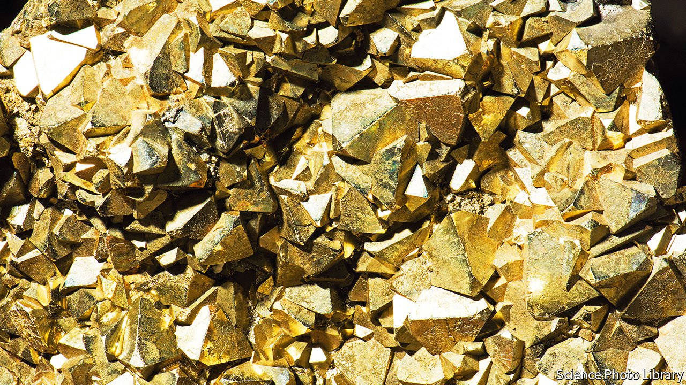

###### Mining

# Fool’s gold is a good source of the real stuff 

##### A new discovery could make it an even better one 

 

> Jul 19th 2021 

FOOL’S GOLD—pyrite, to give its proper name—may once have disappointed prospectors looking for nuggets. But modern miners have learned to love it, because inside its crystal lattice of iron and sulphur there is often actual gold to be found.

It is never much—at most a few tenths of a percent. And extracting it is hard work which involves grinding and heating the mineral, and then treating it with sodium cyanide, which is extremely toxic. But that can be worthwhile. Some 5-10% of the world’s gold production derives from pyrite. And this is likely to increase. According to estimates by McKinsey, a consultancy, 24% of the world’s gold reserves are “refractory”—meaning the gold must be yanked from the clutches of some mineral, in most cases pyrite.


To a large extent, however, this extraction process is flying blind. That is because it has never been properly established quite how the gold is lodged in the pyrite. One theory is that it forms tiny inclusions—nanonuggets, so to speak. Another is that it is integrated, atom by atom, within the crystal, thus forming a kind of iron-sulphur-gold alloy.

Nick Timms of Curtin University, in Perth, Australia, though, reckons he has found another explanation. As he and his colleagues write in Geology, they used a scanning electron microscope and an atom probe (a device which combines a field-ion microscope and a mass spectrometer) to investigate samples from a Chinese gold mine. They discovered that the gold in pyrite (along with many other “foreign” atoms, including arsenic, copper, nickel and lead) is concentrated in places known as dislocations, where the crystal, having been exposed to high pressure or high temperature at some point in its past, has got kinked.

Dr Timms suspects this concentration happens when foreign atoms, which because of their odd sizes do not fit properly into the crystal, migrate through the lattice to relieve the tensions that result when it is bent. That migration herds them towards particular places, and when there are enough of them in such a place the lattice buckles and the tension is released.

This process must be quite efficient. Aliens made up just over 1% of the metal atoms in the sample (the rest being iron). In the deformation zones they were three times as abundant.

That is useful information. Experiments with other types of crystal have shown that impurities in such deformed areas are easier to dislodge than those elsewhere in a lattice. If this is also true for pyrite, it might point the way to a more efficient way of extracting its gold—perhaps by using a harmless solvent like thiosulphate, rather than cyanide, or even employing bacteria to do the job. And only a fool would not be interested in seeing how that panned out. ■

