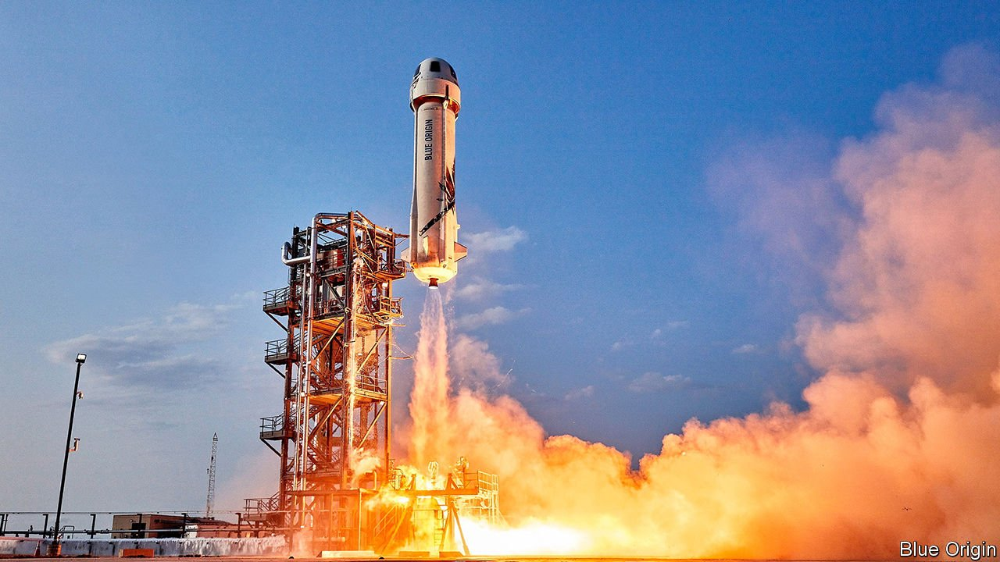
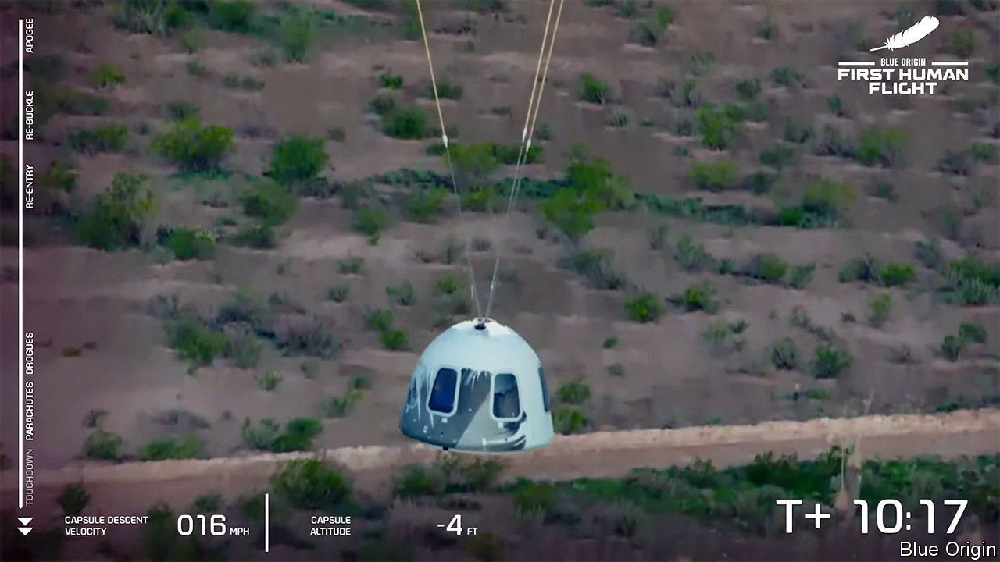

###### Billionaire astronauts

# Jeffrey Bezos goes into space 

##### He was carried there by one of Blue Origin’s New Shepard rockets 

 

> Jul 20th 2021 

A FEW MINUTES after 1pm Universal Time, on July 20th, Jeff Bezos, founder of Amazon, a successful online bookshop and parcel-delivery company, and of Blue Origin, an aspiring rocket firm, became the first billionaire in space. Or maybe not the first. It rather depends on your definition of “space”.

Mr Bezos and three companions—his brother Mark; Wally Funk, an American woman who trained as an astronaut in the 1960s on an unofficial, privately sponsored programme, but did not fly into space; and Oliver Daemen, an 18-year-old Dutch physics student, who thus unarguably became the youngest astronaut ever—blasted off in one of Blue Origin’s human-rated capsules, mounted on top of a New Shepard reusable rocket. The rocket launched the capsule on a trajectory that would culminate above an altitude of 100km. The capsule then separated and carried on into space, while the rocket returned to a landing pad 3km downrange of its launch site in Culberson county, Texas. Its jaunt complete, the capsule, too, then parachuted back to Earth.

 


The debate about who goes into the record books as “first billionaire in space” was made live on July 11th, when Sir Richard Branson, a Briton, flew to an altitude of 85km in a rocket-propelled plane built and owned by Virgin Galactic, a firm he founded. Sir Richard announced this trip after Mr Bezos had set the date for his—apparently to pre-empt him. There is nothing wrong with a bit of friendly competition, of course. But Sir Richard’s jaunt muddied the waters because many people think it was not exactly the real deal.


The lower bound of outer space is, by convention, something called the Kármán line. This is the altitude above which a craft relying on aerodynamic lift to keep itself aloft would have, because of the thinness of the air at high altitude, to travel faster to obtain that lift than the speed required to go into orbit around Earth.

The exact height of the Kármán line does, though, vary with atmospheric conditions. So again, by convention, it is usually pegged at 100km. This convention is recognised by the Fédération Aéronautique Internationale, the keeper of standards for such matters. One up to Mr Bezos.

America’s armed forces, however, lack the means to reach such heights, but still want some of their own pilots recognised as astronauts. So they claim instead that space begins at an altitude of 80km, the upper bound of an atmospheric layer called the mesosphere—and to avoid diplomatically awkward distinctions between its own astronauts and military ones, NASA, America’s aerospace agency, has conceded the point. One up to Sir Richard.

New Shepard itself is named after Alan Shepard, a NASA astronaut who was the first American to make a suborbital ballistic flight of the sort Mr Bezos has just experienced, which he did in 1961 on top of a modified Redstone intercontinental ballistic missile. And the date Mr Bezos chose for his flight was also historically redolent, being the 52nd anniversary of the landing of Apollo 11’s lunar module, which carried the first human visitors to the Moon.

Blue Origin’s next project is New Glenn, named after John Glenn, the first American to orbit Earth. As its name indicates, this will be powerful enough to reach orbit. If all goes well, New Glenn will fly (uncrewed) in 2022, and may subsequently carry passengers, though its main purpose will be to launch satellites. So, unless Elon Musk decides to take a trip in one of the Dragon capsules made by his firm, SpaceX, which already routinely orbit Earth, Mr Bezos does stand a chance of being the first billionaire in orbit. Meanwhile, for anyone who wants a suborbital hop, tickets on New Shepard trips will soon be available, for an as-yet-undisclosed amount. For those who prefer to fly Virgin, $250,000 will buy you a seat. ■

Clarification (July 22nd 2021): A sharp-eyed reader has pointed out that both Sir Richard and Mr Bezos have been pre-empted for the title “first billionaire in space” by Guy Lalilberté, a Canadian who flew to the International Space Station in 2009, courtesy of a Russian rocket. Perhaps we should have framed the competition as “first billionaire in space in a vehicle of his own devising”.

