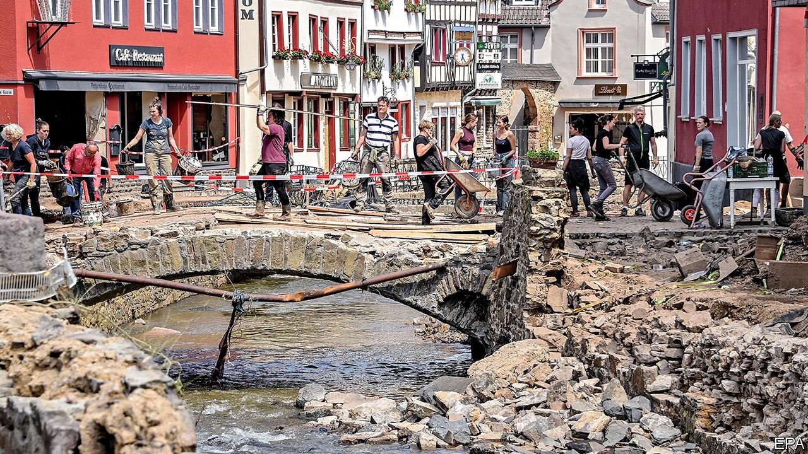

###### 

# Politics this week 

#####  

 

> Jul 24th 2021 

The  since the second world war left at least 200 people dead, with many more still unaccounted for. The bulk of the deaths occurred in Germany, where days of exceptionally heavy rains caused rivers to burst their banks. Belgium saw at least 36 deaths. Germany’s complex federal system, with responsibility divided between federal, state and local governments, seems to have been a big part of the problem. Early-warning systems failed.

Flooding caused by torrential rain forced the evacuation of more than 200,000 people in . In three days a year’s worth of rain fell on the city of Zhengzhou, filling underground railway tunnels. Hundreds of commuters who had been trapped on trains in water over their waists were eventually rescued; 12 of them died.


America said its deputy secretary of state, Wendy Sherman, would visit China on July 25th for talks with its foreign minister, Wang Yi. She will be the highest-ranking American official to go to China since Joe Biden became president.

Ariel Henry was sworn in as Haiti’s new prime minister, after Claude Joseph stepped down as interim leader. This came two weeks after the assassination of the president, Jovenel Moïse, who had handed over leadership to Mr Henry just before his death. Mr Joseph returned to his role as foreign minister.

Pedro Castillo was declared president-elect of Peru. The electoral authority made the announcement several weeks after he won the vote in a tight race and after it had assessed allegations of electoral fraud made by his right-wing rival, Keiko Fujimori. She now says she will accept the result.

The Colombian government issued a revised proposal for tax reforms three months after its initial plan triggered deadly protests. The new submissions put a larger burden on the private sector.

The death toll from  that broke out after the imprisonment of Jacob Zuma, a former president, rose to at least 276. The deployment of soldiers has restored calm. Separately an inquiry recommended that, because of covid-19, local elections that were scheduled for October should be delayed.

An assailant armed with a knife tried to stab Assimi Goita, a coup leader and the interim president of Mali. Mr Goita said he was unharmed.

Rebel forces from Ethiopia’s northern region of Tigray launched attacks into the neighbouring Afar region, widening the country’s civil war. Observers believe the rebels are trying to sever Ethiopia’s main road and rail connection to the port of Djibouti.

At least 30 people were killed when a bomb exploded at a market in Baghdad. Islamic State claimed responsibility. It was the deadliest bombing in the Iraqi capital since January.

Britain’s government said it wanted to renegotiate parts of the Brexit deal that apply to Northern Ireland. These, in effect, place a customs border in the Irish Sea, hampering the flow of goods from the rest of the United Kingdom.

France and Britain reached a deal to step up patrols in the English Channel to block a surge of migrants seeking to reach Britain. The number of migrants crossing this year has already exceeded the total of 8,461 for all of 2020.

June saw another influx of migrants trying to cross the Mexican border into the United States. There were almost 189,000 encounters between migrants and the border patrol, up by 80% from June 2019, before the pandemic. It was a record for June, when border crossings normally start to ease off because of the desert heat.

Meanwhile, a federal judge ruled that Barack Obama had exceeded his presidential remit when he created the Deferred Action for Childhood Arrivals, or Dreamers, programme for children who were brought to the US illegally. The decision stops new applications to stay from being approved, but does not affect current Dreamer participants.

The head of America’s Centres for Disease Control said that  had spread rapidly, warning that infections were surging among the unvaccinated. The wave of Delta cases has caught many countries off guard, not least Indonesia, the new focus of concern in Asia. Hospitalisations there have overwhelmed the health system. Only 8% of Indonesians are fully vaccinated.

India has suffered some 4m excess deaths since the beginning of the pandemic, around ten times more than official figures show. A government study found that more than two-thirds of Indians had covid-19 antibodies, again suggesting that official figures vastly understate the scale of the pandemic.

The  (despite surging infections) left many people confused. Wearing a mask is no longer a requirement, but down to “personal responsibility”, unless you are told to wear one. In France the government compelled visitors to museums to prove they are free of the disease. Both countries are considering stricter implementation of vaccine passes.

Coronavirus briefs


A federal judge ruled that Indiana University has the right to insist that its students are vaccinated, a precedent that could affect other American colleges.

Canada said it would reopen its border to citizens of the United States from August 9th, but only if they are fully vaccinated. Citizens of other countries will be allowed in a month later.

, Australia’s most populous state, reported its biggest rise in infections for 15 months.

The 2020 Olympics, delayed a year by the pandemic, were set to open in Japan on July 23rd. The run-up to the games has been beset by scandals, sexism, jokes about the Holocaust and the worsening covid-19 situation in Tokyo, the host city. They will be less fun than in previous years; spectators are mostly banned and athletes confined to quarters outside events.

