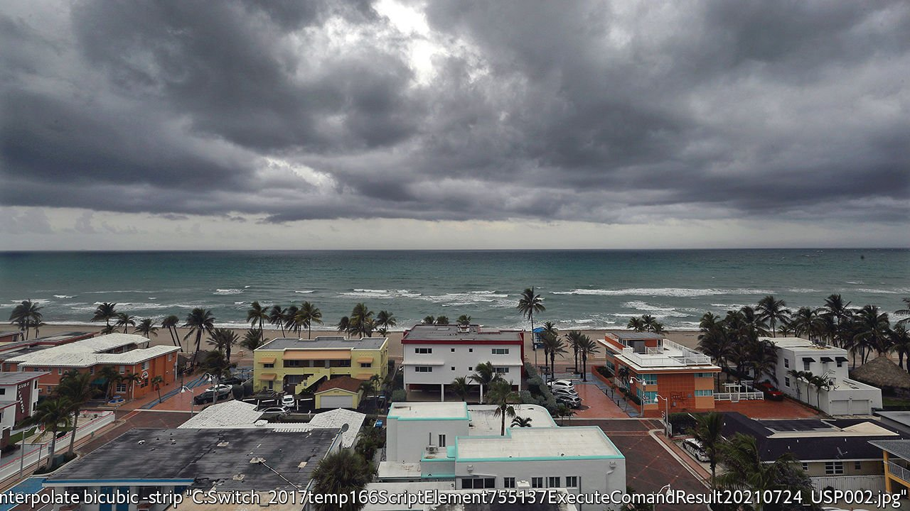
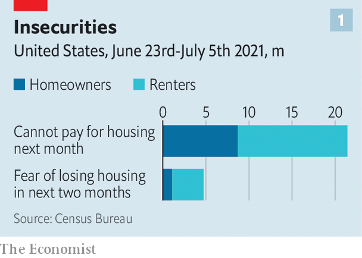
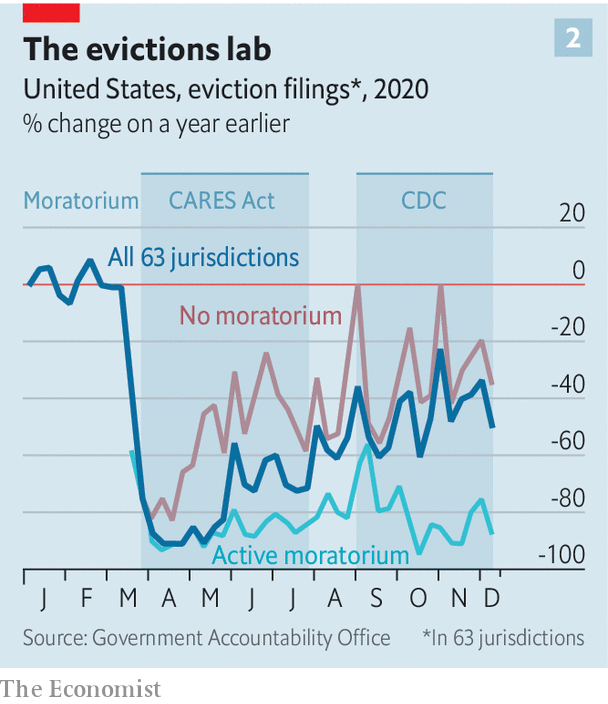
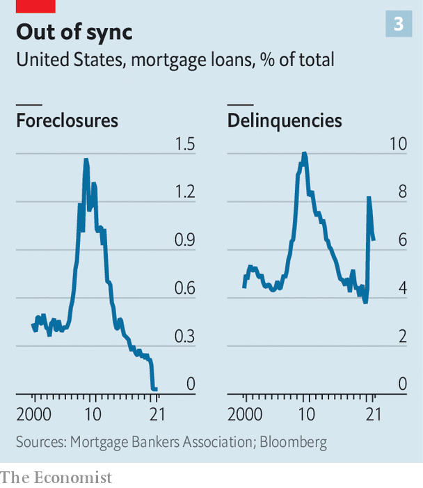

###### Boombust

# As moratoriums lift, will America face a wave of foreclosures and evictions? 

##### In Miami as elsewhere, a house-price boom and a housing crisis could happen at the same time 

 

> Jul 24th 2021 

MIAMI IS hot—especially if you are selling a home. House prices are 20% higher than a year ago. And unlike other big American cities, rents are up too (by 24% year-on-year), as the Magic City soaks up newly untethered teleworkers. Ecstatic estate agents describe a bonanza. Sellers are waiving inspections and appraisals entirely, buying units sight unseen, and aggressively bidding up prices. One agent tells of a client bidding $50,000 above the appraised value of a home—and still getting rejected. Another admits sheepishly to recently buying a house of her own without an inspection. All the usual gaudy accoutrements of the city are here: the ostentatious sports cars, the well-trafficked designer stores, the planes circling Miami Beach advertising a prominent rapper playing at a nightclub.

Yet amid this exuberance, almost 8% of mortgage-holders in Miami are delinquent, among the highest share in the nation. Meanwhile, people renting housing face the end of a federal moratorium on evictions at the end of the month. A moratorium on mortgage foreclosures ends at the same time, raising fears of a spike in houses lost amid a house-price boom.

 


Surveys conducted by the Census Bureau do indeed show worrying signs. One in four renters and one in ten mortgage-holders have little to no confidence in their ability to pay for housing in the next month (see chart 1). Some 2.8m households, containing 7.4m Americans, are behind with the rent. The same surveys show that 1.9m households, in which 6m Americans live, are behind on their mortgages. Black and Hispanic households, those that are poor, and those with children are at greatest risk of losing housing.


No nationwide freezing of evictions and foreclosures has ever been attempted before. Unwinding the policy is therefore unprecedented. The degree of upheaval may ultimately depend on state and local decisions, which are tremendously varied.

Miami offers a compelling case study. Since it had no strict evictions moratorium of its own, a good number of people lost their homes, despite the moratorium declared by the Centres for Disease Control and Prevention (CDC) to slow the spread of covid-19. “The CDC actually has a lot of holes,” says Jeffrey Hearne, a legal-aid lawyer in Miami. “The biggest hole is that it does not clearly apply to a landlord who is evicting for no reason at all.” While the CDC order prohibited evictions for failure to pay rent, landlords were able to evict for other reasons, such as simple termination of an expired lease.

 


And they did. A study of 63 cities and counties by the Government Accountability Office found that those with local moratoriums saw evictions remain at one-tenth of their usual pace; those without quickly surged to 80% of normal volumes (see chart 2). Since January, there have been 920 eviction cases filed in Miami each month—all while the federal moratorium was in place. This suggests that the eventual number of pent-up evictions may be smaller than feared.

The increase may also be tamped down by other means. Congress has allocated $46bn in rental-assistance funds, aimed at keeping tenants in place without leaving landlords to swallow the cost. Some cities, like Miami, have been swift to disburse funds. Other cities and states have not. A Treasury Department report from May 31st found that less than 4% of funds had actually been distributed. The state of California, where applications could take as long as three hours to fill out, has spent $73m of the $1.4bn it was given. Ingrid Ellen of New York University explains the administrative complexity in this way: over 400 separate programmes had to be set up across the country, with platforms for verification and payment that could cope with both hard-to-reach tenants and landlords.

If renters have been evicted despite the federal moratorium, the picture for foreclosures is different. Two federal policies have prevented them. First, the CDC moratorium, which expires soon. Second, the CARES Act, which provided homeowners with 180 days’ worth of forbearance on their mortgage payments. This has been extended twice since, by 180 days each time. Many mortgage providers also voluntarily suspended starting foreclosures.

2008 it ain’t

These policies have been highly effective. Lenders repossessed around 7,000 properties in the first quarter of 2021, 87% fewer than in the same period in 2020, even though the share of mortgage debtors that were behind on their payments spiked to a high not seen since the global financial crisis (see chart 3). By contrast, evictions in some cities are just 20% shy of their pre-pandemic averages, according to researchers at the Eviction Lab. Owners, in other words, have received much more protection than renters.

 


Data from the Mortgage Bankers Association, a lobbying group, find that 4.3% of borrowers are more than 90 days behind, or “seriously delinquent”. In normal times, they would be facing imminent foreclosure. That is about three times the level before the pandemic, says Frank Nothaft of CoreLogic, a property-analytics firm. Most of those people, he adds, are being protected by government programmes.

If foreclosures have been more effectively bottled-up than evictions, it is natural to suspect that they will surge more rapidly. The most worrying analogy is with the global financial crisis of 2008-10, during which 3.8m households lost their homes in the span of three years. But a post-moratorium foreclosure crisis, happening while house prices are soaring and the labour market is tight, would look very different.

Many borrowers might try to stay put by requesting a loan modification. Yet this is not a simple path. Modification requires reams of paperwork, and cases can drag on in Jarndycean fashion. Banks can modify loans at their discretion, though regulation sometimes makes this hard. Default rates on modified mortgages have historically been high so banks must hold extra capital against them, something they are loth to do. The other incentive is pecuniary. Unlike in 2008, any properties that banks seize are likely to be sold at a profit, not a loss. “The banks were bad when they didn’t want the homes,” says Ricardo Corona, a Miami mortgage lawyer. “Imagine what they’ll be like when they do!”

Daryl Jones, also a mortgage lawyer in Miami, expects three waves of foreclosures. First, a spike when the moratorium lifts for those who were mired in foreclosure when the pandemic began. Next, a “smooth increase” between August 2021 and February 2022 as forbearance rolls off. Last, a spike in March 2022 as last-chance forbearances expire. In 2010, the worst year on record, there were 66,000 foreclosures in Miami-Dade County. There are between 5,000 and 10,000 in a typical year. Mr Jones anticipates between 30,000 and 40,000 in the year from September 2021.

Each statistic is the aggregate of many glum stories. One is Keith Simpson’s. Mr Simpson ran a construction company until the financial crisis. He requested a change to the terms of his loan in 2011 after falling behind on payments for the home in Miami that he and his wife bought in 1998. After two years of paperwork and progress, his wife was given too much opioid medication while in hospital in 2013—an accident that left her disabled. Since she was unable to work, Mr Simpson had to resubmit his application for modified terms. Instead, the bank decided to foreclose.

His first legal appeal was successful. Then it was overturned by Florida’s third district court of appeals, which sided with the bank. The couple were served a notice to leave and moved into rented accommodation in 2018—20 years after purchasing their home. “We were just completely wiped out,” says Mr Simpson. “I am 65 years old and I am starting all over again from scratch.” He looks at the situation many homeowners face now and worries the same fate will befall them, too. ■

