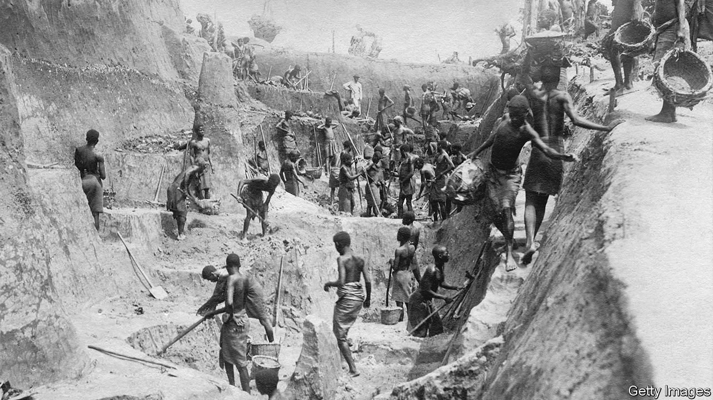

###### Blood on the tracks

# A grim account of the construction of the Congo-Océan Railway 

##### “In the Forest of No Joy” examines the human cost of a colonial infrastructure project 

 

> Jul 31st 2021 

In the Forest of No Joy. By J.P. Daughton. W.W. Norton; 384 pages; $30

THE STATUE of King Leopold II of Belgium that stands in sight of the royal palace in Brussels has been defaced dozens of times in recent years. Activists have painted its hands and eyes red as a reminder of the brutality that Leopold unleashed in the Congo Free State, a territory in central Africa, at the end of the 19th century. As many as 10m Congolese—or half of the population—might have perished as Europeans forced entire villages to collect rubber and ivory for export.


Leopold’s exploitation of Congo was a scandal. In 1908, after years of campaigning by journalists, the Belgian state stripped the king of his private possession. The Belgian Congo joined other European colonies in Africa where wanton extraction was to be replaced by a supposedly civilising mission. Yet though less transparently murderous, the “benign” colonialism of elsewhere was often not that different from what happened under Leopold. A new book, “In the Forest of No Joy”, by J.P. Daughton, an American historian, exposes how forced labour in the French Congo (now the Republic of Congo), on the other side of the river from Leopold’s possession (now the Democratic Republic), led to the deaths of tens of thousands of Africans.

The book is a masterful, if relentlessly bleak, account of the construction of the Congo-Océan Railway, a route designed to connect the central African interior to the Atlantic. What makes it so compelling is the divide it exposes between the often admirable intentions of colonial bureaucrats, who did genuinely think they were lifting Africans out of poverty, and the grim reality that they enabled. The application of “modern” government to conquered people could be almost as savage as plunder, Mr Daughton shows.

The railway was the idea of Pietro Paolo Savorgnan di Brazza, an Italian-born French explorer who conquered much of central Africa for France “by exclusively peaceful means”. The French state imagined itself as a bringer of civilisation to Africa, and the railway was to provide a way for the Congolese to take part in world trade. Yet Mr Daughton shows how the colonial administration in Congo had little capacity to build a railway without violence: it claimed to be recruiting paid volunteers while its agents forced Africans to work at gunpoint. Many were marched hundreds of kilometres to the tracks chained at the neck, as slaves had been a century before. Whatever work had to be done, reported Albert Londres, a French journalist, “it’s captives who do it.”

The evil caused by perverse incentives recurs throughout the book. The Société de Construction des Batignolles, a contractor, was assigned the job of producing the railway and paid a fixed fee. But whereas it had to provide machinery and skilled labour itself, the unskilled labour of Africans was given to it by the colonial state, practically free. It was cheaper to replace workers who died with new ones than to keep them healthy. In 1925 one doctor estimated nearly a quarter of new workers would not survive a year.

Surprisingly, the French state documented these abuses diligently (the archives provide the source of much of Mr Daughton’s information). In 1926 one inspector, Jean-Noël-Paul Pegourier, compared the treatment of workers on the railway to the German genocide of the Herero in Namibia before the first world war. Yet unlike the reports of Leopold’s abuses, these observations had little effect, not least because orders issued from Paris or even Brazzaville were simply ignored. Raphaël Antonetti, the colonial governor, fought back with an avalanche of legalese.

The railway was a masterpiece of engineering, as Mr Daughton readily admits. For decades it provided the only means of transporting goods within Congo. The wealth of Brazzaville, still so named, was built on it. In Britain and France, the infrastructure bequeathed to former colonies is often cited as an argument for its benefits. But to build it, a weak and stingy state had to rely on brutality. As Mr Daughton reports, “the Congo-Océan provides an all-too-useful case in point for how the language of humanity could be invoked to explain the deaths of thousands.” ■

