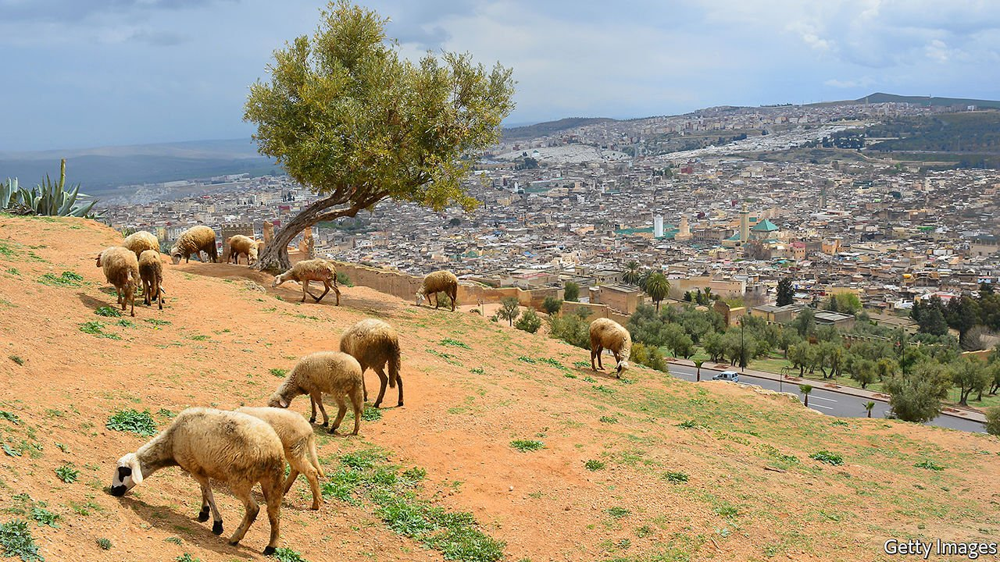

###### Land and freedom

# Leïla Slimani tells the story of her own family in her new novel 

##### “In the Country of Others” is the first instalment in a sweeping trilogy set in Morocco 

 

> Jul 31st 2021 

In the Country of Others. By Leïla Slimani. Translated by Sam Taylor. Penguin; 320 pages; $26. Published in Britain as “The Country of Others”; Faber; £14.99

LEïLA SLIMANI, one of France’s brightest literary stars, has made her name fictionalising real events. “Adèle” followed a woman addicted to extramarital sex; the novel was partly inspired by a scandal that surrounded Dominique Strauss-Kahn, a French politician and economist, in 2011. “The Perfect Nanny” (published in Britain as “Lullaby”) was based on a true story of a childminder who killed the youngsters in her care. The chilling tale won the Prix Goncourt, the most prestigious award for literature in French, in 2016 and Ms Slimani became the first Moroccan woman to earn the accolade.


The author sticks to this mode for her new novel—only this time she is reimagining the story of her own forebears, particularly her grandmother, who fell in love with a Moroccan soldier in 1944. “In the Country of Others” is the first instalment in a trilogy which will cover three generations of one family between 1946 and 2016. Ending in 1955, the book’s domestic narrative unfolds against a backdrop of national politics, as Morocco evolves from French colony to independent state.

In 1947 Mathilde is taken by her new husband, Amine, to the farm he has inherited outside the city of Meknes in northern Morocco. Mathilde and Amine had been living with his mother, Mouilala, for a year and Mathilde is excited about the prospect of a home of her own. When they arrive, however, they find a “small, charmless little building with a corrugated-iron roof”.

Amine struggles to make his farm thrive. Subject to sporadic periods of silence, violence and passion from her husband, Mathilde learns Arabic and tries to adapt to the harsh, beautiful landscape. Their daughter, Aïcha, first opposes then seeks refuge in her strict Catholic school, while Amine’s younger brother, Omar, contemptuous of the medals his sibling earned fighting for France during the second world war, joins a revolutionary militia. Their sister, Selma, strikes out with her own short-lived rebellion against Morocco’s conservative codes of conduct.

Translated by Sam Taylor, Ms Slimani’s novel thrums with nervous energy. Mathilde’s and Amine’s relationship as a mixed-race couple is minutely observed, as is their shared ambivalence towards the struggle for independence. Though her use of multiple viewpoints can be disorientating, Ms Slimani excels at evoking this time and place. Readers will end the first volume of the trilogy with high expectations for the next. ■

