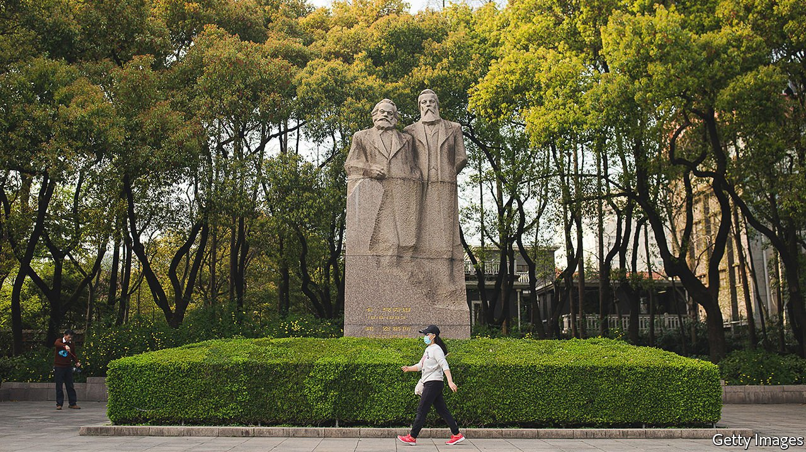

###### Marxism v markets

# China’s techlash gains steam. Again 

##### Online-education firms will not be the last victims 

 

> Jul 28th 2021 

FIRST IT WAS fintech. Last November China’s Communist rulers abruptly suspended the $37bn initial public offering (IPO) of Ant Group, a financial-technology titan, and forced it to modify its asset-light business into something more like a bank. Since then they have pursued other internet giants. The two biggest, Alibaba and Tencent, have been targeted by trustbusters. This month regulators banned Didi Global’s ride-hailing app over data transgressions, days after the firm’s $4bn IPO in New York. And on July 24th, in the clearest sign yet that the government wants to revise its state-capitalist model into something with less global capitalism and more Chinese state, online-education companies were told they can no longer make a profit or use offshore vehicles that enable their shares to be traded abroad.

Global capitalists are spooked. The share prices of three big online tutors listed in New York, TAL Education, New Orient and Gaotu, are down by two-thirds, wiping out $18bn in shareholder value. The panic has engulfed other Chinese firms with American listings, which were collectively worth over $2trn not long ago (and often also use the offending offshore structures). The Nasdaq Golden Dragon China Index, which tracks nearly 100 of the biggest such stocks, fell by a record 19% in three trading days. Fear spread to Hong Kong, where it has pulled the territory’s benchmark tech-stocks index down by 16%, and even to mainland China. Foreigners have dumped enough mainland-traded shares to cause a surge in currency outflows that pushed down the value of the yuan on July 27th, according to Natixis, an investment bank. Policy uncertainty may have reached a point at which outsiders just stop buying Chinese stocks, says Zhang Zhiwei of Pinpoint Asset Management, a hedge fund.


The squeeze reflects the government’s “overriding concern” that it has less control over the internet than it would wish, says Mark Hawtin of GAM, an asset manager. Online education is a case in point. It has been one of China’s most innovative and fastest-growing industries in recent years. Firms have used clever software to offer individualised courses to millions of pupils, many of whom are poor. In 2019 and 2020, the industry saw 27 IPOs. Three-quarters of the proceeds funded firms offering services to schoolchildren rather than university students.

This ferment proved too much for the government, which prizes stability above all else. The authorities began to view the industry’s fees as an extra burden on parents, potentially discouraging them from having more children—an increasingly pressing problem as China’s population begins to decline. State media, channelling their inner Marx, talk of an end to “the era of barbaric growth”. The simplest way to curb this barbarism? Do away with the profit motive. Many companies serving school-age children will now have to become non-profit organisations. Their lucrative businesses suddenly seem about to “be worth almost nothing”, says Travis Lundy of Smartkarma, a research outfit.

As Peter Milliken of Deutsche Bank puts it, in China “the profit pool [investors] chase exists within parameters set by the state.” Where will these shift next? One place may be video-gaming. Games firms collect lots of data on users, many of whom are minors, and gaming addiction is a Beijing bugbear, notes Chelsey Tam of Morningstar, a research firm. The industry titan, Tencent, has already been censured. In July alone it was fined twice, by the cyber-regulator for sexually explicit content and by antitrust authorities for unfair practices, and ordered to end exclusive music-licensing deals. On July 27th it suspended registrations for new users of WeChat, a ubiquitous messaging app, to align itself with new regulations. Its market value has sunk from $950bn in January to $550bn.

Other targets include internet-connected cars and online health care, which both suck in reams of sensitive data. A private-equity investor in the health business says his firm is adjusting its portfolio to reflect new risks. In a meeting with banks on July 28th the government tried to restore calm. But its message is clear: the Marxist pursuit of power trumps market logic. ■

