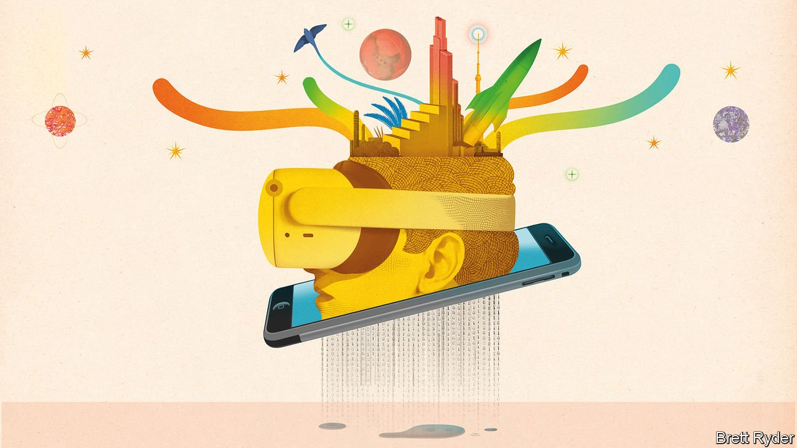
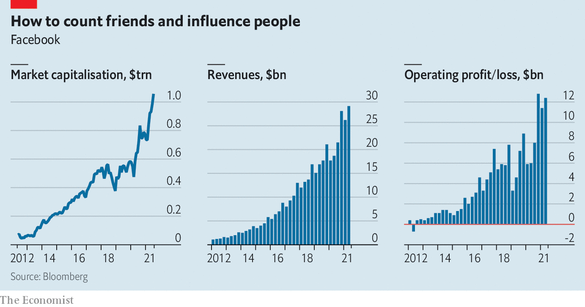

###### Faceworld

# Facebook eyes a future beyond social media 

##### Advertising has made the social network into a trillion-dollar company. Can new ventures take it further? 

 

> Jul 29th 2021 

Editor's note (July 28th 2021): This story has been updated since it was first published

FACEBOOK HAS always had two faces. One is the grimace of a firm that many people, in particular politicians, love to hate. President Joe Biden recently accused the social-media giant of “killing people” by spreading misinformation about vaccines against covid-19. (He later rowed back a bit after Facebook pointed out it does quite a lot to stop the spread of such content and to promote legitimate vaccine advice.)

The other face is a happy one of a firm that users, advertisers and investors cannot live without. It was grinning again on July 28th, when it presented second-quarter results. Revenues rose by 56%, year on year, to $29bn—despite Apple’s update in April to its iPhone operating system that let users easily opt out of being tracked around the web by apps like Facebook. That puts it on track to exceed $100bn in sales this financial year. Quarterly net profit hit $10.4bn, double that of a year ago. Despite a wobble in late trading after Facebook warned of slowing sales growth in coming quarters, it looks poised to become a paid-up member of the exclusive club of companies with a market capitalisation above $1trn, which it joined earlier this year (see chart).


How can a firm with such baggage be so successful? The answer also has two faces to it. With 2.9bn daily global users, Facebook’s main offerings—its flagship social network (known internally as Blue), photo-sharing on Instagram and messaging on WhatsApp and Messenger—are a digital magnifying glass of human nature. This glass amplifies the good (neighbourly help amid the pandemic) as well as the bad (conspiracy theories and quack cures). It also serves as a remarkable lens for advertisers to focus on the world’s consumers. And the two-facedness is likely to become more pronounced if Facebook succeeds with its biggest project yet: creating a “metaverse” that would combine a 3D digital world with the 3D physical one.

 


At its core Facebook is a giant advertising machine. Ads generate 98% of revenue. Blue is a dominant ad platform internationally, raking in some $55bn last year, estimates KeyBanc Capital Markets, an investment firm (Facebook does not break out results by service). Instagram, which Facebook bought in 2012 for $1bn, now chips in another $20bn or more, taking its share of overall ad revenues to nearly 30%, from just over 10% in 2017.


Debra Aho Williamson of eMarketer, a data provider, calls Facebook’s ability to target ads “incredibly precise”. Advertisers value this precision highly: Facebook earns $8 a quarter for every one of its users, nearly twice as much as Twitter. The firm watches what its users do not only on its own services, but almost everywhere else online. This lets it pick which products to offer to a given user, identify others with similar interests and determine whether they buy anything after seeing an ad.

Even before the pandemic hit, this was hard to resist: for smaller firms with fewer resources to run sophisticated marketing operations, which make up the bulk of Facebook’s 10m advertisers, but also for big global brands. Even Chinese sellers are spending billions of dollars on Facebook, says Brian Wieser of GroupM, which places ads on behalf of brands. Facebook’s apps may be banned in China, but Chinese merchants can plug their wares to Western consumers thanks to firms such as Wish, an American online marketplace that helps arrange ads, payment and shipping.

Covid-19 has turbocharged Facebook’s machine. Self-isolating American adults spent on average nearly 35 minutes per day on Blue in 2020, according to eMarketer, two minutes more than the year before. That adds up to more than 10,000 additional years of collective attention. While some firms went belly-up or cut ad spending in last year’s recession, others were born: 6.6m in America alone since the start of the pandemic. Many crave some of the extra attention. Today it is as unthinkable to run an online consumer business without targeted ads as it once was to run one with no shopfront, says Mark Shmulik of Bernstein, a broker. A bigger slug of such firms’ budgets will be spent on Facebook and its fellow ad-tech giant, Google, he says. Admen are calling it “the new rent”.

Facebook has added more than 2m renters in the past 15 months. It will add more as economies reopen and digital ads, which now make up 60% of overall ad spending in America, keep chipping away at old media. Facebook has warned of a “greater impact” of Apple’s tracking opt-out in the current quarter; Flurry, a data firm, estimates that four in five iPhone users have opted out. But even if this makes Facebook’s targeting a bit less effective, it will still be at least as good as its rivals’, predicts Mark Mahaney of Evercore ISI, an investment bank.

And though on July 23rd American trustbusters got another three weeks to refile a lawsuit against Facebook, which had been thrown out last month for lack of evidence, they will struggle to prove that it is a social-networking monopolist under current competition law. For all the anti-tech bluster in Washington, law is unlikely to change as long as Congress stays polarised.

The bigger threat to Facebook’s prospects, which has long preoccupied Mark Zuckerberg, its co-founder and boss, is that the virtual masses tire of its apps and move elsewhere, pulling advertisers with them. In the past two years a new generation of social media has emerged that poses just this threat. Although Facebook’s share of American digital advertising has continued to grow, its global social-media advertising has been edging down since 2016. The challengers range from specialists such as Clubhouse and Discord, two audio-chat services, to Snapchat and TikTok, which take on Blue and especially Instagram more directly. TikTok fans in America now spend more than 21 hours a month on the video app, compared with less than 18 hours that users spend on Blue, according to App Annie, a market-research firm.

In the past Facebook might have bought smaller rivals, as it did with Instagram. With trustbusters looking on, it is instead placing a series of big bets. The first is on the “creator economy”, where people make money from digital works. This is an extension of its ad business, but one in which it has fallen behind. TikTok and YouTube, in particular, have been better at attracting creators who keep users glued to their screens. In April Facebook said it was developing new audio features, including Clubhouse-like chat rooms where listeners can tip performers. In June it launched Bulletin, a newsletter-hosting service similar to Substack, which popularised the genre. This month Mr Zuckerberg vowed to shower creators on Blue and Instagram with $1bn by the end of next year (he didn’t say what form the payments would take).

Facebook’s second bet looks beyond advertising to e-commerce. It already hosts 1.2m online shops on Blue and Instagram. That puts it in the same league as Shopify, a fast-growing rival to Amazon, which has 1.7m. A month ago Facebook introduced a new way to let buyers try on clothes virtually. It also plans to link its “Shops” offering with Marketplace, its existing peer-to-peer trading service, and WhatsApp, which it wants to turn into a vehicle for chat-based “conversational commerce”, the latest thing in online shopping. Later this year it wants to phase in Diem, its controversial cryptocurrency, which would beef up its payments infrastructure.

For now Facebook has waived seller fees, but they could add a few billion dollars to its turnover as soon as next year. Besides bringing in non-advertising revenues, an e-commerce business would also help the firm with its tracking problem. If shoppers spend more time and leave more data on its platform the inability to follow them elsewhere on the web becomes less important. Mr Shmulik expects e-commerce to fragment into such walled gardens, each combining shopping and advertising, and operated by a tech giant.

Mr Zuckerberg’s grandest gamble concerns the metaverse. When he spent $2bn in 2014 to buy Oculus, a maker of virtual-reality (VR) gear, many thought he was buying himself a toy. But in recent years Facebook has made other VR acquisitions, most recently BigBox VR, developer of “Population: One”, a shooter game similar to “Fortnite”. This hands Facebook control of a hardware platform for VR and “augmented reality” (AR), which serves users digital information as they survey the real world through smart spectacles and the like.

As with e-commerce, part of Facebook’s rationale may be to lessen its dependence on the whims of hardware-makers such as Apple. The potential prize is large. Sales of Oculus headsets contributed around $1bn to Facebook’s revenues last year. If the technology keeps improving, VR and AR are the obvious next phase of gaming, which has matured into an industry with global revenues of $180bn.

Meta-morphosis

Mr Zuckerberg’s ambitions do not stop there, however. He doesn’t see the metaverse, which now has its own division within the firm, merely as a place to enjoy games or other immersive entertainment. Instead, he envisages it as a virtual space where people live and work, in keeping with a dream that geeks have harboured since 1992, when the term “metaverse” was coined by Neal Stephenson, a science-fiction author. In five years’ time, Mr Zuckerberg has said, he would like Facebook no longer to be seen primarily as a social-media company but as a metaverse company.

That would make Facebook cool again. It would also bring more scrutiny from critics worried about the firm’s power. If users start spending 35 hours a week immersed in its virtual world, rather than 35 minutes a day, this may invite regulation that actually bites. For now, the metaverse is inviting something Mr Zuckerberg fears more: competition. Others are sizing up the field, from video-game firms like Roblox and Epic Games, to other tech giants. Apple is reportedly planning its own AR glasses; Microsoft already sells AR goggles. If Facebook beats them to metaverse supremacy, it will have plenty to grin about. Otherwise, expect grimacing. ■

Correction (July 28th 2021): An earlier version of this article misstated an estimate of Facebook’s advertising earnings per user. We also mistakenly included Instagram in eMarketer’s estimate of time spent on Blue in 2020. Sorry.

