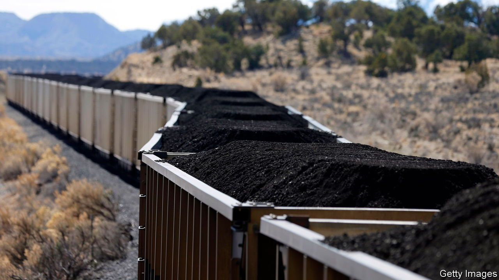
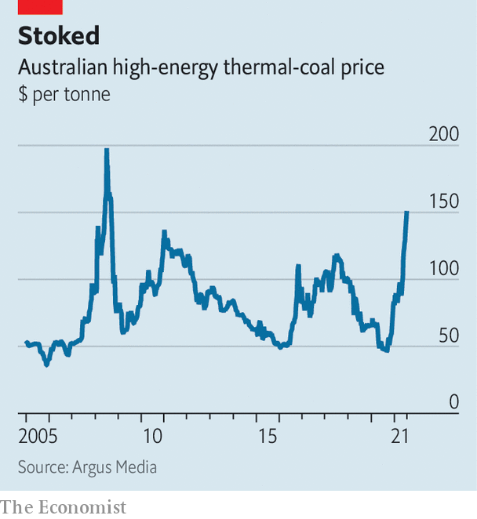

###### Fired up

# Despite climate concerns, demand for dirty fuels is surging 

##### As industry recovers, coal and natural gas are resurgent 

 

> Jul 31st 2021 

GREEN TYPES had hoped that the recovery from the pandemic might jump-start the world’s decarbonisation efforts. Governments say they want to build back better and greener, and have announced ambitious plans to kick the fossil-fuel habit. In Europe, officials have unveiled policies to achieve a 55% reduction in greenhouse-gas emissions, compared with their level in 1990, by the end of this decade. On July 21st Japan announced plans for fossil fuels to fall from 76% of its power-generation mix in 2019 to 41% by 2030.

Despite the grand talk, though, fossil fuels are resurgent. A recent report from the International Energy Agency makes for sobering reading. Global electricity demand is forecast to grow by nearly 5% in 2021 and by 4% in 2022. Fossil-fuel-based power will probably make up 45% of the extra demand this year and 40% next year. (By contrast, it made up about a quarter of new power generation in 2019.)


The revival of the American economy has led to strong demand for natural gas from industrial firms. In Asia and Europe, a hot summer has boosted demand for imports of liquefied natural gas. Citigroup, a bank, calculates that European gas-storage levels, an indicator of the tightness of the global market, are below those seen in the past five years. S&amp;P Global Platts, a research firm, reckons that demand in parts of Asia and Europe partly reflects the need to replenish stores ahead of the winter.

 


Coal markets are heating up, too: the price of one benchmark has nearly trebled so far this year. Chinese electricity demand, which relies heavily on the sooty stuff, shot up to a record in mid-July. Production bottlenecks in South Africa and Colombia have not helped. Anastacia Dialynas of Bloomberg NEF, a data outfit, reckons that high natural-gas prices may encourage power producers to favour coal-burning plants over gas-fired generators. America’s Energy Information Administration forecasts that coal’s share of domestic electricity production will rise to 26% this year, from 22% in 2020. Steelmaking, which uses a lot of coal, provides another boost. Commerzbank, a German lender, predicts that global steel output could hit a record high this year.

Politics has added fuel to the fire. In October China banned coal imports from Australia. Some 70% of its usual imports of seaborne metallurgical coal (used to make steel) became off-limits, says Jim Truman of Wood Mackenzie, a consultancy. Steel mills along China’s coast rushed to find alternatives. But local sources proved insufficient, and imports from Mongolia were curtailed by covid-related border closures.

The price spike may ease over time. In May China’s central government ordered provinces to curb electricity use, which should reduce the demand for fuel. Supply bottlenecks will be overcome. An expected boost to American gas production should eventually refill storage units worldwide.

Even so, the fossil-fuel surge offers a warning. Hopes that the world would permanently lower its energy use after the global financial crisis of 2007-09 came to nothing. In late July this year a gathering of environment ministers from the G20 group of countries in Italy turned into farce, with officials from China, India, Russia and Saudi Arabia blocking an agreement to end fossil-fuel subsidies and phase out the use of coal. Build back better, come back greener may be an admirable goal, observes David Fyfe of Argus Media, an industry publisher, but unless it is accompanied by serious policies, “coal will remain the default fuel for base-load power in many countries.” ■

For more coverage of climate change, register for The Climate Issue, our fortnightly , or visit our 

