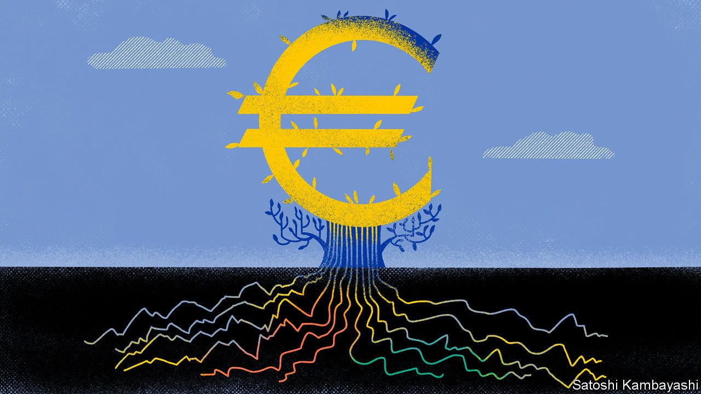

###### Buttonwood

# The case for a further narrowing of euro-zone bond spreads 

##### Italy’s have the furthest to fall. And it is coming into the fold 

 

> Jul 31st 2021 

IT WAS BUSINESS as usual at the European Central Bank (ECB). At the press conference on July 22nd that followed its regular monetary-policy meeting, Christine Lagarde, the bank’s boss, might have been hoping for a few plaudits. The ECB had recently announced that it was changing to a symmetric inflation target, bringing it into line with practice everywhere else. No such luck. Many of the questions were critical in nature. Why is the ECB not doing more? How split are its members? And so on.

As dispiriting as this was for Ms Lagarde, the focus on issues of fine-tuning is rather cheering. Mario Draghi, her predecessor as ECB president, spent a lot of time fighting to keep the euro zone together. These days it looks a lot more solid, a lot more normal. The new inflation target is only one sign of this. Another is that the active use of fiscal policy is no longer anathema. The next-generation EU fund (NGEU), which will disburse €750bn ($880bn) to member states, affords a degree of burden-sharing between countries. And the politics of “Europe” are notably less ugly. Populists in France and Italy no longer talk about leaving the euro or the EU.


This is progress. Only a few years ago a common opinion among American investors was that the euro would break up. If the euro zone is to become truly normal, though, a corollary is that the bonds issued by its members’ governments should be almost interchangeable. For some countries, the spread (or excess yield) over German bunds has already narrowed considerably. France trades at 30 basis points (0.3 percentage points) over ten-year bunds. Ireland’s spread is 45 basis points. The widest spreads are found on Italy’s government bonds, or BTPs. A ten-year BTP has a spread of around 110 basis points over the equivalent bund. But a case can be made that these will narrow further.

It begins with the changes at the ECB. After the completion of a recent strategy review, the central bank tweaked its inflation goal. Instead of “below, but close to, 2%”, it will aim at a symmetric target. Inflation below 2% will be as undesirable as inflation above it. Reasonable people might have expected the bank to further relax monetary policy as a consequence. Its most recent forecast, made in June, was for sub-2% inflation over much of the next few years.

What the bank offered instead was a fresh dose of “forward guidance”—a pledge that it would keep interest rates at their present level, or lower, until it saw durable 2% inflation on the horizon. This did not imply that interest rates would be “lower for longer”, said Ms Lagarde. Rather, it was a commitment that they would not be increased prematurely. Any expansion of its various bond-buying schemes would have to wait until fresh inflation forecasts were made in September.

Perhaps it is prudent to wait. After all, the reopening of America’s economy has brought with it a string of big upside surprises to inflation. But the betting is that things will be different in the euro zone. Fiscal support there has been in the form of job subsidies rather than the cash transfers that fuelled a surge of spending in America. And there has been nothing quite on the scale of the $1.9trn package that Congress passed in March. A reasonable bet, then, is that the ECB will extend its bond purchases to meet the new target, or at least not curtail them abruptly.

If it does, spreads are likely to narrow. Italy’s have the furthest to go. Its bonds have been an outlier for a reason. Italy is a big, sluggish economy with a heavy public-debt burden. A wider spread is justified by the greater risk of default.

Yet a state of affairs in which euro-zone bonds, bar Italy’s, look more like bunds would be an odd one. It would imply that the euro could survive a default or exit by Italy. That is a bold assumption. If Italy blows up, other countries would be at risk, too. Indeed if you believe the euro is doomed, the last bonds you should sell are BTPs, because at least you’ll get a higher yield while you wait. And there are lots of investors who are obliged to own Italy. For those that track a benchmark euro index, being underweight Italy is costly.

Moreover, Italy is coming into the fold. It is a big beneficiary of the NGEU fund. Mr Draghi is now the prime minister, and is trusted in Brussels and in Berlin to use the money well. But what about after that? Well, here’s a thought. Every year the euro survives, it becomes harder to imagine an alternative. The longer it lasts, the longer-lasting it appears to be.

