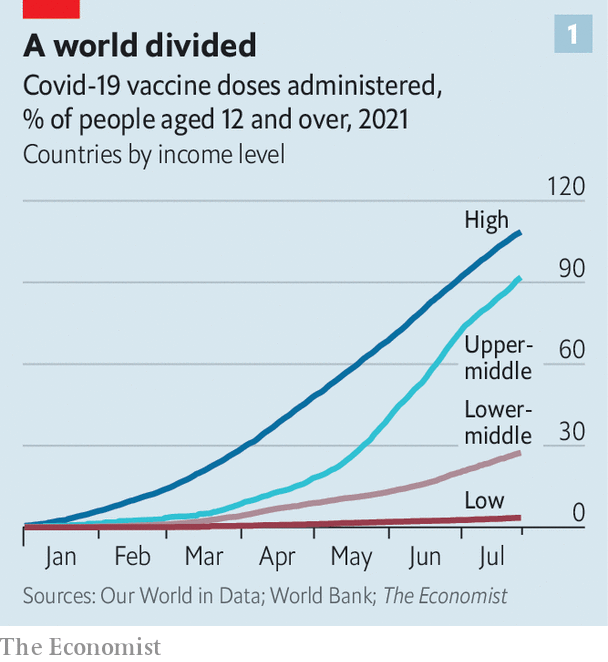
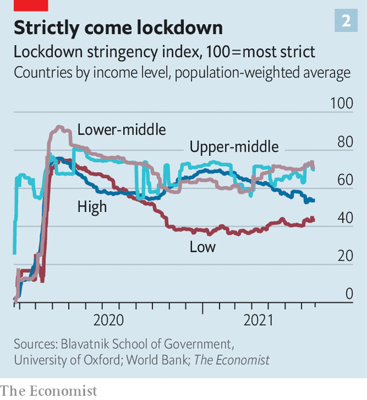
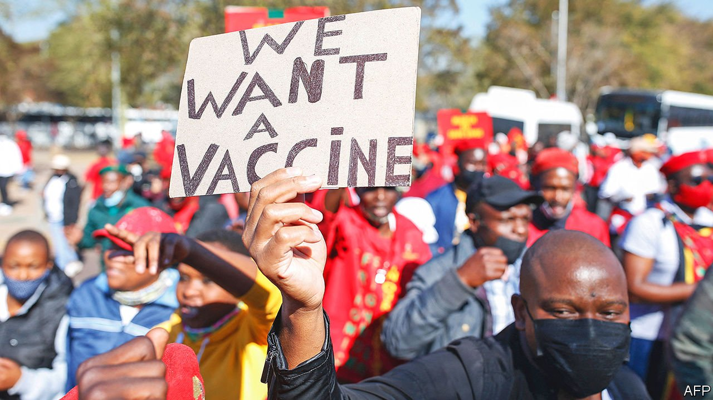

###### It’s catching

# The pandemic has exacerbated existing political discontent 

##### The problem is worst in middle-income countries 

 

> Jul 31st 2021 

A PILE OF fake corpses littered the heart of Bangkok. The bodies—white sacks stuffed with hay and spattered with red paint—symbolised Thai victims of covid-19. “They’re dead because of the failure of this government,” a protester bellowed into a megaphone. To underscore the point, protesters had laid the “corpses” across a giant portrait of the prime minister, which they then set ablaze.

In many countries around the world, from Brazil to Belarus, the pandemic is stirring unrest. People are angry about the economic hardships they face. They have seen how the rich and well-connected go to the front of the queue for vaccinations, medical treatment and government help. They are angry that their leaders have not done a better job of containing the coronavirus. At the same time, people’s suffering has created a sense of solidarity which is fanning grievances that smouldered long before anyone had heard of covid-19.


Thailand’s protests flared up on July 18th as the Delta variant was running amok, leading to the country’s worst wave of covid-19 so far. Hospitals are swamped. Just 5% of the Thai population is fully vaccinated. Thais had hoped for a swift economic rebound, after GDP shrank by 6.1% in 2020, but that now seems unlikely. The Bank of Thailand recently reduced its growth forecast for 2021 from 3% to 1.8%.

Many Thais berate their government for failing to secure enough vaccines soon enough, or for reopening the country too quickly to foreign tourists, which they fear may have contributed to the current wave. Some grumble that the government has relied too much on Chinese-made vaccines rather than Pfizer’s or Moderna’s which they believe offer more protection.

Globally, you might expect covid-19 to make unrest less common. Before the pandemic, big protest movements had been increasing around the world, growing 2.5 times between 2011 and 2019, according to the Institute for Economics and Peace (IEP), a think-tank in Sydney. However, dense crowds of angry people, all shouting slogans and spraying each other with spittle, could easily transmit the virus. Sure enough, in the early weeks of the pandemic the number of protests around the world dwindled in such places as India, Pakistan, Chile, Iraq and Nicaragua.

It didn’t last. Discontent has once again bubbled up in countries including Colombia, South Africa and Myanmar, even as the virus has continued to do its worst. In Tunisia this week, amid violent mass demonstrations which were sparked by the government’s mishandling of the pandemic, the .

The IEP found that in 2020, civil unrest rose by 10%. It counted 5,000 instances of pandemic-related violence in 158 countries. Violent demonstrations are more common than at any time since 2008. A broader measure that includes peaceful protests also rose, according to the Armed Conflict Location &amp; Event Data Project, an NGO. In the year to March 1st 2021, ACLED logged 51,549 demonstrations or riots. Counting only countries surveyed in both years, it detected a significant increase.

In this, the pandemic looks as if it is following the pattern set by earlier outbreaks of infectious disease. In a paper published last year, Tahsin Saadi Sedik and Rui Xu of the IMF analysed data from 133 countries between 2001 and 2018 and found that social unrest starts to increase 12-14 months after the onset of an epidemic, such as Zika, a mosquito-borne virus, and peaks after two years. The covid-19 pandemic has been incomparably more severe and longer-lasting than those epidemics in almost every country. The disruption it causes could well be, too.

One direct cause of protests, the IMF data suggested, is economic hardship. A good example is Cuba, where a vast network of secret police and informers usually spot and crush dissidents before they cause trouble. Yet on July 11th thousands marched in more than 50 towns and cities, risking the dictatorship’s wrath to chant “freedom!” and overturn a few police cars. It was perhaps the biggest display of anti-government fury in Cuba in six decades.

Cubans are angry because the shops are empty, they have nothing for dinner, the electricity keeps failing and they are not allowed to vote out the people in charge. Covid-19 has aggravated these perennial grievances by devastating the Cuban economy. Tourists, the main source of hard currency, have stopped coming. GDP shrank by 10.9% in 2020 and slid further this year.

Nothing to lose but their groceries

The closure of Cuba’s borders to keep out the virus has cut connections with the capitalist world that made life more bearable. Everyday things like soap and coffee are usually brought in by relatives who made it abroad or by mules who travel to places like Panama, Mexico, Russia or Miami to buy supplies and resell them on the black market. The severing of this supply chain has stoked inflation, lengthened queues and reminded Cubans of how poorly the government caters for their basic needs.

The collapse of tourism has had knock-on effects on the health system. Without the dollars holidaymakers used to splurge on hotel rooms and rum cocktails, the government is struggling to buy the ingredients it needs to make drugs. Painkillers, antibiotics, insulin, asthma medicine and diagnostic tests have become scarce, so people with easily treatable illnesses are forced to suffer. Good medical care is supposed to be one of the pillars of the revolution. “Many people in Cuba were once content to accept that, while they might never be able to take an extravagant holiday, they at least had the guarantee of good health care,” says a Cuban doctor.

Pandemic-aggravated unrest strikes rich and poor countries alike, but middle-income countries are most vulnerable both to the disease and its social effects. Rich countries are protected by vaccination—even if some of their citizens hesitate to be jabbed. In the poorest places, the coronavirus is one burden among many, states are often too weak to enforce lockdowns, and the population’s youth offers a high degree of protection from covid-19.

 


In middle-income countries, by contrast, vaccination is patchy and lockdowns are common (see charts). Many of their people are old enough and fat enough to be especially vulnerable to the virus. What’s more, people in middle-income countries have expectations of their governments.

 


Too often, as in South Africa, those expectations have been dashed. The protests there earlier this month were stirred up at first by supporters of a justly jailed ex-president, Jacob Zuma, in an attempt to secure his release. But one of the reasons they snowballed into mass looting and the burning of shops and businesses was that so many South Africans are poor, jobless and furious about the corruption and rotten government that keeps them that way.

Covid-19 has put all of that on display. Lockdowns have been exceptionally tough, and many South Africans find the rules irksome. A spray-painted slogan on a looted shop in Edendale, in KwaZulu-Natal, the worst-hit of South Africa’s nine provinces in the riots, read “Level 4 to hell”—a reference to the country’s second-highest level of pandemic alert, during which the government imposes “extreme precautions”.

A short-lived ban on buying open-toed sandals was baffling. Periodic bans on the sale of alcohol struck many as unfair. Rich people with wine cellars have carried on tippling behind their high walls, but the poor have been deprived of one of life’s pleasures, and harassed by police when they indulge. During the riots, liquor stores were among the first to be looted.

When covid-19 hit, “everything came to a stop; my business couldn't function,” says Patrick Dlamini, who fixes cars, which fewer people are driving because of covid-related curfews, and recycles bottles, which fewer people are draining because of the booze ban. “There’s no money,” he frets. The looting, he reckons, was caused by “a combination of Zuma and covid”.

The . Pandemics expose the gulf between the haves and have-nots. What is more, the IMF’s analysis shows that when pandemics impose economic hardship, the burden falls most heavily on the poor. At a time when everyone should be in it together, it rankles when ordinary people see how the privileged both escape hardship and enjoy special treatment into the bargain. It brings the angry into the streets.

Colombia shows how the sense of injustice can overwhelm the government’s efforts to help. One of the world’s most unequal places, it has also spent longer under lockdown than most countries. GDP dropped by 6.8% in 2020 and 2.8m people fell into destitution. A decade of progress in eradicating poverty was wiped out. The pain was shared unequally. Youth unemployment from May to July last year was 30%, compared with overall unemployment of 20%, and 12 percentage points higher than it had been a year earlier. In a place where half of the economy is off the books, informal workers had nothing to fall back on.

Sorry isn’t good enough

The government tried to make amends. It introduced a fund called Ingreso Solidario to help the poor survive during lockdowns, but many families still did not have enough money to get by. In April this year it introduced a tax reform that set out to redistribute money to the poorest half of Colombians, partly by eliminating VAT exemptions that help the rich and widening the net of income tax.

But Colombians, struggling to cope with the pandemic, assumed that the reform would load them up with more taxes. Coming at the start of April, just as the disease was mounting and most cities were reimposing lockdowns, the tax bill brought people onto the streets—especially the jobless young. Over several days in May, protesters manned barricades, attacked police stations and looted businesses in Cali, the country’s third-largest city.

Once protests have started to take hold, more tend to follow. Again, hardship is a factor. A paper published in May by Metodij Hadzi-Vaskov, Samuel Pienknagura and Luca Antonio Ricci, of the IMF, analysed an index of social upheaval in 130 countries. It concluded that unrest is followed by a fall in economic output of 0.2 percentage points after 18 months—and that the effect in emerging markets is twice that in advanced economies.

What’s more, the very act of protesting can generate a sense of solidarity. In Belarus, for example, the coronavirus inspired people to stand up to the regime. They got a taste for rebellion. The spark came in the spring of 2020 when Alexander Lukashenko, the country’s despotic leader, dismissed covid-19 as a “mass psychosis” and blamed his citizens for dying of it. The EU’s members advised citizens to stay at home and offered financial help. Mr Lukashenko told his to have a shot of liquor, indulge in a banya (steam bath) and ride a tractor.

Mr Lukashenko, who has ruled Belarus since 1994, likes to portray himself as the father of the nation. He has boasted about the country’s broad system of social support, which harks back to the Soviet Union. When he stumbled over covid-19 Belarusian activists sensed a rare opening.

A team of IT specialists launched #ByCovid19, a social-media movement that stepped into the void left by the state. In a few weeks it attracted hundreds of thousands of volunteers across the country and supplied personal-protection gear for doctors and machinery for hospitals. Andrei Strizhak, one of its founders, says that it proved to Belarusians that they could act together. After Mr Lukashenko rigged an election in August, they did just that by taking to the streets in huge numbers.

Something similar may be starting in Brazil. Early in the pandemic, supporters of President Jair Bolsonaro dominated the streets. Unmasked and dressed in green and yellow, thousands of bolsonaristas gathered roughly every two weeks to back the president’s denouncement of governors’ lockdowns. In August 2020, 37% of Brazilians approved of Mr Bolsonaro, according to Datafolha, a pollster, partly because the government was paying 600 reais ($110) per month in emergency aid to a third of the population.

 


Today the emergency aid has been slashed and big crowds are calling for his impeachment. In May a senate inquiry into the government’s handling of the pandemic revealed that Mr Bolsonaro had rebuffed offers to buy vaccines last year, and later ignored possible corruption. One in seven Brazilians is out of work and one in ten is going hungry. In recent polls less than 30% of Brazilians backed the president and a record 51% disapproved of his government.

Three times in just over a month starting in late May, all the states of the country were protesting at once, uniting thousands of people in many cities. Former allies of Mr Bolsonaro have joined the marches, spurred on by the death toll from covid-19, currently at more than 550,000. “The glass is almost full,” says Creomar de Souza of Dharma, a Brasília-based consultancy. “We will see what is the last drop that might make it overflow.”

Plenty of countries have avoided covid-related protests. India has been relatively quiet, in spite of its government’s mistakes. So has Malaysia, which coped well with covid-19 in 2020. But in these places, too, discontent is stirring. Critics of the Modi government in India have become louder, and now include fellow-travellers from his own Hindu-nationalist power-base. One example is the formation of a group of retired senior civil servants—some of them once very high-powered—that has taken to berating the government.

In recent weeks Malaysia has suffered a wave of infections, taking the total to over 1m. Poor ethnic Malays, unprotected by the country’s patchy social safety-net, have watched ministers and the business elites flout health rules that carry swingeing penalties for ordinary offenders. The factories of well-connected owners have been allowed to continue to operate—despite being superspreading venues for employees. Around 18% of the population have secured a jab, but among the well-connected the share is much higher.

Households have taken to hanging white flags from their windows as a call for help. Increasingly, black flags flutter beside them, hoisted mainly by younger, educated Malaysians signalling frustration at the government’s mistakes. The black-flag, or Bendera Hitam, movement has unnerved the authorities, who are probing it for evidence of sedition. Bridget Welsh of the University of Nottingham, Malaysia thinks this wider mobilisation highlights how a country proud to consider itself uniformly middle-class is in reality a country of haves and have-nots.

It ain’t over ’til it’s over

The pandemic is far from over. Covax, the global vaccine-sharing initiative, aims to provide developing countries with enough jabs to inoculate a fifth of their populations by the end of 2021, but that target is very unlikely to be met. So far, almost 4bn doses of vaccines have been put into arms. To get to 70% coverage, the world needs to give another 7bn—more, if booster shots are required. That is unlikely before 2022.

In the meantime, governments will attempt to control the disease with rules and regulations—including measures to restrict dissent. According to Freedom House, a watchdog, at least 158 out of 192 countries have placed new curbs on public protests. Some governments have done so impartially and temporarily, to protect public health. Others have seized on covid-19 as a pretext, locking up their opposition for supposedly violating social-distancing rules while letting the governing party hold huge rallies.

In the long run political repression is often a recipe for trouble. The pandemic suggests that people’s anger does not dissipate while they are cooped up indoors. It simmers like water in a saucepan, even as governments do their best to hold down the lid. In Thailand gatherings of more than five are banned, officially to reduce the spread of the virus. The protesters on July 18th were met with tear-gas and rubber bullets. But that only makes them angrier. “We just want to get vaccinated,” says one. “Covid-19 is breathing down our neck but the government is doing nothing at all.”

Dig deeper

All our stories relating to the pandemic and the vaccines can be found on our . You can also find trackers showing ,  and the virus’s spread across  and .

