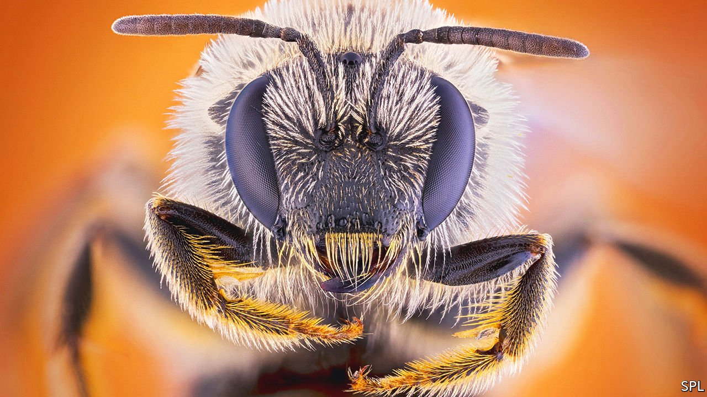

###### The nose knows

# Flies, worms and bees could help detect illness 

##### Invertebrates can detect the chemical signs of sickness 

 

> Jul 28th 2021 

DOGS CAN smell things at concentrations of one part in a trillion—equivalent to a single drop in a pond the size of 20 Olympic swimming pools. That ability is put to good use by human beings. Trained dogs can sniff out explosives and drugs, track missing people, and even guide truffle-hunters to their prizes. They can also detect illnesses, including cancer, malaria, Parkinson’s disease and covid-19, before obvious symptoms appear. A study published in 2019, for example, suggested that trained dogs were able, 97% of the time, to identify blood samples taken from patients with lung cancer. A group of researchers in Germany recently trained dogs to pick out saliva samples collected from those infected with SARS-CoV-2, the covid-causing virus, from uninfected samples, with a success rate of 94%.

Training dogs, however, takes time. Handlers must be paid. The animals themselves get tired and bored. In past studies on cancer detection, less than half of canines entered for training made the grade. Dogs are not, then, a practical answer to the question of how to detect illness quickly, before it gets a grip.


But fruit flies might be. And so might tiny nematode worms called Caenorhabditis elegans. And so, indeed, might bees. Unlike dogs, all are cheap and expendable—and their senses are just as good. Along with technology tailored to their talents, they could provide economical, easy and non-invasive ways of detecting cancer, and also offer an alternative to laboratory tests for covid that might be welcome in countries with limited budgets.

At the moment, only four cancers—of the breast, cervix, colon and rectum, and sometimes the prostate—are screened for routinely, and only in places that can afford it. Between them they account for only a quarter of the world’s cancer deaths. For many unscreened-for tumours—for example, cancers of the pancreas, stomach and oesophagus—early detection is vital. Animal-based diagnostics could extend the range of screening tests available.

Fruit-fly-wise, one leading researcher is Giovanni Galizia of the University of Konstanz, in Germany. Fruit flies smell things using their antennae, and Dr Galizia has genetically modified his flies so that when they detect odiferous molecules, the resulting brain activity generates fluorescence under a microscope.

The exact pattern depends on what the fly is smelling. With the help of machine learning, Dr Galizia can recognise the patterns generated by odours from healthy cells and those generated by cancerous ones. Indeed, he can now tell between cells from different types of breast cancer.

For his experiments, Dr Galizia is using cancerous cells grown in a dish. Collecting such cells from people would require a biopsy. That would only be done if there was already suspicion that something was wrong—rather defeating the point of a screening test. Dr Galizia’s ambition is therefore to detect cancer in urine rather than cells. He is also keen to dispense with the flies, for looking at fly brains down a microscope is fiddly. Instead, he hopes to find combinations of chemical-receptor proteins that can distinguish between urine from people with and without cancer. Those proteins could be integrated into sensors on silicon chips. If Dr Galizia can make this work for breast cancer, it will probably work for other cancers, too.

Detection by worm, by contrast, relies on whole organisms—though the detection itself is automated. In 2015 Hirotsu Takaaki, then a researcher at Kyushu University, in Japan, tested whether C. elegans could distinguish between the urine of people who had cancer and those who did not. He found that the worms tended to crawl towards urine from cancer patients and shy away from urine from the healthy. The following year Dr Hirotsu founded a company to automate the process.

Five years on Hirotsu Bio Science has three test centres around Japan. In each of these, robots drop spots of urine onto the edges of Petri dishes, and then add clusters of worms at the centre. This process is repeated dozens of times per patient. If most of the worms crawl towards the urine, then the patient in question is likely to have one of 15 kinds of cancer—though Dr Hirotsu cannot yet say which. The firm hopes to change that by using genetic engineering to tweak the worms’ senses. Eric di Luccio, its head of research and development, says the company plans to offer a test specific to pancreatic cancer next year.

The smell of success?

Detecting covid with bees, meanwhile, involves a method that goes back to Ivan Pavlov and his dogs. The insects are offered sugar-water alongside SARS-CoV-2-infected saliva samples, but not with uninfected samples. They thus learn to extend their probosces when they sniff covid.

Aria Samimi, boss of InsectSense, the Dutch firm that developed this approach, imagines local apiarists providing armies of bees for the firm’s training machines, just one of which can train more than 100 bees a day. Potential partners in Zimbabwe and India have expressed interest, Mr Samimi says. And, intriguingly, researchers in both the Netherlands and Denmark are keen to see if bees can detect cancers, too.

Which, if any, of these ideas will come to fruition remains to be seen. Medical regulators will have to be convinced that what may seem wacky at first glance is actually sensible. But doctors have been encouraged to use their noses to assist diagnosis since the time of Hippocrates. Having a little olfactory assistance from invertebrates might be no bad thing. ■

