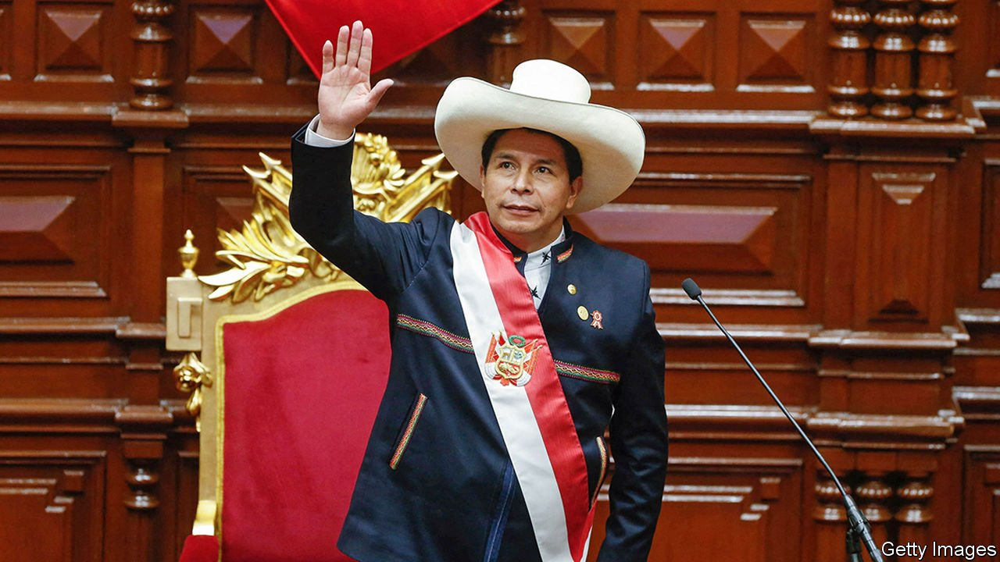

###### A gallop into the unknown

# Peru’s left-wing new president pushes for a new constitution 

##### But it remains unclear how radical Pedro Castillo can be 

 

> Jul 31st 2021 

IT WAS AN inauguration like no other in Peru’s recent history. Pedro Castillo, the new left-wing president, took office on July 28th following the narrowest of electoral victories in a bitterly divided country. But he delayed naming his cabinet until the following days, leaving Peru temporarily without a government. His inaugural speech was generally moderate in tone, promising “responsible change” in the economy and more money for health care and education. But he insisted that he will seek to install a constituent assembly to draw up a new constitution—the device used by left-wing populist strongmen such as Hugo Chávez in Venezuela and Evo Morales in Bolivia to concentrate power and hang on to it. For his inauguration he wore a collarless indigo jacket, seemingly copied from Mr Morales, as well as his trademark hat of cream-coloured palm fibre.

Mr Castillo’s inauguration took place on the 200th anniversary of Peru’s independence from Spanish colonial rule. In a populist gesture, he said he would not govern from the presidential palace, built on the site of the house of Francisco Pizarro, the Spanish conquistador of Peru. Instead, his office will be in Lima’s convention centre. A farmer, schoolteacher and union leader from Peru’s northern Andes, Mr Castillo is for some a symbol of those often ignored in the country’s political life.


In fact he is not the first mestizo (mixed-race) president, nor is he the first political outsider to secure the role. But of all Peru’s presidents, he was elected on the most left-wing platform, is the least experienced and has the weakest mandate, having won just 15% of the total vote in the election’s first round in April. He won a run-off election on June 6th by just 44,000 votes out of 17.5m, and only because many centrist Peruvians could not bring themselves to vote for his opponent, Keiko Fujimori, a conservative whose father Alberto ruled Peru as an autocrat in the 1990s.

It was not Mr Castillo’s fault that he was not declared the winner until July 19th. The delay was because Ms Fujimori cried fraud; her allegations were eventually dismissed by the electoral tribunal. But Mr Castillo has known for weeks that this was a near-certainty. He could have moved far more quickly to offer the country reassurance about his plans. He has said little in public since the election, and avoids media interviews. He appears mistrustful by nature. His closest aides are members of his large extended family and comrades from the teachers’ union.

The delay in naming a cabinet suggested Mr Castillo finds it hard to take decisions, and pointed to infighting between him and Vladimir Cerrón, the Marxist-Leninist political boss who runs Perú Libre, the hard-left party for which Mr Castillo stood. Everything suggests that Mr Castillo is drawing from a shallow talent pool.

He takes over in difficult circumstances. Peru has suffered greatly in the pandemic, with more officially recorded deaths as a share of population than any other country. Its feeble health system was overwhelmed. The economy shrank by 11% last year, while the official poverty rate rose from 20% to 30%. That fuelled rage against the political establishment, and was a factor in Mr Castillo’s victory.

Francisco Sagasti, the caretaker president since November, has laid the foundations for recovery, organising vaccinations. The economy may this year regain most of the lost ground. But the foundations remain fragile. “We have political polarisation instead of political leadership,” says Liliana Rojas-Suarez, an economist. The private sector is suspicious, especially of the idea of a constituent assembly.

The biggest question-mark is over the influence of Mr Cerrón, a Cuban-educated doctor. Only because he was prevented from running by a conviction for corruption when he was a regional governor did Perú Libre turn to Mr Castillo. More than half of Perú Libre’s 37 legislators in the 130-seat Congress answer to Mr Cerrón.

Mr Castillo has made some gestures of moderation. He has said he would retain the central-bank president, a respected professional. Pedro Francke, the probable new economy minister, is a moderate. Mr Cerrón has criticised him for sounding like “a Chicago boy—those who have failed for decades”. In fact Peru’s free-market economy delivered rapid growth, though political instability has eroded this since 2016. The poverty rate fell from over 50% in 2001 to 20% in 2019. The failures have been an unreformed state and public services.

To govern effectively Mr Castillo “needs to moderate in every way and Cerrón doesn’t let him”, says Gino Costa, an outgoing legislator for the centrist Morado party. Two polls this month found that only around 30% of Peruvians want a new constitution and radical changes in economic policy. Right-wing and centre parties have a majority in the new Congress. Mr Castillo said he would obey the existing constitution, which requires a majority in Congress and a referendum to amend it. It is not clear how he would reconcile this with his proposal for a constituent assembly.

Many on the right reject Mr Castillo’s presidency. Ms Fujimori said she would accept the election result but in the same breath that her supporters would work “to re-establish legitimacy”, a veiled threat to bring down the new government. The previous Congress had a taste for impeachment, trying it four times in three years. It forced the resignation of one president and impeached another. The opposition is not far from the 87 votes required.

Will Mr Castillo survive or self-destruct? His chief assets are plausible populist rhetoric and an image of honesty and authenticity in a country crying out for these qualities. “If he lasts a year he can probably last five” and complete his term, ventures a former minister. But that, and what those years would mean for Peru, will depend on the choices he makes in the coming weeks. ■

