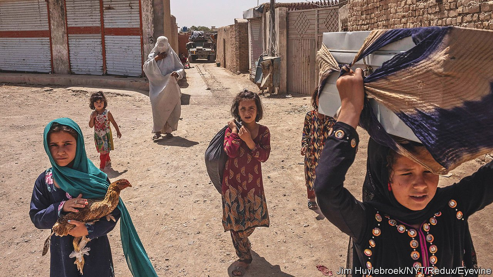
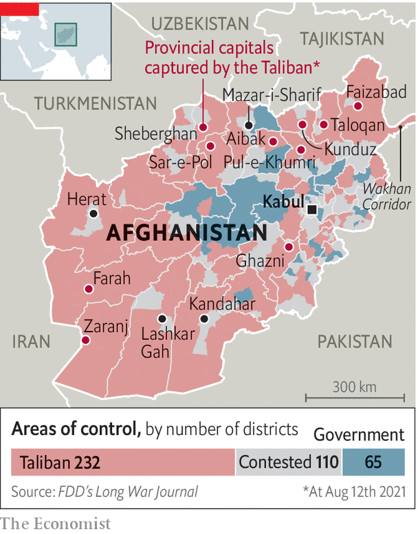

###### Making the best of a bad situation

# Afghanistan’s neighbours are preparing for life with the Taliban 

##### Regional powers are not looking forward to it. But they cannot agree on what to do about it 

 

> Aug 12th 2021 

TWO DECADES after Western forces helped sweep the Taliban from power, and four months after President Joe Biden announced his intention to end America’s permanent military presence in Afghanistan, the . Having captured swathes of the countryside since the spring, the Taliban have in the past week overrun ten of the country’s 34 provincial capitals. Significantly, most are in the north (see map), a region historically hostile to the insurgents. With government forces surrendering en masse and the army chief sacked, the group’s fighters have seized weapons and lucrative border crossings. Afghanistan’s four biggest cities, including Kabul, the capital, are now swamped with refugees and effectively under siege. American intelligence officials hint it may be only weeks before they fall.

For much of the past 20 years of simmering internal conflict and NATO military involvement, Afghanistan’s neighbours either shunned the country or meddled in pursuit of their own interests. Some encouraged Afghan proxies as a way to score points against each other. Others found Afghanistan a convenient place to kick sand in America’s face. But now, as the spectre looms of either a full takeover by a radical Islamist group with a well-earned reputation for nastiness, or a descent into all-out civil war, it is dawning upon regional players that they may have to step in.


“All of Afghanistan’s neighbours have already, in a soft manner, accepted that there will be a Taliban takeover,” says Umer Karim of the Royal United Services Institute, a think-tank in London. The trouble is that while few in the region relish having the Taliban move in next door, they cannot agree what to do about it. Instead, each of the neighbours is gingerly positioning for its own advantage.

 


Pakistan is the most significant. It has not only the longest border and deepest links with Afghanistan, but also close ties to the Taliban. Its powerful security establishment has long played a double game, publicly aiding America in its “war on terror” even as it secretly harboured Osama bin Laden and quietly sustained Afghanistan’s Islamist radicals. Concerned more by rivalry with a much-bigger India than with any danger from ragtag jihadists, Pakistan’s generals view Afghanistan as their own “strategic depth”. Their main goal has been to deny the space to anyone else, even if that meant using the Taliban as a cat’s paw, and even at the risk of blowback to Pakistan.

That risk is not a small one, as attested by the death of over 20,000 Pakistani civilians in a wave of Islamist terror between 2002 and 2016, much of it perpetrated by Afghan-linked groups. Even so, many in the Pakistani establishment are privately touting the Taliban’s imminent takeover as a victory for Islam, a defeat for America and a finger in the eye to India, which has given substantial economic and military aid to the Kabul government and this week evacuated its consulate in Mazar-i-Sharif.

Publicly, Pakistani officials say they have been blindsided by the speed of America’s departure and the disintegration of the Afghan government. They insist that they wished for a negotiated peace, not a military takeover by the Taliban. They also maintain that Pakistan has little influence over the Islamists. A Western diplomat in the region scoffs at Pakistani disingenuousness, suggesting that its generals will again burn their fingers playing with Islamist matches.

Iran, which shares another long border with Afghanistan, has a more tortured relationship with the Taliban. Its leaders are certainly delighted to see the Great Satan, America, abandon its bases next door. But as Shia Muslims who view their own Islamic revolution as a modernising movement—women can study, work and hold office in Iran, so long as they veil—they look askance at the Taliban’s hidebound Sunni fanaticism. Swamped for decades with destitute refugees and cheap heroin from Afghanistan, Iran is also worried about a new influx, particularly of Hazaras, a Shia ethnic minority that the Taliban have viciously persecuted in the past. With little leverage over the Taliban and no liking for the tottering government in Kabul, Iran is likely instead to lend support to local Afghan militias in the border region, which recently beat off a Taliban assault on the city of Herat.

A long, remote finger of Afghanistan, the Wakhan Corridor, abuts China. Asia’s rising superpower has largely kept aloof from its unruliest neighbour, contenting itself with moralising about the failings of Western intervention. As a close ally of Pakistan, however, Beijing has drawn warily closer to the Taliban, hosting a senior delegation from the group in July with the pomp afforded to visiting foreign ministers. Its main concern is that Afghanistan should not become a rear base for ethnic Uyghur separatists.

With a diplomatic savvy that belies their supposed commitment to a shared Muslim faith, the Taliban did indeed promise that their territory would not be used “against the security of any country”. The Chinese, however, will be aware of reports that Uyghurs count among thousands of foreign jihadists active in Afghanistan, mostly enlisted in Taliban ranks—and also that America was given a similar promise about al Qaeda, shortly before the attacks of September 11th 2001.

Having thrown a million Uyghurs into prison camps, China is probably pretty safe. This cannot be said of Afghanistan’s three smaller Central Asian neighbours, Tajikistan, Uzbekistan and Turkmenistan. Islamist radicals from all three former Soviet republics have taken refuge in Afghanistan. With the entire border now in Taliban hands they understandably fear that some militants will infiltrate back. All three countries have embraced closer military ties with Russia. To underscore renewed regional influence and send a warning shot to the Taliban, Russian forces have in the past week undertaken large-scale joint manoeuvres with Tajik and Uzbek troops along their Afghan borders.

Whatever their shared interest in preventing a full-blown catastrophe, Afghanistan’s neighbours have not, so far, proved helpful. At a UN Security Council meeting last week, India as chair kept out Pakistan, because Pakistan has in the past lobbied to exclude India from other meetings on Afghanistan. A series of parleys that brought regional players to Doha, the Qatari capital, on August 10th looked only slightly more positive. American negotiators attempted to press the Taliban to slow their offensive, threatening diplomatic isolation if they took over Kabul by force. Accustomed to drone strikes and cluster bombs, the Taliban delegates may have looked around the room and decided that this was a price worth paying.■

