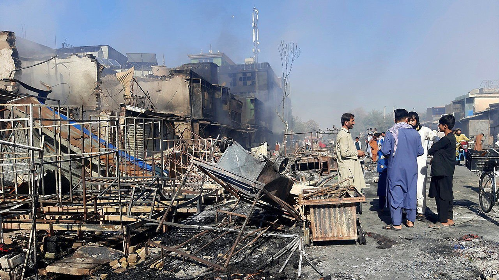
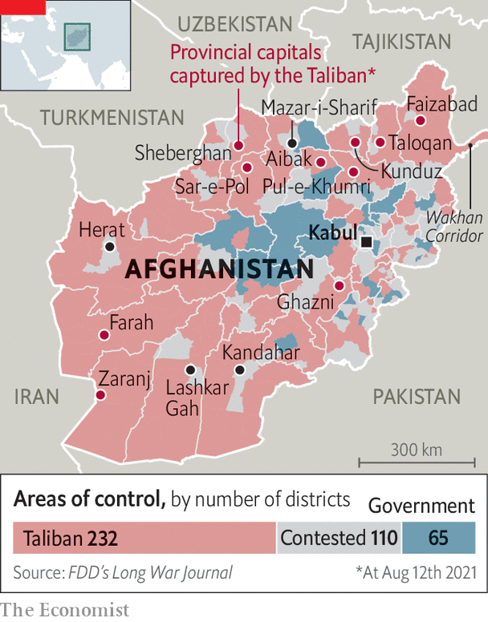

###### Pro-God, anti-Taliban

# Big-city Afghans are defiant in the face of advancing jihadists 

##### Residents of Kabul chant “God is greatest”, enraging their besiegers 

 

> Aug 10th 2021 

 This story has been updated since first publication on August 8th

ZARANJ, IN NIMRUZ province, was the first to fall, on August 6th. Sheberghan, capital of Jawzjan province, followed a day later. Kunduz, Sar-e-Pol and Taloqan went on August 8th. Aibak was taken on the 9th. Farah and Pul-e-Khumri collapsed on the 10th, Faizabad on the 11th and Ghazni on the 12th. In just one week, the Taliban have captured nearly a third of Afghanistan’s 34 provincial capitals.

 had previously been confined mostly to rural districts. The government in Kabul believed that the insurgents lacked the firepower or numbers to seize towns. That proved optimistic. The fall of the Afghanistan’s biggest cities—Kabul, Kandahar, Herat, Mazar-i-Sharif—is not inevitable, but the mood is grim. “We will overcome this. We will come out stronger and wiser... We will come out like a phoenix,” the vice-president, Amrullah Saleh, said on August 6th, trying to exhort his nation to defiance. Yet morale is low, and the Taliban’s slick propaganda machine is in overdrive.


Many Afghans, however, have responded with defiance. In recent days thousands of people have gathered in the streets and on the rooftops of big cities, including Kabul, to wave the nation’s black, red and green tricolour, chanting “God is Greatest!” The displays began in the western city of Herat, close to the border with Iran. What started as a suggestion on social media was taken up by Ismail Khan, a local warlord who has remobilised his militia to defend the city. Kabul followed Herat’s example the following evening. Similar displays have followed since in many cities.

 


The chants are both a direct challenge to the Taliban and a vow of support for the Afghan forces, says Saddaf Yarmal, a 20-year-old student who took part. “We have to support our own country,” says Mahjabin Siddiqi, a 23-year-old student, adding, “For 20 years the Americans have been here, but we haven’t seen good results. It has to be us.”

The choice of the phrase “Allahu akbar!” as a rallying cry is pointed. Not only did the same shout form the soundtrack to the resistance to Soviet occupation in the 1980s, but it also directly challenges the Taliban’s claim of a religious mandate to rule. The jihadists assert a direct link to the insurgency that forced out the Russians, portraying their struggle as the latest battle against an un-Islamic regime in Kabul.

A spokesman for the Taliban therefore reacted angrily online to the use of the slogan, claiming ownership of it even though the phrase appears on the flag of Afghanistan. He said that the militants had waged jihad with those words for 20 years and that they should not be used by “American slaves and secularists”.

The defiance on display in Afghanistan’s big cities is directed not only at the Taliban, but also at neighbouring Pakistan, where much of the Taliban’s leadership lives and where their fighters have at times found havens. As the security situation has worsened, anti-Pakistan feeling has grown. “Day by day it’s getting more clear that Pakistan is interfering in our internal issues,” says Javid Safi, a lawmaker from Kunar province, which borders Pakistan.

Both Afghan and withdrawing Western military commanders maintain that the Taliban are not an unstoppable juggernaut. A couple of government victories, or even battles that end in stalemate, could change the dynamic. But the insurgents are on the front foot. The ten towns just lost to them are unlikely to be the last.■

