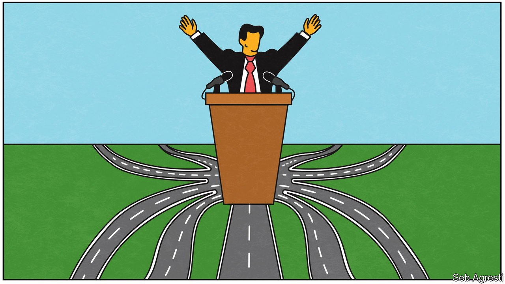

###### Banyan

# Democracy is decaying in a growing number of Asian polities 

##### Elected autocrats are undermining checks and balances 

 

> Aug 14th 2021 

MOST DEMOCRACIES would struggle to match the productivity of India’s Parliament. During its “monsoon” session, which ended on August 11th, a score of bills covering everything from coconuts to bankruptcy have passed the upper or lower house, or both.

Alas, the reason why laws pass so easily is far from benign. Under Narendra Modi, the prime minister since 2014, the ruling Bharatiya Janata Party (BJP) has eroded many of the checks and balances that underpin true democracy. Elections themselves are largely free and fair. But defamation laws are abused to hound critics. Political opponents are intimidated and even imprisoned. Over 7,000 Indians have been charged with sedition under the BJP, casting a chill on civil society. In a scandal that would topple any accountable government, a global investigation by a group of newspapers and NGOs suggests that Mr Modi’s government has slipped Israeli eavesdropping software called Pegasus into the mobile phones of hundreds of Indians, including opposition leaders, journalists, a former top election official and senior civil servants. As yet, it has faced no serious consequences for an act which, if proven, would no doubt be illegal as well as illiberal.


As for Parliament, Mr Modi and his sidekicks think of it not as a deliberative body but as a rubber stamp. They can do this because the opposition are disorganised and lethargic. Granted, opposition MPs are now demanding a debate and investigation into Pegasus, and boycotting Parliament to press their demands. Alas, the boycott plays into the prime minister’s hands, at least for now, as he bulldozes through his bills. One was discussed for just a single minute. A bankruptcy code of national significance commanded the monsoon session’s longest deliberation—a full 39 minutes.

This is no way to run a country. The V-Dem Institute at the University of Gothenburg, which produces an annual report on the state of democracy around the world, declared this year that India has gone from “electoral democracy” to “electoral autocracy”, as autocratic as Pakistan and worse than Bangladesh or Nepal. It is not the only Asian state where democracy is under assault.

Like unhappy families, every decaying democracy is unique. Myanmar has reverted to full-blown military dictatorship. Sri Lanka has fallen under a family dynasty. Four Rajapaksa brothers run the place, including the president and prime minister, and a younger Rajapaksa generation is on the make.

In Indonesia, elections are free and fair. But President Joko Widodo, or Jokowi, has hollowed out democracy by gutting the anti-corruption commission and co-opting the opposition, thus fostering cronyism and ministerial ineptitude. Malaysia’s gerrymandered constituencies have long ensured the dominance of parties pandering to the ethnic-Malay, Muslim majority, at the expense of secular or multiracial representation. Recent rot has been occasioned by grabs at power by shifting groupings of the Malay elite. The current prime minister, Muhyiddin Yassin, came to office last year in a backdoor putsch. His power now hangs by a thread, with supporters offering to buy opposition MPs’ support. None of this helps ordinary Malaysians cope with the pandemic or the accompanying economic crisis.

Though countries or territories are all unhappy in their own way, certain shared attributes signal a lurch for the worse. One is the use of investigative authorities to go after domestic foes. In India, after Dainik Bhaskar, a media group, highlighted the government’s bungling of covid-19, tax inspectors launched a raid. Hong Kong was never a democracy, but until last year’s promulgation of a draconian security law at least limited elections gave voice to an opposition. Since then Hong Kong’s most critical newspaper has been closed and national-security cops now vet political candidates. Aspiring to win is, for a Hong Kong democrat, seditious.

Can the rot be stopped? Indian democracy survived Indira Gandhi’s dictatorial Emergency from 1975 to 1977. Today some see the opposition’s coming-together over Pegasus as the beginning of its revival, while a new chief justice is showing welcome independence. In Sri Lanka voters have a record of turfing governments out, and have done so once already with the Rajapaksas. Yet each burst of autocracy leaves democratic norms a little more battered. Once they are broken, it is hard to put them back together, whoever is in office.

