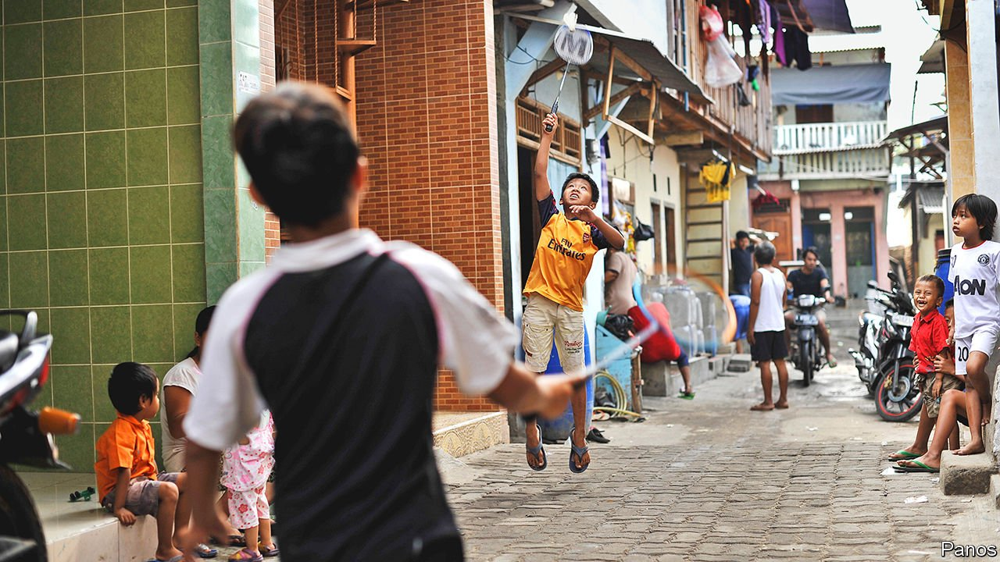

###### A pretty good racquet

# How Indonesia became the home of badminton 

##### Government support, fanatical fans and world-beating players have made it the country’s favourite sport 

 

> Aug 14th 2021 

W HEN THE Chinese players whacked the shuttlecock out of bounds on August 2nd, giving Indonesia its only gold medal at the Tokyo Olympics, the winning team of Greysia Polii and Apriyani Rahayu collapsed onto the floor and sobbed with relief. Some 3,500 miles away, the Indonesian archipelago erupted with joy. Fans bursting with pride celebrated online, filling each others’ phones with tweets and memes. The president declared their triumph in the women’s doubles game an early “birthday gift” to the nation (its independence day is on August 17th). The badminton champs have been promised, among other things, prize money of 5bn rupiah ($347,000) each, houses, meatball kiosks and five cows.

In England, where the modern version of the sport originated, badminton is a lawn game, played by people drunk on Pimm’s and sunshine. In Asia it is a serious business. At the Badminton World Championships in 2019, Asian countries won 19 of 20 medals. In recent decades China has emerged as a heavyweight. But Indonesia is the sport’s juggernaut. It has won more titles at the Thomas Cup, the most prestigious tournament, than any other country. Badminton is the only sport in which it has ever won gold at the Olympics—and it has done so at all but one since the sport was introduced in 1992. Indonesia is the “home of badminton”, Kompas, a newspaper, boasted after the match.


Wherever one travels in the archipelago, says Raja Oktohari, president of the Indonesian Olympics Committee, “within a second you can find people playing badminton.” It is simple to get a game going. Racquets and shuttlecocks can easily be bought or made (just stick some feathers into a cork), and once a clothesline and an opponent have been located, the match is on.

It is little wonder then that badminton is Indonesia’s favourite sport. It is also the country’s most developed, and boasts the only national team for which the government runs a training centre. Scouts scour the country’s 3,500 badminton clubs for fresh talent. Parents encourage their children to take it up. The rewards for skill and hard work are handsome—not always a given in a country where corruption and nepotism are rife. Broto Happy, the Indonesian Badminton Association’s spokesman, estimates that new recruits to the national squad earn about 30m rupiah ($2,087) a month, ten times the average income. Those in the top tier can earn billions of rupiah through sponsorship deals. Ignatius Sunito, a sports journalist, noted two decades ago that badminton “eliminates suffering, poverty, powerlessness and injustice”.

Perhaps most importantly, badminton is a source of national pride. It is the only sport to produce a string of heroes; Rudy Hartono, for instance, has won eight titles at the All-England men’s singles, more than any other player. Many of its champions come from ethnic minorities. As Mr Raja says, the sport “cannot be separated from Indonesia”.

