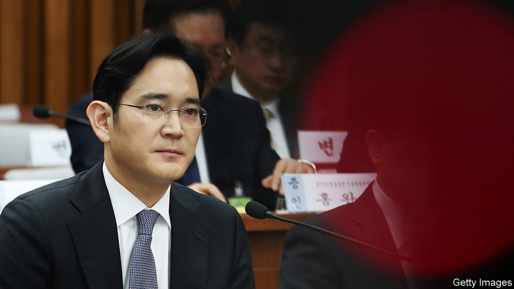

###### The ties that bind

# The release from prison of Samsung’s de facto boss raises eyebrows 

##### Relations between South Korea’s government and its businesses remain cosy 

 

> Aug 12th 2021 

WHEN THE office of Moon Jae-in releases the names of people the South Korean president will pardon on National Liberation Day on August 15th, as is customary, Lee Jae-yong, the de facto boss of Samsung, will not be on the list. That is in keeping with the president’s promise not to use his powers to pardon prominent white-collar criminals “for the good of the economy”, as is also customary.

The absence from the list of Mr Lee’s name should not, however, be seen as evidence that the president has been true to the spirit of his promise. That is because Mr Lee no longer needs the pardon. On August 9th the justice minister said that the erring Samsung boss would be released on parole on August 13th. The decision, he said, took into account the formal requirements for granting parole as well as—what else—the difficult economic situation in the country.


Mr Lee was sent to prison for bribing Park Geun-hye, the previous president, to obtain her government’s support for a merger in 2015 that solidified his control over Samsung. Other leaders of South Korea’s chaebol, or conglomerates, had been lobbying Mr Moon to pardon Mr Lee so he could return to the helm of Samsung and steer the company through intensifying competition with rival chipmakers. They welcomed the decision. So did the conservative opposition, which said it showed that the government cared about fixing the pandemic-pummelled economy.

By contrast, corporate-governance activists and critics from Mr Moon’s own camp were incensed. PSPD, a group that is close to the governing Minjoo party and played an important role in protests that brought down Ms Park in 2017, called the decision a “death sentence” for justice. It said it would encourage business leaders to continue to commit crimes in the expectation that they would get off lightly. Senior Minjoo members said the decision showed the government had betrayed its principles and cared little for fairness.

They have reason to gripe. Formally, Mr Lee has fulfilled the conditions for parole, because the justice ministry changed them in April. Inmates are now required to have served at least 60% of their sentence to become eligible, rather than 80%, as used to be the case.

Unlike the formal requirements, softer criteria for parole, such as admitting the crimes and showing remorse for them, are less obviously fulfilled in Mr Lee’s case. Park Sang-in, an economist at Seoul National University who studies the power of the chaebol, considers freeing Mr Lee extremely unusual given the serious nature of his crimes, let alone the fact that he is still on trial for charges related to the ones for which he was sent to prison in the first place (Mr Lee denies the charges in the case that is still pending). “This is just a way for Moon to let him out without explicitly breaking his election promise,“ he says.

The justice ministry has yet to say whether it will grant Mr Lee an exemption from the employment ban imposed on those convicted of economic crimes and allow him to return to his day job at Samsung. But he is widely expected to do so eventually, even though it is unclear whether his absence has actually had any negative impact on the company’s day-to-day business.

Most South Koreans apparently do not mind much. In two polls conducted in late July, around two-thirds said they were in favour of releasing Mr Lee. They were feeling less generous about crooked politicians, some of whom have in the past been pardoned for their misdeeds by their successors. The majority of respondents in both polls thought Ms Park, who is in prison for taking Mr Lee’s bribes and abusing her power, or Lee Myung-bak, her predecessor, who is there after being convicted in a separate corruption case, should remain locked up. Neither is therefore likely to appear on Mr Moon’s list this time around, reckons Mr Park. As yet ineligible for parole, the pair will probably have to celebrate Liberation Day in their cells—unlike the boss of Samsung.■

