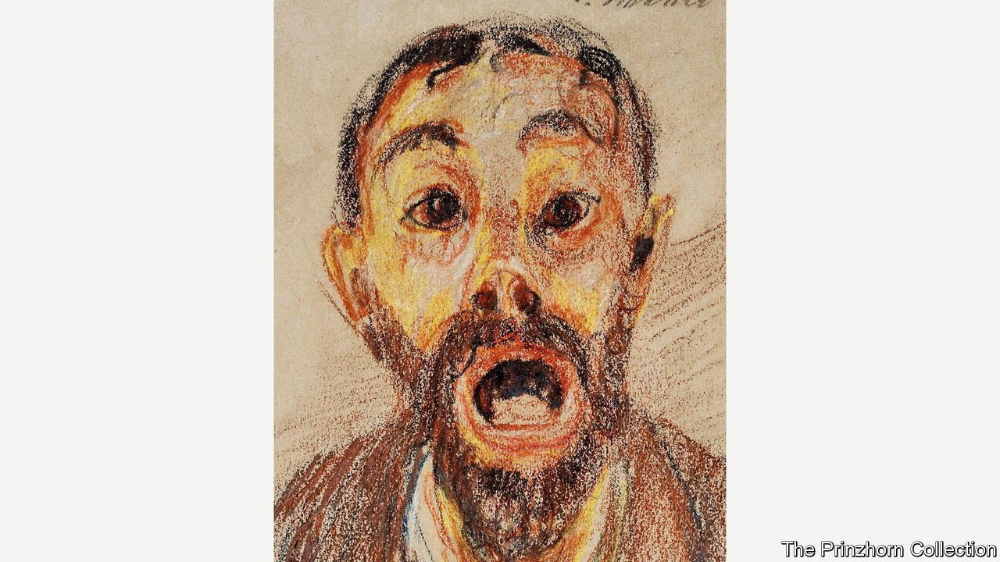

###### Mental illness, art and the Nazis

# A doctor recognised his psychiatric patients’ art. Hitler disagreed 

##### The story is movingly told in “The Gallery of Miracles and Madness” 

 

> Aug 14th 2021 

The Gallery of Miracles and Madness. By Charlie English. Random House; 336 pages; $28. William Collins; £20

HOW TO APPRAISE art by people with severe mental illnesses has long exercised critics. For a tragic period in Germany in the middle of the 20th century, the opinion of a single arbiter—who decreed that such work could not count as art, and that those who made it should be exterminated—was the only one that mattered. Adolf Hitler’s failure as a watercolourist did not undermine his belief that in essence he was an artist, and that his guiding principles were somehow artistic in character. “The Gallery of Miracles and Madness”, Charlie English’s engrossing new book, charts the catastrophic clash between Hitler’s aesthetic views and the efforts of his contemporaries to expand the notion of what art might be.


The Prinzhorn collection at the University of Heidelberg’s psychiatric clinic was established after the first world war by Hans Prinzhorn, a young doctor who also held a PhD in art history and was a professionally trained baritone; later he would translate D.H. Lawrence’s fiction and become a champion of Navajo rights. He began to reconsider work by patients that had previously been used purely for clinical observation. The paintings, collages, poems, sculptures, music and embroidery were vividly original and often disturbing, full of torment and ecstasy and seeming to offer fresh, unfiltered depictions of the human condition. The patients used whatever materials they could find, including menus, nursing rosters and toilet paper. Their subjects ranged from fantastical machines and erotic bicycles to royalty, murder and religion.

The work embodied psychotic realities and relayed messages from isolation, explains Mr English. Prinzhorn’s achievement was to declare that it was art, and to liberate it “from the psychiatric clinics and nursing institutions where it had been made, and release it into the wider world”. He was remarkably well-connected in cultural circles and his collection was enthusiastically received by a contemporary art scene itself traumatised by the recent war. Early supporters included the painter Paul Klee and the architect Walter Gropius. But it was the Surrealists who were most avid in their embrace, particularly Max Ernst and André Breton, and later Salvador Dalí who, preposterously then and offensively today, is said to have spent most of the 1920s trying to go insane so as to achieve the same primal insights.

The rise of Nazism made this renown, and the association with mental illness, fatally dangerous. Hitler’s antipathy to modern art had long been fused with ideas of racial purity, “degeneracy” and judgments as to what—and who—deserved to exist. Some vulnerable artists escaped from Germany, but Prinzhorn’s incarcerated patients were subjected to persecution that quickly escalated from forced sterilisation to systematic murder by gassing, in a pattern that would soon extend to millions of other victims.

Mr English is a fluent storyteller and patiently exhumes the lives of artists such as Franz Karl Bühler, a metal-worker who had represented Germany at the Chicago World’s Fair in 1893, later producing paintings that were compared to the work of Matthias Grünewald and Albrecht Dürer (see picture). August Natterer was an electrical engineer and a favourite of the Surrealists; they admired his attempt at scrupulous accuracy in conveying the hallucinations that followed a breakdown brought on by sexual trauma. Wilhelm Werner drew cartoons of his own sterilisation. Altogether more than two dozen of Prinzhorn’s artists were murdered by the Nazis; “The Gallery of Miracles and Madness” affords them a respectful appreciation.

In his last days in his bunker, Hitler retreated from the cataclysm around him into artistic delusions of remodelling his hometown of Linz into a great cultural centre. His creative ambitions once again came to nothing. Yet the work of these artists, much of which miraculously survived the war, lives on as testament to the variety of human experience, and of ways to communicate what it feels like to be alive. ■

