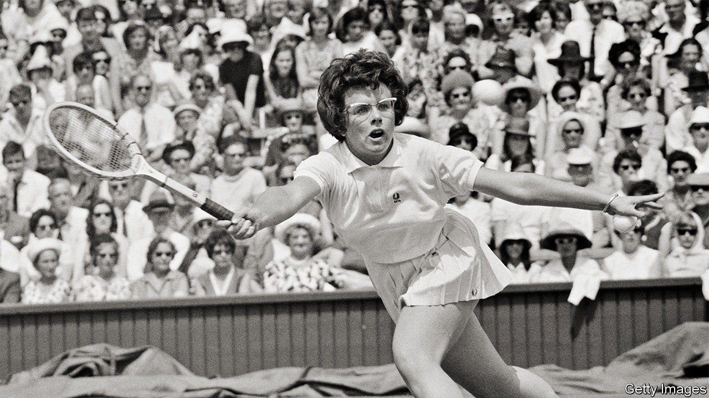

###### Women in sport

# Billie Jean King was a champion on and off the court 

##### True to its name, “All In”, her autobiography, is bracingly candid 

 

> Aug 14th 2021 

All In. By Billie Jean King. Knopf; 496 pages; $30. To be published in Britain by Viking in September; £20

AT THE AGE of 15, Billie Jean King anticipated the trajectory of her life in a school essay. A tennis prodigy, she thought she would soon make it to Wimbledon but lose in the quarter-finals. On the flight to London she would meet a heart-throb and fall in love. In time she would be happily married, “sitting with my four wonderful children” and grateful to have an education and a husband, “instead of turning out to be a tennis bum”.


Luckily for fans at the All England club, Ms King proved better at slicing backhands than at prophesy. Between 1961 and 1979 she won six Wimbledon singles titles and 14 in doubles in one of the 20th century’s great sporting careers. She never had children, and defended abortion rights with the example of her own terminated pregnancy. She did marry a man, but later emerged as a figurehead for gay rights.

In “All In”, a perceptive autobiography written with Johnette Howard and Maryanne Vollers, Ms King notes that her youthful prediction reflected the stifling boundaries that hemmed in American girls in the 1950s. Few women had careers; professional women’s sports barely existed. When she began winning tennis trophies, first near home in California, then in Europe, she encountered shocking pay disparities. To her disgust, for instance, in 1970 the Italian Open offered $3,500 to the men’s champion and $600 to the women’s.

Other indignities followed. Journalists focused on female athletes’ looks, not their achievements. Ms King refused to play to type and faced snide criticism. Her outspokenness was derided. Male stars offered no support, laughing off the notion that fans came for ladies’ matches.

She pursued equal pay relentlessly. A pragmatist, she arrived at a meeting with the US Open’s tournament director in 1972 with corporate funds in hand to bridge the prize gap. She vowed that most of the top women would not participate the following year if he refused. (He agreed.) She organised the Women’s Tennis Association in 1973 and became its first president. Later that summer she won Wimbledon in singles, doubles and mixed doubles. Today women compete for equal prize money in all four Grand Slam competitions. The world’s best-paid female athlete is routinely a tennis player.

Ms King’s highest-profile match was the “Battle of the Sexes” in 1973. Bobby Riggs, a loudmouth with hidebound views and a knack for publicity, challenged her to a friendly exhibition. She recognised the stakes and took care not to underestimate her opponent, studying his game and developing a plan to make the older man run. And run him she did, under the carnival lights of the Houston Astrodome, with 30,000 people cheering and 90m more tuning in at home. Countless admirers later told her what her win meant to them, she writes, including Barack Obama, who saw her practise in Hawaii in the 1970s.

True to its title, “All In” is bracingly candid. Alongside the sporting and political battles it tells of the eating disorder from which Ms King suffered, a sexual assault she experienced as a teenager and the whirlwind of being outed as a lesbian by a former lover in 1981. Ms King does nothing by half-measures—so much the better for readers, sport and the many women she encouraged and empowered. ■

