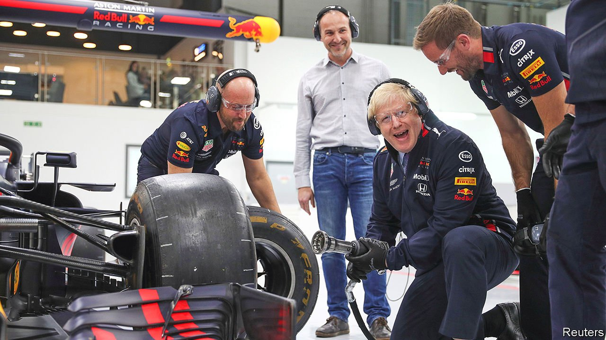
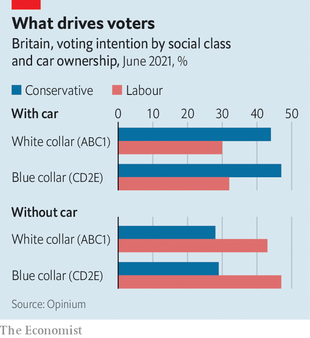

###### The petrol party

# Boris Johnson’s strained love affair with the motorist 

##### At least, if he keeps to his green promises 

 

> Aug 14th 2021 

REVIEWING THE new MG, a dinky sports car, the motoring correspondent of GQmagazine fondly recalled a trip of his youth in an earlier model. With only two seats, a female fellow passenger balanced on his thighs, “which was my secret plan”. “After a quarter of an hour of bouncing down the M40, the contours of my lap are, topographically speaking, beginning to resemble the gear stick,” he explained. Later, the woman turned around, “and her chest is in my face, and oooooof...”

Boris Johnson, Britain’s prime minister and the author of that literature, made his name among Tories with his journalistic dispatches from Brussels. For the rest of the country, particularly young men, it was cars. As a young parliamentarian he was a star guest on Top Gear, a television show in which middle-aged men hurtle around race tracks. On the campaign trail he is found spinning doughnuts, posing as a pit stop mechanic and discussing his motorbike—“a midlife crisis,” he sighs.


The Conservatives are the party of the motorist. For the past two decades, roughly a quarter of households have had no car, but among those that do, a growing share has more than one, with car financing making flashy models increasingly affordable. The gap between drivers and drive-nots is an important predictor of voting behaviour, says Chris Curtis of Opinium, a pollster. At the general election in 2019, the Tories had a 17-point lead among car owners, while Labour had a 17-point lead among those without. These allegiances cut across social classes, with white- and blue-collar workers splitting according to their driving habits (see chart).

 


This reflects Britain’s new electoral geography. Labour performs best in cities, such as London, where car ownership is lower. Workers in the so-called “red-wall” seats that Mr Johnson won in 2019—and which are often comprised of new estates and industrial parks—are more likely to commute by car than voters elsewhere, including established Conservative seats.

Whereas Tony Blair, a former Labour prime minister, courted “Mondeo man”, Jake Berry, a northern Tory MP, has dubbed Mr Johnson’s archetypal supporter “truck man”: a tradesman with kids and a pickup who embodies hard work and self-reliance. In the 2019 election, Jeremy Corbyn, Labour’s leader and a keen cyclist, said he would make Britons less dependent on cars. Mr Johnson promised £29bn ($40bn) for road improvements and a national campaign against potholes.

Yet the prime minister’s environmental ambitions may dissolve this bond. In November Britain will host the 26th UN climate-change conference, known as COP26. Last year Mr Johnson announced the country would end the sale of diesel and petrol cars by 2030, a decade earlier than planned. He has promised carrots, in the form of subsidies for battery factories and charging infrastructure, which is currently patchy. The Royal College of Art has been commissioned to design plug-points as handsome as Giles Gilbert Scott’s famous red phone box.

The stick, which he is yet to wield, sits in the tax system. The levy on fuel has been frozen since 2011, resulting in the Treasury taking £11bn less this year than if successive planned rises had gone ahead. That has caused the cost of driving to fall relative to wages over the past decade. At some point, the government says, road taxes will need to be overhauled to encourage the uptake of electric cars and replace lost revenues as behaviour changes.

Mr Johnson’s green ambitions are popular. A majority of motorists and non-motorists agree that climate change is a “real issue, and it is as bad as often described”, according to Opinium. His future policies may not be. Drivers are far more likely to say fuel duties are too high. That makes some Tory MPs restless. Craig Mackinlay, leading a new “net zero scrutiny group” in Parliament, calls on Mr Johnson to “stand up to the climate fanatics” and abandon the 2030 sales ban. Taking on the petrolheads will require political courage, and all the blokey charm of a GQ car reviewer. ■

