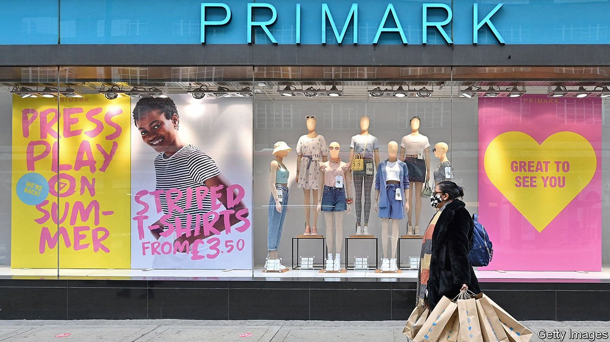

###### International trade

# Brexit Britain wants to liberalise trade with poor countries 

##### How much good it does depends on the details 

 

> Aug 14th 2021 

AMONG THE arguments for Brexit was the idea that Britain could do far more trade with the world’s poorest countries. High EU tariffs, it was claimed, posed an insurmountable barrier for poor farmers.

That was not quite true. Under the EU’s rules, dozens of poor countries, including Angola and Bangladesh, face no tariffs on “everything but arms”. Somewhat better-off countries like India enjoy reductions on two-thirds of tariff lines, which can be cut to zero if they adhere to 27 international conventions on labour rights, the environment and the like.


Yet Brexit does afford an opportunity for liberalisation, which Liz Truss, the trade secretary, is keen to exploit. Although some countries make extensive use of the EU scheme when trading with Britain, others, particularly in Sub-Saharan Africa, do not. One option being considered by Ms Truss is a big loosening of the “rules of origin”, which define where a product comes from. Another is to widen the pool of products from low- and middle-income countries which qualify for reduced tariffs, to include some chemicals, bicycles, leather and other things. (Britain can be more radical than Europe where it does not have big domestic industries to protect). A further idea is to reduce the number of conventions that poorer countries must sign up to, making the “enhanced” scheme more attainable, and thus worth striving for.

All of this is good news for clothes retailers, such as Primark, a discount chain, that source lots of stock from poor countries. The company has told lawmakers that buying Ethiopian socks made with Chinese yarn is a tangle, due to rules of origin. Marginally lower prices for British shoppers may follow. How much the world’s poorer countries stand to benefit from any reform depends on how it is designed. Cutting tariffs too far for middle-income countries could blunt the advantage of tariff-free trade for their weaker neighbours—a concept known as preference erosion. “What really matters is: are you getting a leg-up relative to your competitors?” says L. Alan Winters of the UK Trade Policy Observatory at the University of Sussex.

Professor Winters and his colleagues have identified around a thousand tariff lines that could be cut—including on jams, tuna and pineapple—that would benefit middle-income countries such as Indonesia and Vietnam, without disadvantaging the poorest countries, simply because they don’t produce these goods. Ms Truss wants the new scheme to come into force next year. Some trade-watchers think that is too fast; the government is in a rush to have something to show for Brexit.

For more coverage of matters relating to Brexit, visit our 

