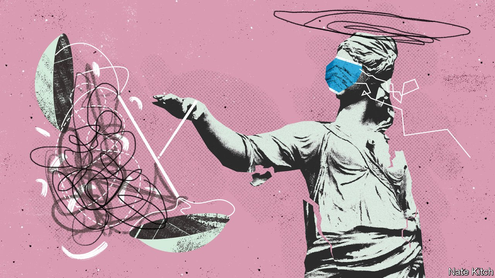
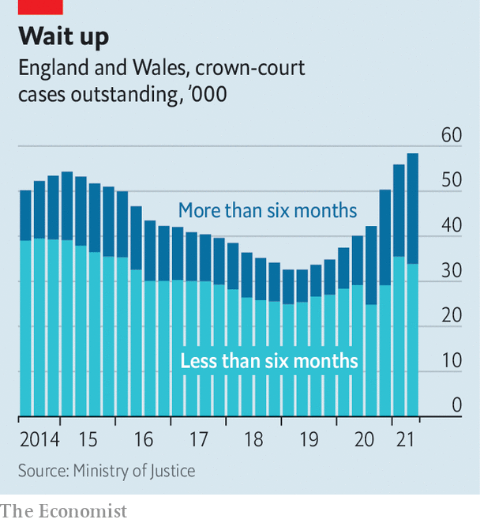

###### In trouble with the law

# Britain’s courts are in a mess 

##### Covid-19 has made a bad situation much worse 

 

> Aug 14th 2021 

AT SNARESBROOK CROWN COURT, in suburban east London, a trial is coming to an end. The barristers, replete in gowns and wigs, have presented their cases; the jury watches as the judge sums up the evidence. The defendant, a young man accused of raping a child, sits impassively in the dock, his face covered by a mask.

Justice is being done. But it has been a long time coming. The alleged offences happened several years ago. The case took over a year to investigate and the trial was then delayed five months more by England’s covid-19 lockdown. It has only now reached a court. When the jury leaves, the judge calls in a different set of barristers. They must decide whether a man accused of burglary can be kept in prison for longer than would normally be legal, because of a failure to find a slot for a trial in time.


Britain prides itself on its legal system. Its commercial courts are favoured by firms all over the world for their efficiency and impartiality. But the routine administration of justice has not been in such a dire state for decades. At the end of the first quarter of 2021, there were nearly 60,000 outstanding cases at crown courts, which deal with the most serious cases. That is 45% more than a year previously, and the highest level ever recorded. At Snaresbrook, even the grand Victorian building is a wreck. The outside is covered in scaffolding; the air conditioning frequently fails, leaving everyone sweltering.

The family courts are in a similar state. Divorces where there is no dispute over money or custody of children are being resolved online, often faster than before. Tougher cases are not. The average time taken to resolve a private dispute involving children is a third greater than a year ago, at 40 weeks. Financial disputes are barely seen at all. “Lots of warring couples are in a state of flux”, says Aysen Soyer, a solicitor in north London. The courts service reckons it could take until 2023 for the backlog to return to pre-pandemic levels.

Some of the blame lies with covid-19. Many hearings, particularly in civil cases, were moved online. But in England and Wales, jury trials were not conducted remotely (in Scotland, which has its own system, a few were). So while some justice was able to continue—cases with a guilty plea, for example—a backlog quickly built up.

The bigger problem is that the virus burdened a system that was already under serious strain. “There was nowhere to hide,” says Max Hardy, a criminal barrister. In 2019 spending on the courts was 18% lower than it was in 2011; spending on the Crown Prosecution Service (CPS) was 32% lower. There is now little capacity to undo the backlog.

Legal aid, which pays most defence lawyers, is a particular pinch point. Rates were last increased last century, and were cut by nearly 10% in 2014. “Maybe in the 1980s barristers were living the life of Riley” says one at Snaresbrook. “Now, not so much.” He complains about being stiffed for his work on a drugs trial, where a “lorryload” of cannabis went unweighed, depriving him of a higher rate for a more serious offence. The number of legal-aid firms has nearly halved since 2010. With trials moving again, there are simply not enough lawyers to do the work.

According to Lucy Welsh, an academic who counts herself among the number of former criminal lawyers, the result is weaker cases. The longer one takes to come to trial, the fuzzier the memories of witnesses and victims become. That is if they make it to court at all. Since 2015 the proportion of cases that fold because the victim withdraws has risen from 9% to 26%. Dame Vera Baird, the government’s victims commissioner, has said that rape is effectively “decriminalised”: the number of cases that are completed has fallen from more than 5,000 in 2016 to just 1,500 last year. Delays are not fair on the accused either. The number of people in prison awaiting trial has increased by 40% since June 2019, even as the overall prison population fell.

In the family courts, delays mean children can wait years to find out how they will split their time between parents. Disputes about money leave people unable to move on with their lives. Ms Soyer says a recent case of hers took almost two years and burned through most of the couple’s shared assets. Having hearings online made agreement all the harder. “The judge really does need to see people,” she says.

The government plans to improve things. In April it announced it would lift one of its austerity measures in England and Wales: a cap on the number of “sitting days”, which limits how many courtrooms can operate. It has increased spending on the CPS, though not on legal aid.

It also hopes to make courts more efficient. More hearings will be held online, and more crimes will be prosecuted using so-called “single justice procedures”, in which defendants who admit guilt do not need to come to court (these have previously been limited to motoring offences and, more recently, lockdown breaking). The government has also proposed extending court hours from 10am-4pm to 9am-6pm, which would allow two trials to be seen in one day.

 


Yet these proposals will not be enough. More sitting days are not much help if there are not enough lawyers and judges. Nor do barristers see it as their job to help ministers out of a hole. They are fiercely opposed to working longer days, arguing they need evenings to prepare cases and travel long distances to court.

The government is also piling pressure on the system. It is in the process of hiring 20,000 more police officers. If they make more arrests, as is presumably the intention, that will mean more charges and more trials. The Institute for Government, a think-tank, reckons spending on the courts will not rise enough to cope with the extra demand, let alone to crunch through the backlog.

If this concerns ministers, they show little sign of it. On July 28th Boris Johnson, the prime minister, attacked “left-wing criminal-justice lawyers”, who he accused of working alongside the opposition Labour Party to stifle his plans to tackle crime, which involve tougher sentencing. But in reality, it is his government’s stinginess that is wrecking them. A tougher sentence is not much good if the case collapses in the meantime.■

