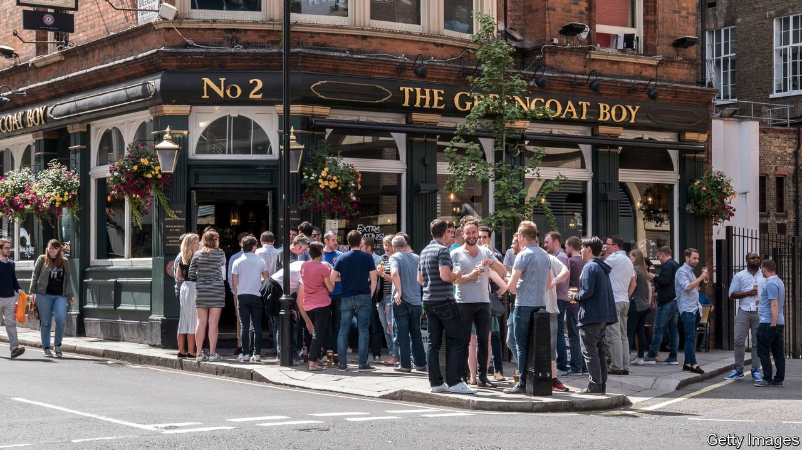

###### Nothing too gruesome

# Britain’s economy: less scarred by covid-19 than had been feared 

##### Rishi Sunak, the chancellor, has money to play with 

 

> Aug 14th 2021 

ECONOMIC FORECASTING is difficult, especially during a pandemic. On August 12th the Office for National Statistics (ONS) reported that GDP grew by 4.8% in the second quarter of this year, leaving the economy just 2.2% below it’s pre-pandemic level. The pace of recovery slowed a little in July as covid-19 cases spiked. Even so, official government forecasts from earlier in the year now look absurdly pessimistic.

The Office for Budget Responsibility (OBR), a fiscal watchdog responsible for forecasting, made its most recent predictions in March. They were drawn up amid a lockdown and with the progress of the country’s vaccination campaign still uncertain. So the watchdog cautiously forecast annual GDP growth of 4%. After a fast vaccine roll-out, economists now expect annual growth of around 7%.


With growth perkier than expected, borrowing looks set to substantially undershoot the OBR forecast. When Rishi Sunak, the chancellor, set out his plans at the budget in March he expected government debt to rise by £234bn ($324bn, or around 10% of GDP) in the next year. The median forecast from private-sector economists now stands at almost £20bn less.

The next set of OBR forecasts, due in the autumn, will thus make more pleasant reading for the chancellor. Ordering people to stay at home caused an immediate slump in demand, but that has reversed as restrictions have eased. Not only has the recovery been faster than expected, the structural damage wrought by the pandemic appears to be less daunting.

In March the OBR expected the economy to be 3% smaller by the mid-2020s than it would have been in a world without covid-19. The pace of the recovery calls that into question. What once appeared to be serious scars may in reality be nasty bruises: not pleasant to look at it, but something that will fade with time.

The fiscal watchdog’s 3% drop assumed a 1% fall from a lower labour supply (as foreign workers returned home during the pandemic) and a 2% fall from weaker productivity (as work patterns were disrupted). Both estimates now look questionable. Population estimates have become less reliable during the pandemic, but reports earlier this year of mass emigration now look wide of the mark. Productivity forecasts may also prove unduly pessimistic. As covid-19 restrictions have been rolled back, the cost of compliance has fallen. Some firms even report that working from home has made them more productive.

The Bank of England now assumes that the long-term scarring will amount to 1% of GDP. Treasury officials expect the OBR to move towards Threadneedle Street’s view. A larger economy means higher tax revenues and less pressure on spending. According to the OBR, a 1% rise in GDP means a fall in borrowing equivalent to 0.7% of GDP after two years.

At the moment the OBR is forecasting that the current budget, which excludes capital spending, will be balanced by March 2026. If the fiscal watchdog was to adopt the Bank of England’s estimate of the lasting hit instead, then the budget would be running a surplus of around 1.5% of GDP by then. The chancellor stresses the need for tight public spending. In fact, Mr Sunak may have cash to splash. ■

Dig deeper

All our stories relating to the pandemic and the vaccines can be found on our . You can also find trackers showing ,  and the virus’s spread across  and .

