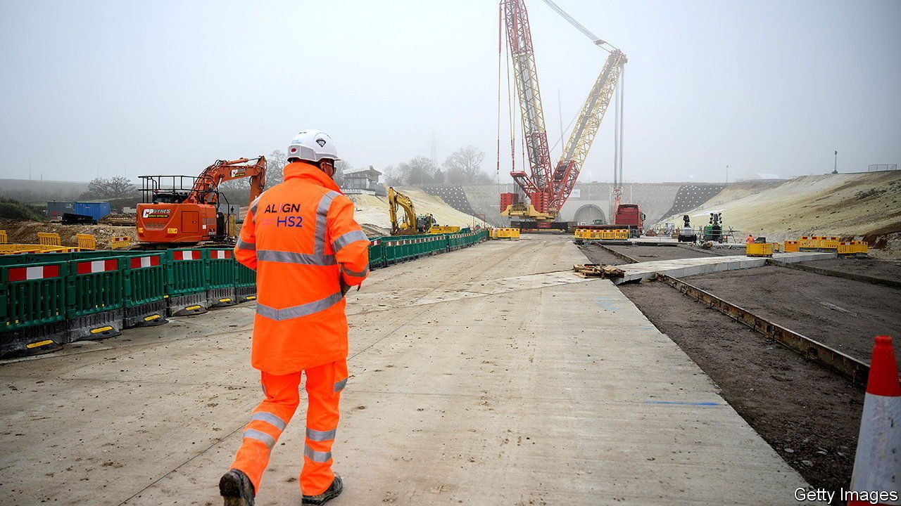
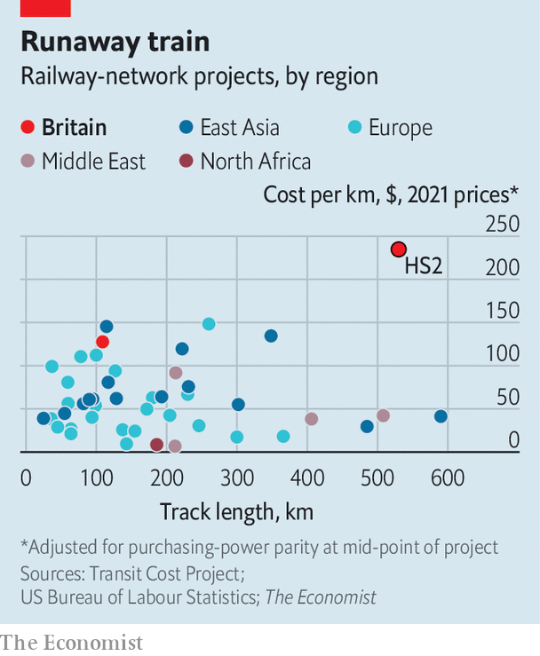

###### On the wrong track

# HS2’s extension and the paradox of infrastructure investment 

##### Boris Johnson would have less of a dilemma if British trains were not so expensive 

 

> Aug 14th 2021 

TORY MPS and Labour mayors are unlikely allies. But some have united to defend the planned extension of High Speed 2 (HS2) from Birmingham to Leeds. The railway’s costs have ballooned from £33bn ($53bn) in 2012 to at least £108bn. Work has only started on the first phase, from London to Birmingham. Boris Johnson might be tempted to swing the axe.

The prime minister’s dilemma would be less acute if Britain built more cheaply. HS2 is the most expensive high-speed railway in the world, costing $235m per kilometre of track, according to calculations based on data from the Transit Costs Project at New York University (see chart). The second most expensive in Europe runs from Lyon to Turin and passes under the Alps. It only costs $148m per kilometre.


The south-east and West Midlands, through which HS2 runs, are densely populated. Yet not much more so than Lombardy, through which high-speed lines have been built at much lower costs. HS2 is also an ambitious project. The government hopes it will sustain up to 18 trains an hour. Yet France’s LGV Sud-Est delivers 12 an hour, with a potential capacity of 16, and costs only 3% as much as HS2 per kilometre of track (it runs through sparse land and was built when labour was less pricey).

 


Britain’s legal regime is a more likely villain. The problem, according to construction experts, is not so much the country’s stringent rules (continental Europe has those too) but the way they are applied. Planning goes through many stages, creating opportunities for opponents to challenge. Each delay adds to the bill.

Another problem, says Andrew Adonis, who advocated for high-speed rail as a Labour minister in the late 2000s, is that “we have too few seriously trained engineers in the state machine and we don’t have a culture of systematic infrastructure investment and planning.” Tendering places heavy emphasis on cheapness, resulting in absurdly optimistic proposals. The end result is pricier than it would have been, because of delays and contingency planning.

Spending on railways has been stop-start. Big projects are followed by lulls. Proposals spend ages waiting for approval, and are then cancelled. Uncertainty over HS2’s eastern leg is only the most recent example of this. Just last year there were rumours the whole thing might be scrapped.

As a result firms struggle to build up the expertise required for big projects. Efficiencies are missed and projects are sub-contracted. The result is a chicken-and-egg situation. Unless Britain continues to invest in infrastructure it will be difficult to push costs down. But why invest in infrastructure when costs will inevitably spiral out of control? ■

