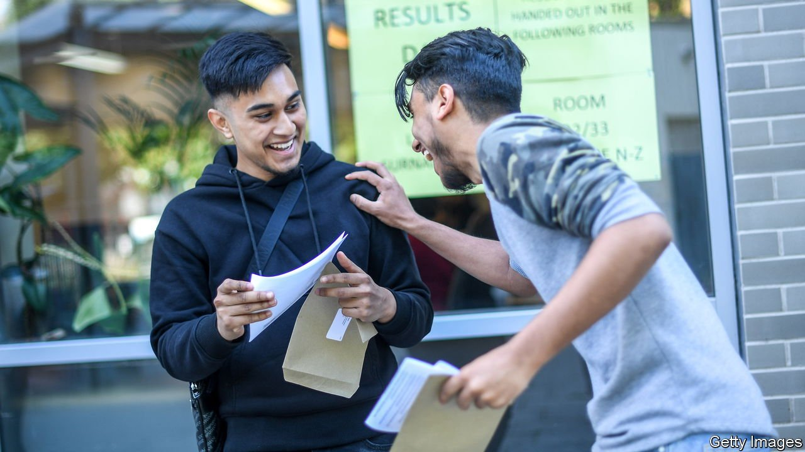
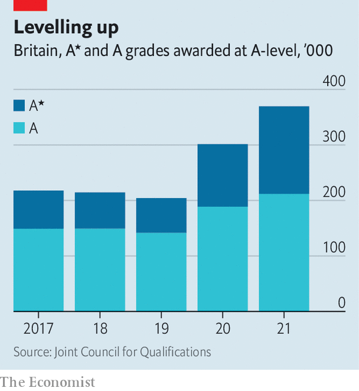

###### Seeing stars

# The British government’s unwanted higher-education boom 

##### Ministers mostly have themselves to blame 

 

> Aug 12th 2021 

BRITAIN’S CONSERVATIVE government is ambivalent about universities. It won a majority in 2019 by picking up votes from people who never went to one. According to the British Election Study, 74% of people with no qualifications who voted Conservative or Labour broke for the Tories, while most people with degrees went for Labour. Ministers tout alternatives to higher education such as apprenticeships. When they do talk about universities, it is often to attack them as nests of woke ideology.

But their actions have a different effect. Britain is witnessing a jump in university attendance. Some of this is driven by social and economic forces that would have applied whatever the government did. Some of it is caused by the government’s chaotic treatment of schools and examinations during the covid-19 pandemic.


By the end of June 311,000 British 18-year-olds had applied to university, 10% more than last year. The economic disruption caused by the pandemic is one reason. Steve West, head of the University of the West of England, notes that applications usually rise during economic downturns. Another is demography. Britain is experiencing an adolescent bulge that will increase the number of 18-year-olds by 25% between 2020 and 2030, according to the Office for National Statistics.

Young people have the numbers, the desire—and now the grades to go to university, thanks to the chaotic handling of A-level exams. Despite a steady rise in covid-19 cases last autumn, the government waited until January to cancel exams in England (Scotland and Wales moved earlier). It made two concessions, both of which were likely to push up marks. First, it said pupils should only be assessed on what they had been taught. Given the number of days that schools had been closed, some had been taught rather little. Second, the grades that teachers assigned would be only lightly moderated.

Last year’s A-level grades were high, especially after the government ditched a clumsy attempt to bring them down by using an algorithm. The ones that pupils received on August 10th were stratospheric. Many more A* and A grades were handed out (see chart). In private schools, 40% of all A-level grades were A*. Girls have done especially well out of teacher assessments. In 2019, 39% of those who studied maths got an A* or A, compared with 42% of boys. This year they beat boys 58% to 54%.

 


Universities knew this was coming, and tried to prepare. They normally offer places conditional on particular A-level grades, although they often take pupils who narrowly miss the target. This year the best universities rejected many applicants outright. But grades ended up so high that their campuses will be stuffed all the same. The number of applicants immediately placed at elite “high-tariff” universities is 14% higher than a year ago.

Mark Corver of DataHE, an analysis firm, predicted this year’s surge in grades. He also predicts that the tide of young people into higher education will not recede. University-going is like a ratchet: people who went usually want their children to go. Besides, grades at GCSE (taken at 16) are as inflated as A-levels, which has encouraged younger pupils to set their sights higher. “Our sixth-form numbers are up,” confirms Sir Daniel Moynihan, chief executive of the Harris Federation, an academy chain with many working-class pupils.

For universities, it is a challenging time. Some are so over-subscribed that they are offering students money to go elsewhere. The cohort that arrives next month will be not only large but also ill-prepared, having suffered disruption at school. They may not get the help they need. Universities’ efforts to teach online during the past year were often woeful: the share of full-time students in England happy with their courses fell from 82% to 74% according to the National Student Survey.

For the government, the situation is alarming. Because student loans are issued on generous terms, most are never fully repaid. The Higher Education Policy Institute, a think-tank, reckons that the government will have to write off 54% of the loans issued to last year’s cohort, at a cost of almost £11bn ($15bn). Ministers could cut fees, alter repayment terms or cap student numbers. But they will find it hard. The rush into higher education means that many more voters now have an interest in a well-funded university system. ■

