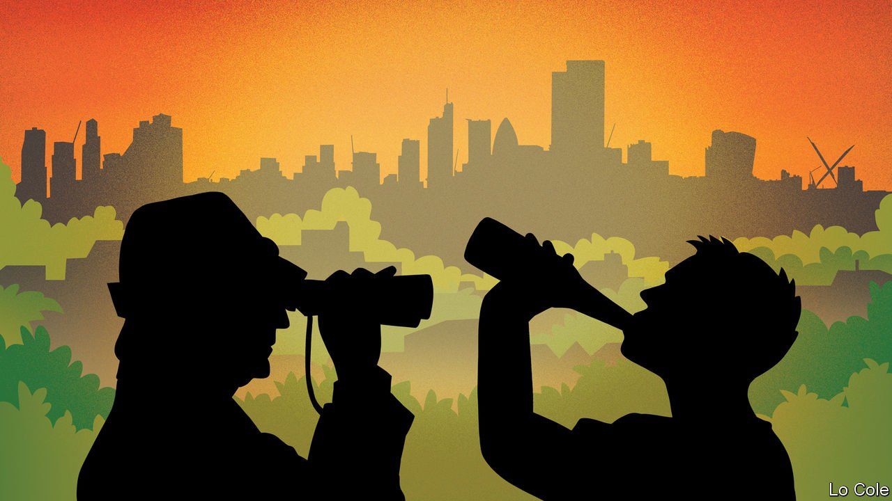

###### Parks and recriminations

# The battle for north London’s public space 

##### Boozing youngsters v the metropolitan elite 

 

> Aug 12th 2021 

HAMPSTEAD HEATH is home to many fine creatures. Purse web spiders, green woodpeckers, brimstone butterflies and kestrels have all found peace in the oddity that is London’s 790-acre moorland. They roam happily alongside a near-mythical tribe: north London’s metropolitan elite. But the current chieftain, Marc Hutchinson, a solicitor and chair of the Heath &amp; Hampstead Society, is unhappy with the heath’s most recent arrivals: drunken young people.

When covid struck last spring, open spaces across Britain were flooded with youngsters looking for somewhere to socialise. The habit has stuck, much to the annoyance of regular parkgoers. Local newspapers are filled with complaints about anti-social behaviour spoiling beauty spots. In most places, locals are powerless. Not so in London’s most expensive neighbourhoods.


Battle lines were first drawn in Primrose Hill, where residents say they were besieged by raves, fireworks, knife crime and “drug cars”. Their solution was to lock the park at night. Sir Keir Starmer, Labour leader and a local MP, offered support. The Royal Parks, a charity, forked out for nine-foot aluminium gates, which locals now want to make permanent. That is not an option in Hampstead Heath, where enclosure has been banned since 1871. Instead, councillors want to cut the number of nearby alcohol licenses. Not all local firms are opposed. “Less businesses means more customers,” reckons a newsagent.

Oliver Cooper, the leader of the Tories on Camden council, supports the measures, arguing that party animals put off other park-goers. Mr Hutchinson now has new targets in his sights. Ancient tree roots are being damaged by an increase in visitors, he says, with numbers up from roughly 9m in 2019 to 17m in the past year. Commercial dog walkers will soon be limited by licenses, of which there will be 40, and the number of dogs they will be able to walk at once will be capped at four.

Amy McKeown, a mental-health strategist campaigning to remove the gates in Primrose Hill, says claims of unpleasant behaviour are overstated. Official data show knife-crime injuries in the area fell from 16 in 2019 to 7 in 2020. Martin Fisher, a psychotherapist who lives in the area, says an online residents’ forum has become filled with accusations that partygoers are “knife-wielding yobs”, “scum” and “poor people coming from undesirable areas.” He argues that phrases such as “those awful people, in their awful cars, playing their awful music” are racist euphemisms. Recriminations show little sign of ending soon. “It’s like Brexit,” sighs Mr Fisher. “It has polarised the community.”

