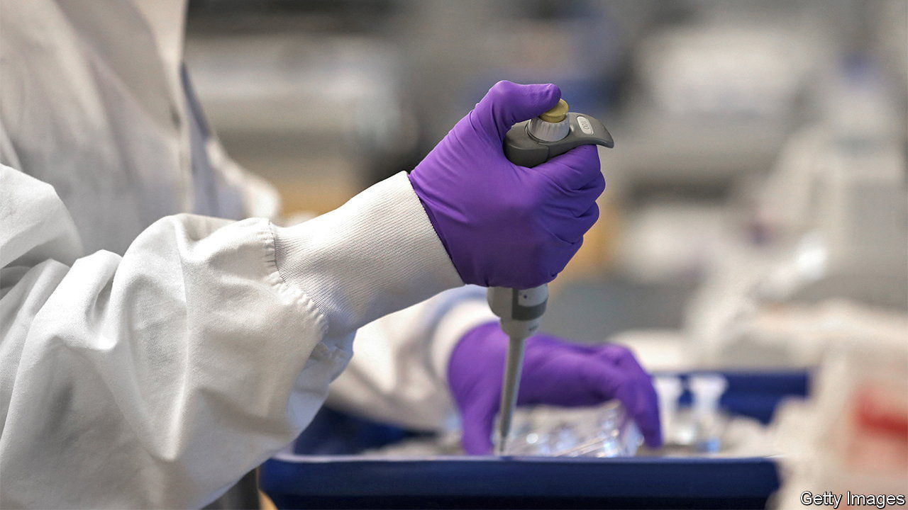

###### Pharmaceuticals

# American biotechnology is booming 

##### The pandemic has highlighted the promise of clever new drugs—and the firms developing them 

 

> Aug 11th 2021 

IN 1908 ASHTON VALVE COMPANY built a factory on the corner of Binney Street and First Street in Cambridge, Massachusetts. In what was a high-tech industry of the day, it made gauges, valves, whistles, clocks and other gadgets that helped make steam boilers less susceptible to blowing up and killing people. Just over 100 years later, in 2010, another purveyor of a life-saving technology moved into Ashton’s long-abandoned premises: Moderna.

In the past year the biotech darling has become synonymous with the fight against covid-19. Its ingenious  vaccine has, like a similar one developed by Pfizer, an American drug giant, and BioNTech, a German startup, saved millions of lives. Moderna’s success has also brought attention to America’s biotechnology industry, a lot of it centred on Cambridge. Home to Harvard University and the Massachusetts Institute of Technology, it is the closest that the biotech business currently has to a Silicon Valley.


And the industry is booming. Since 2010 an index of biotech firms listed on the Nasdaq exchange has quintupled in value (see chart), and the number of companies in it has more than doubled, to 269. Between 2011 and 2020 the money that biotech startups raised in American initial public offerings (IPOs) ballooned from $4bn to $65bn. So far this year venture capitalists have poured more than $20bn into pharmaceutical and biotech firms, not far from last year’s record tally of $27bn.

 


Cambridge is filled with cranes and new buildings, dull on the outside but bursting with exciting science within. In next-door Boston new laboratories are going up around the revamped Seaport. Prices for lab space reportedly reach $160 a square foot, perhaps the costliest commercial real estate in America not at street level.

The pace of the industry’s expansion would have been inconceivable 10-15 years ago, marvels Jean-François Formela of Atlas Venture, a venture-capital (VC) firm. Businesses are popping up everywhere, including down the hall from Mr Formela’s office. Flagship Pioneering, a VC firm which guides entrepreneurs from a promising idea to a business that can attract outside investors, has spun out 26 companies since 2013. Its founder, Noubar Afeyan (who is also Moderna’s chairman), hopes to spin out up to ten a year from now on.

The boom has several causes. Tim Haines, chairman of Abingworth, a London-based asset manager focused on life sciences, notes that many investors have been swept up in the notion of “philanthropic capitalism”: making money from products that could benefit society. Other reasons are more hard-headed. According to Mr Haines’s estimates, 64% of drugs in late-stage development are being concocted by youngish biotech companies built around a novel technology rather than by big pharma firms such as Pfizer (which often team up with smaller biotechs like BioNTech, or acquire them, to juice up development pipelines).

Many of these technologies are themselves the result of recent advances in cell and gene therapies, in ways of delivering them, and in identifying which patients they are likely to benefit most. New money is flowing into firms developing treatments for cancer, illnesses of the immune system or the brain, and even infectious diseases. Everyone is vying to be the next Moderna, whose market capitalisation has jumped from $5bn when it went public in late 2018 to $156bn. Many are hoping to emulate it by expanding from developing therapies to manufacturing them.

Walking past Moderna’s headquarters just off bustling Binney Street it is easy to overlook the risks. People with both a PhD in life sciences and managerial nous are a rare breed. Unlike brainstorming the next app, life science cannot be done on Zoom. Many clever ideas never come to fruition. Those that do become therapies often cost a lot, which increasingly angers both Democrats and Republicans in Congress and has led to calls for price controls.

The greatest danger is a common one for startups: can they make money? Only one in six firms in the Nasdaq biotech index did so in 2020. The remaining five-sixths lost a combined $33bn. Vertex, a star graduate of Binney Street that has relocated to Seaport, lost money from its founding in 1989 until 2017. Moderna turned a profit last quarter for the first time in a decade and its share price has slid. Still, its wannabe imitators can take comfort that biotech investors are a patient lot. ■

