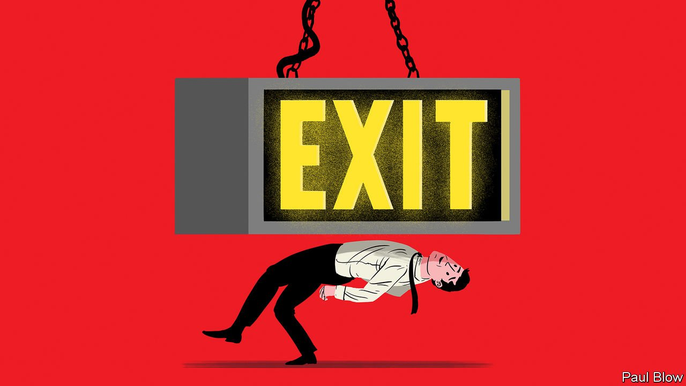

###### Bartleby

# Flexibility is the key to success 

##### Our Bartleby columnist bows out 

 

> Aug 14th 2021 

THERE IS AN old joke that the key to success in life is sincerity. If you can fake that, the saying goes, then you have got it made. On reflection, however, the essential quality for surviving at work is not sincerity, but flexibility.

When Bartleby started his career in 1980, personal computers were the preserve of hobbyists and sending a letter required the passing of a handwritten draft to the typing pool. Phone calls came through the switchboard. Office life was so dependent on shuffling paper that staplers, paper clips and Tipp-Ex were essential. No one had a mobile phone so swift contact was impossible; this correspondent once sat for 45 minutes in a restaurant waiting for a guest who had been shown to another table and was miffed about his non-appearance.


Now office workers must grapple with a host of technologies. They need to know how to raise their hand (and mute themselves) on Zoom, track changes in a Google doc and make financial calculations on a spreadsheet. They must switch between applications, and back again, several times an hour. They must learn to use (or at least understand) new jargon even when it seems fatuous or irritating.

The need to adapt to change has not been confined to office work, of course. Those employed in manufacturing have had to cope with new techniques and new machines. Many of them have had to change sectors in order to find work. Manufacturing employment has fallen from 30.2% of the workforce in 1991 to 22.6% in 2019 across the OECD, a club of mostly rich countries. Retail workers have grappled with bar codes, automated checkouts, contactless payments and click-and-collect. But office workers have also had to adjust to one hugely significant change: a breakdown of the barriers between work and home life. The advent of email and the smartphone means that workers can be contacted at any time of the day or night. If the phone rings at 10pm, it’s probably not your mother, it’s your boss.

Employees have to adjust to many corporate cultures over the course of their careers. Only a minority of workers ever spend their working lives at a single organisation. The median job tenure for workers aged 25 and over in America is around five years and has changed little in recent decades. Public-sector workers stay longer in their jobs than those in the private sector, who last around four years. In a 40-year career, that implies the average private-sector employee might work for ten different firms. On top of that, globalisation has meant that workers have had to get used to dealing with foreign customers and suppliers, colleagues working across different time zones, and sometimes foreign owners.

Over the years, employees—particularly men—have had to adapt to new social norms. What used to be known as “laddish humour” is now rightly deemed to be demeaning to female colleagues. Boozy lunchtimes were once common, but are now frowned upon. Some middle-aged workers have been slow to accept this shift but employers have become steadily less tolerant of such behaviour.

During the pandemic, workers have had to show even more flexibility, keeping in touch with their colleagues and maintaining their productivity while juggling child care and the need to avoid infection. Not everyone has enjoyed it, but the ability to conquer the tyranny of the 9-to-5 routine is a very positive development. Monday mornings no longer seem quite such a dreadful prospect if they don’t involve a stressful commute.

It is actually a great tribute to modern workers that they have adjusted splendidly to all these changes. But it gets more difficult as you grow older. Attitudes harden; habits become ingrained. There are many things which Bartleby finds puzzling about modern life. Once, talking loudly on the street was a sign of madness; now people are happy to disclose intimate details of their personal lives while bellowing on their mobile phones. Electric scooters seem to offer all of the dangers of bicycling (and a lot more risk for pedestrians sharing the pavement) without any of the health benefits. And most perplexing of all is that a man with the character and record of Boris Johnson has become his country’s prime minister.

This puzzlement is a hint that this columnist is insufficiently flexible to cover the modern world and needs to retire. The danger is that one becomes a caricature of a grumpy old man and, like his fictional namesake, Bartleby would “prefer not to”. Many thanks for reading the column over the past three years.

