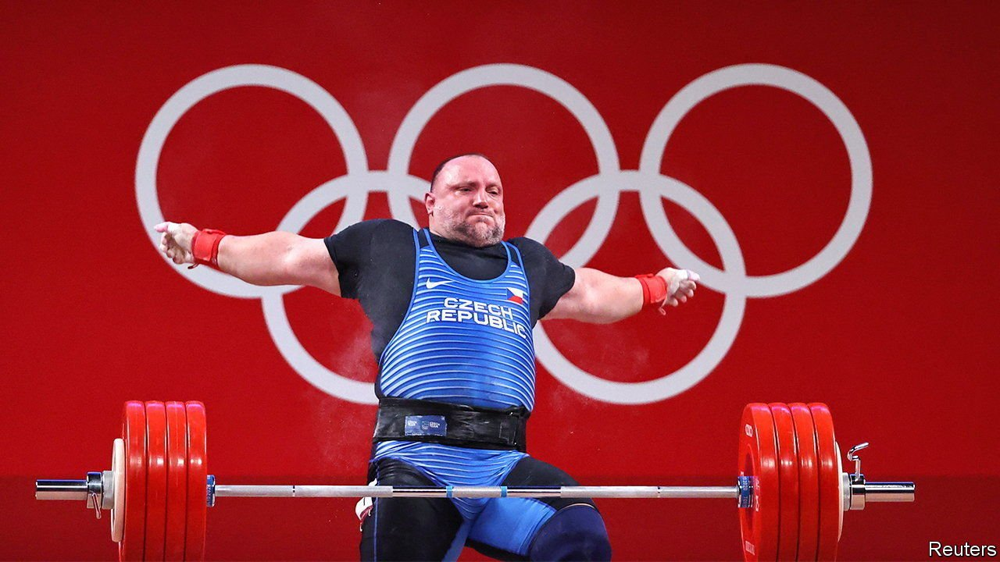
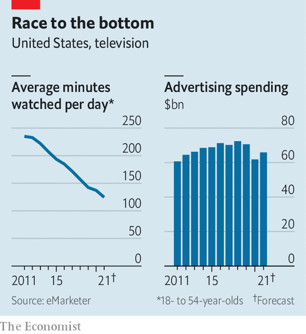

###### Loser takes all

# The Olympics is a ratings flop. Advertisers don’t care 

##### The Tokyo games illustrate a puzzle: as audiences decline, the TV-ad market is holding up 

 

> Aug 11th 2021 

AMONG THE records broken at the Tokyo Olympics, one went uncelebrated: the games were the least-watched in decades. In America just 15.5m people tuned in each night, the fewest since NBCUniversal, now part of Comcast’s cable empire, began covering the event in 1988. Viewership was 42% lower than at the Rio games in 2016. Broadcasters in Europe recorded similar falls. Brands that had paid to advertise alongside the jamboree complained. NBC scrambled to offer them free spots to make up for the ratings shortfall. Yet the Olympics illustrated a puzzle of advertising. Even as audiences desert TV, brands are paying as much as ever for commercials.

Tokyo was an uneven playing field. Many events took place while Americans and Europeans were asleep. Stars such as Simone Biles and Naomi Osaka left some events early. Covid-19 meant no spectators, and face-masks all round. But the collapse in viewership wasn’t a one-off. Tokyo’s opening ceremony was watched by 36% fewer Americans on the day than watched Rio get under way in 2016. Rio’s audience in turn was 35% lower than London’s in 2012.


While viewers have disappeared, advertisers have stuck around. NBC sold more than $1.2bn in ads for Tokyo, about the same as in Rio. Even after dishing out the compensatory ads, it expects to make a profit on the $1bn or so it paid for the rights to televise the games. It has also managed, in the words of Jeff Shell, its boss, to use them “as a firehose to promote everything else that we’re doing at the company”—above all its streaming service, Peacock, which zoomed up the app-store charts.

 


The games exemplify a broader trend. This year the average American will watch 172 minutes of broadcast and cable television a day, 100 minutes less than ten years ago, estimates eMarketer, a research firm. Among the so-called “money demographic” of 18- to 49-year-olds, viewership has fallen by half as audiences have gone online. Even so, spending on TV ads is remarkably stable. In 2021 brands will blow $66bn on American commercials, about the same as every year for the past decade.

TV remains “the worst form of advertising, except for all the others”, says Brian Wieser of GroupM, the world’s biggest ad-buyer. The big streamers, such as Netflix and Disney+, are ad-free zones. Brands are wary of YouTube’s user-generated content. And ad-supported streamers like Peacock and Disney’s Hulu still lack enough ad space to move big marketing budgets. As a result, advertisers keep ploughing money into television, even as returns diminish.

Perhaps not for long. YouTube is making inroads into brand advertising as its content mix becomes more professional. Amazon is expected to run ads in its National Football League coverage next year. By combining premium content with targeted commercials, the e-empire is going to unlock “huge buckets” of ad dollars, predicts Andrew Lipsman of eMarketer. In 2019 advertising on streaming services in America was worth only 9% as much as adverts on cable and broadcast TV, eMarketer says. In 2023 that figure will be 32%.

Where will this leave events like the Olympics? Probably still on the podium. Ad money will drain out of daytime and some primetime TV, thinks Mr Lipsman. But big, live spectacles will be as desirable as ever. “There is nothing more powerful in media than the 17 straight days of Olympics dominance,” summed up NBC’s sports chief, Pete Bevacqua. As in sport, it doesn’t matter that you aren’t as good as you used to be, as long as you beat the competition. ■

For more coverage of the Tokyo Olympics, visit our dedicated 

