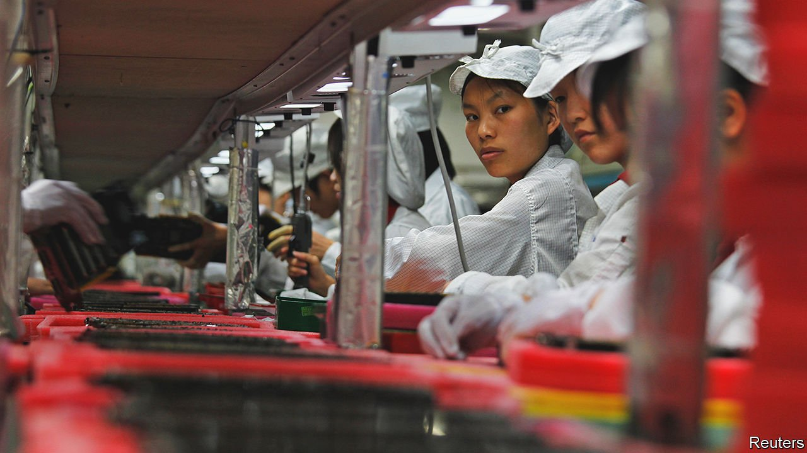
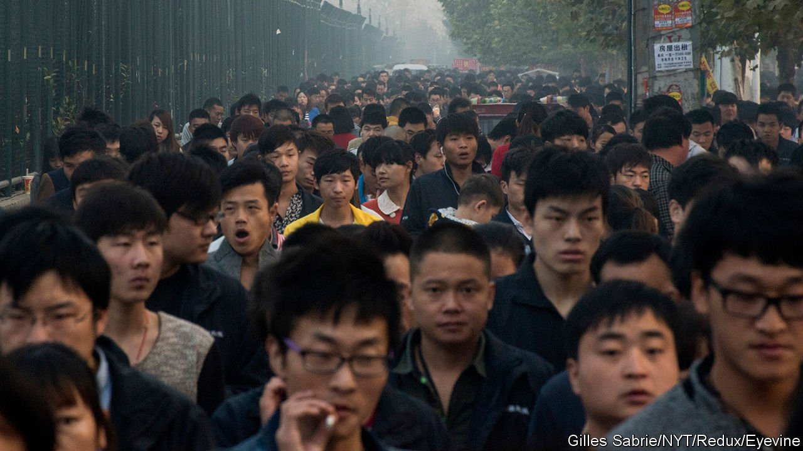

###### Production-line poets

# How Chinese factory-workers express their views on life 

##### Poems, videos and fashion all speak to migrants’ alienation 

 

> Aug 14th 2021 

AS TRENDSETTERS GO, Luo Fuxing was an implausible one. A school drop-out, Mr Luo spent his days catching fish and herding goats in a village in southern Guangdong province. Eating pork was a once-weekly treat. At the age of 14, he left home to earn a wage in the province’s sweatshops. He hated the tedium of the work. He read that American criminals had tattoos of spiders’ webs inked onto their elbows to show time spent behind bars. Mr Luo got one too, because “the factory was just a bigger prison.”

He quit for a job in a hair salon. Inspired by Japanese manga and punk fashion, he dyed his hair and styled it into dramatic, gravity-defying spikes. Dark lipstick and eyeliner completed the look. He posted selfies to QQ, a messaging service—and soon hundreds of thousands of factory-town youth were copying his style. Mr Luo called its adopters the shamate, from a Chinese rendering of “smart”. It was “a wild-growing art form among workers”, he says. The trend, which peaked around a decade ago, helped newly arrived migrants from the countryside to bond. They met in parks, roller-skating rinks and online groups, where they shared not just sartorial cues but gripes about migrant life, from low pay and poor conditions to divorcing parents.


China has developed a distinct working-class culture in recent years, of which shamate fashion is only the most garish example. In mainstream media assembly-line workers are commonly shown in serried ranks and drab uniforms, with no hint as to how they spend their time outside factory walls. The stereotype is that workers who migrate to boomtowns and big cities—as 300m have done over the past four decades—are there only to earn a living. They are still commonly referred to as “migrant workers”, on the assumption that they are outsiders who will return to their rural hometowns. Many once did. But today’s working-class youth have no interest in going back to the land; many have lived in the city from a young age. They want to put down roots. Although marginalised in mass culture, workers are expressing themselves, in forms as varied as poetry and short videos shared online.

The government tends to portray migrant workers as patriotic and self-sacrificing. A museum dedicated to them in Guangzhou, the capital of Guangdong, lauds their contribution to China’s economic ascent. Exhibits extol the Communist Party’s efforts to improve workers’ livelihoods and applaud their diligence. A sign at the entry reads: “Guangdong lets migrant workers create proud glories and legends again and again!” The hardship of factory work is glossed over, as are common injustices such as withheld wages.

Elsewhere, workers are often treated as country bumpkins. A “migrant-workers” version of the annual Spring Festival Gala, a big television show broadcast on the eve of the lunar new year, airs on a channel about agricultural news. Workers who began to stage their own unofficial gala some years ago were condescendingly described by state news outlets as offering “a little song, a little dance and a lot of passion”.

Small wonder that a coruscating memoir by Fan Yusu, a domestic worker living in Beijing, was a national sensation when it was published online in 2017. Ms Fan is now the editor-in-chief of New Workers’ Literature, an unofficial bimonthly journal of working-class writing, launched in 2019. One genre winning admiration from the literati is called dagong shige or “labour poetry”. Its most famous practitioner was Xu Lizhi, who worked on an assembly line for Foxconn, a Taiwanese firm that makes most of Apple’s iPhones. Before he committed suicide in 2014, at the age of 24, he had written almost 200 poems about the drudgery of factory work. Among the best known is “I Swallowed An Iron Moon”:


Many workers’ poems refer to homesickness, alienation, injuries and powerlessness. A few deliberately evoke beauty, in jarring contrast to their bleak surroundings. In “Sundress”, Wu Xia—a rare female worker-poet, hired by a textile factory at the age of 14—writes of her love for the “unknown girl” with the means to buy the garment she sews. She also thus lays bare the elusive promise of social mobility that drives so many to the assembly line: Ms Wu, now 40 and a published poet, still works at a clothing factory.


Some literature is defiant, including towards government policies that make it extremely hard for factory-workers born in rural areas to make use of schools and hospitals in the cities. In “Who Can Forbid My Love”, Ms Wu writes of her adoptive city of Shenzhen: “This kind of love seeps into the pores, skin, cells, blood, bone / Even though there’s no residence permit with my name on it.” Chen Nianxi, a worker in a private mine, speaks of fellow miners who, employed by state-run firms, toil less yet earn more while he must blast “the rocks layer by layer / to put my life back together”. (English translations of these and other poems were published in 2016 in “Iron Moon”, an anthology of labour poetry.)

Such writing is tolerated by the government partly because journals like New Workers’ Literature are written for limited circulation and may not be sold in bookshops. Many poets publish online where, to avoid censorship, they steer clear of “unfiltered representations of the horrors” inside unregistered workshops known as “black factories”, notes Maghiel van Crevel of Leiden University. Some poems are proud or patriotic; many of those who write are motivated by a desire to earn respect. In the visitors’ book at the museum in Guangzhou, a visiting labourer has written: “Migrant workers, working souls, we’re the finest of them all.”

Yet workers’ writing is not fundamentally about political resistance, says Mr van Crevel, who studies labour poetry. Few blue-collar youths today feel they belong to a cohesive working class. That is partly because officials and state media avoid using the word “class”, or jieji, owing to its antagonistic overtones. (“Social stratum”, or jieceng, is preferred.) Many young workers call themselves dagong ren, a word for labourer that connotes temporary and low-status work. Its most extreme display is a subculture in Shenzhen whose members style themselves “Sanhe gods”. These young migrant workers hang around the city’s Sanhe job market to find day work, often as builders or delivery drivers. They reject the grind of the factory; their slogan is: “Work for a day, party for three.” Some even sell their national-identity cards.

Becoming a shamate was also a form of rebellion against the monotony of factory life. In a Chinese documentary released in 2019, “We Were Smart”, 70 former and current shamate shared their views on what it meant to be one. Their exuberant hairstyles turned heads. “People paid attention. It wasn’t positive attention. But they saw you. And the point was to be seen,” says one interviewee. Many felt they were part of a select group, and that cutting their hair would have meant going back to being “just another unknown line worker”. For some, the punk identity became more important than earning a better wage at a big factory, where they would have been forced to cut their hair. For men and women alike, it was a way of seeming tougher in a disorienting new city where many were cheated: “We felt we weren’t safe out there. That we were too honest, and were afraid of being messed with.” The hair, tattoos and clan mentality all helped.

 


As the fashion spread, its adherents began to be ridiculed by prim, middle-class netizens. A sustained online attack against shamate around 2010 led thousands to lop off their hair and drop out of the group. Police began to round up anyone with the telltale style, to check their papers; anyone without a temporary residence permit would be detained.

Shamate fans still congregate in parts of Guangdong. But the fashion has lost its edge as factory youth have found a new way to express themselves: video-sharing apps. Lorry drivers, construction workers and farmers have built followings and sometimes found stardom—not despite being blue-collar workers, but because of it. In manufacturing hubs, where phones are often banned inside factories, assembly-line workers document their lives outside them. Widely used hashtags include #FactoryLife and #LiftTheBucket. The last refers, often ironically, to quitting a job in search of a better one, with nothing but a bucket of belongings.

Through the videos, workers cheer each other on. They trade information: which factory has higher wages or fairer bosses, say. That is especially useful in a “hostile environment where there is no trade union to tell them about working benefits”, says Aidan Chau of China Labour Bulletin, an NGO in Hong Kong. Some speak of injuries or sexual harassment. Others parody the trendy life of urban middle-class youth. “Their aspiration to live in a city and become an urban citizen grows, even as they realise it is implausible—even impossible,” says Mr Chau.

Whether expressed in poems or through video-sharing apps, a sense of disillusionment seems to be growing. There was once pride in being a worker, says Mr Luo. “Now it’s embarrassing to say you’re one.” Young people working in factories see short videos as an escape: a way to kill time, but also to be part of a wider world beyond their gritty boomtowns. Yet even online, they struggle to gain acceptance. Zhang Yurong is among a handful who have built a wide following by recording life as a worker at Foxconn. Some comments on her videos say factory workers are “people abandoned by society”. That angered her, she says, not because it was wrong but because it was right.

A fellow worker-poet and friend of Xu wrote in tribute after his death: “Another screw comes loose / Another migrant-worker brother jumps / You die in place of me / And I keep writing in place of you.” ■

