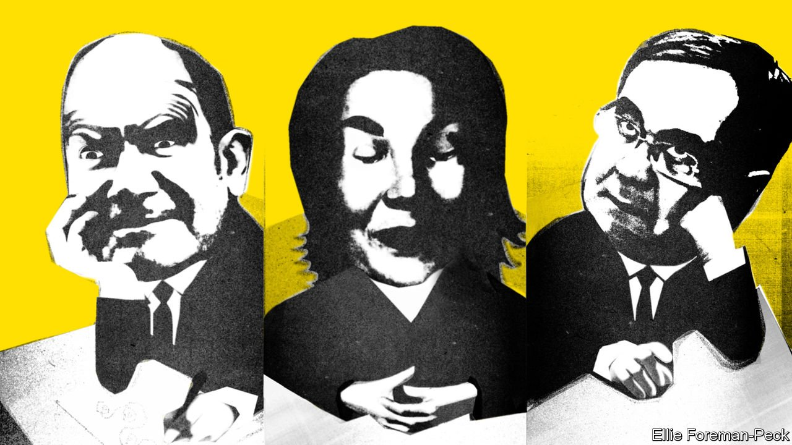
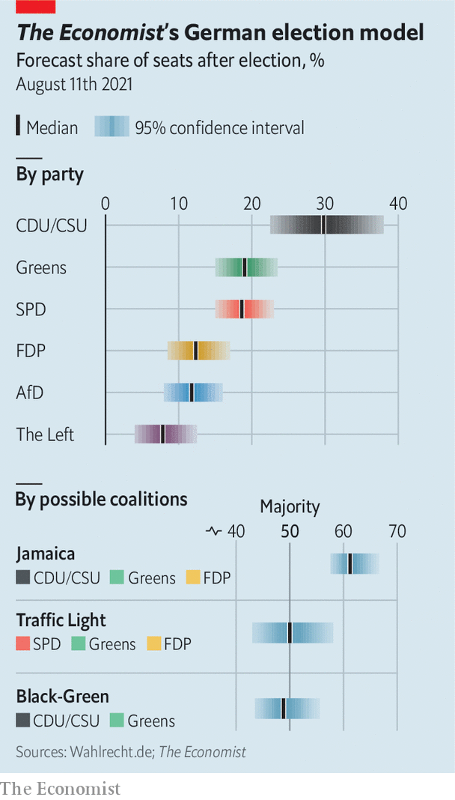

###### After Mutti

# Angela Merkel’s successor could be left, right or Green 

##### Our new prediction model for Germany’s wide-open election 

 

> Aug 10th 2021 

IN AMERICA presidential campaigns start soon after the mid-term elections and last nearly two arduous years. In Germany, in contrast, for most of this year it was hard to tell that one of the most important elections in post-war history will take place on September 26th. It was only in the first week of August that posters sprouted on lampposts across Berlin, featuring the three high-profile contenders for the chancellorship as well as obscure local politicians running for parliament. Political advertisements are at last running on television. The Social Democrats even broke a taboo this month by running a negative one, attacking the religious beliefs of a close aide of Armin Laschet, the conservative candidate who is the narrow front-runner to succeed Angela Merkel, who is retiring after 16 years as chancellor.

Until  inundated parts of North-Rhine Westphalia (NRW) and Rhineland-Palatinate in mid-July, conventional wisdom suggested a win for Mr Laschet, the candidate of the Christian Democratic Union (CDU) and its sister party, the Christian Social Union (CSU). But Mr Laschet is also the state premier of NRW, and his response to the floods has been inept. As The Economist launched its election-forecast model online on August 10th, the once soporific election campaign was becoming more interesting. The gaffe-prone Mr Laschet cancelled all campaign events last week and some TV appearances in September, ostensibly to focus on the aftermath of the flood disaster.


Meanwhile Olaf Scholz, the candidate of the Social Democratic Party (SPD), is gaining ground. Germans do not vote directly for their chancellor, but INSA Consulere, a pollster, found last week that when respondents were asked whom they would pick if they could, Mr Scholz got 27% of the votes. Annalena Baerbock, the Green Party’s candidate, drew just 13% and Mr Laschet 14%. Fully 36% said that they do not want to vote for any of the three.

 


With Mr Scholz doing well (or at least not blundering), a genuine alternative to the conservative party’s long rule has become plausible. The Economist’s , our first for Germany (which can be found at www.economist.com/german-election-2021), blends the latest polls with other indicators, such as data on parties’ past performance, to come up with an educated guess at how many votes and seats each might win. It also measures the considerable uncertainty of the contest. The model’s projections will be updated daily.

Germany’s election system is . Voters get two votes. The first is used to elect a local MP—roughly one for every 250,000 people—using a first-past-the-post system; every winning candidate is guaranteed a seat. The second vote is for a party rather than a candidate. It is more important than the first because it determines the overall proportion of seats that each party holds in the Bundestag, the lower house of parliament. Candidates’ prospects for the chancellorship depend not on their personal popularity but on how well their parties do on the second vote. Most polls (as well as our online poll-tracker) predict that the SPD will come in third after the CDU and the Greens, or tie with the Greens for second.

Once seats are allocated, coalition talks get under way. As of August 12th our model shows that the combination most likely to have a majority would be the CDU/CSU, the Greens and the free-market Free Democratic Party (FDP). This is known as a Jamaica coalition, after the colours of that country’s flag. The Greens and Christian Democrats might also go it alone in a black-green combo, if their vote share is high enough. Our model also spies a potential upset with an Ampel (traffic-light) coalition of the Greens, SPD and FDP. This would give Mr Scholz his best chance at the chancellorship, though Ms Baerbock would probably claim it if the Greens beat the SPD. It would exclude the CDU from government for the first time since 2005, when Mrs Merkel first took charge.

The FDP has not been in government since 2013, when it failed to cross the 5% vote-share threshold required to get into parliament. But it would be part of two of the three most likely coalitions. “It’s looking good for the FDP,” says Ursula Münch, head of the Academy for Political Education in Tutzing. Christian Lindner, the youthful boss of the FDP, whose party is benefiting from Mr Laschet’s weakness, favours Jamaica but has not ruled out Ampel. Hence he risks losing some of the majority of FDP voters who prefer Mr Laschet to Mr Scholz. Mr Lindner is already discussing ministerial portfolios. He says he would like to be finance minister—and assumes that the Greens would claim the planned environment and climate ministry.

Many pundits think the Greens and CDU/CSU chose the wrong candidates. Did they? “ Jain (yes and no)”, says Olaf Böhnke of Rasmussen Global, a political consultancy in Berlin. The CDU/CSU should have picked Markus Söder, the CSU’s head and state premier of Bavaria, who has better political instincts and is more dynamic than Mr Laschet. But Ms Baerbock ticks lots of boxes, says Mr Böhnke, who adds that all women in German politics face extra grilling. In his view Ms Baerbock’s missteps, including alleged plagiarism in her book and embellishment of her CV, have been exaggerated by the centre-right press.

With a month and a half to go, the outcome is highly uncertain. Since 2005 the number of undecided voters has increased drastically, says Thorsten Faas, a professor of political science at the Free University in Berlin. The last weeks of election campaigns have become more important than ever, which makes both our online poll-tracker and our election-forecast model especially relevant. Particularly with new candidates for the chancellorship, old loyalties may no longer hold, says Mr Faas. Faithful followers of Mrs Merkel will not automatically vote for Mr Laschet.

On August 10th Mr Laschet met his fellow state premiers to discuss covid-19 and recovery from the floods. Such gatherings are important for the Rhinelander: to overcome accusations of lassitude, he must show resolve in helping flood victims and a clear strategy to fight the pandemic’s fourth wave. Otherwise the allure of Mr Scholz, who as finance minister has promised hundreds of millions of euros in flood remediation, will grow even more. ■

