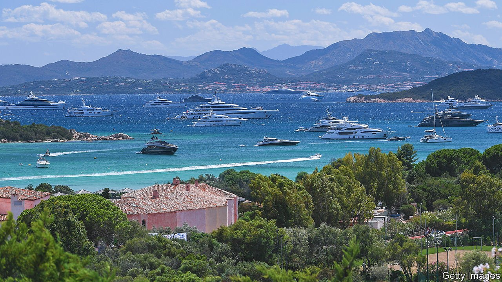

###### Swish in Sardinia

# On Italy’s Smeralda coast, the megayachts are back 

##### But their owners are nowhere to be seen 

 

> Aug 13th 2021 

FRANCO BLOISI is puzzled. Mr Bloisi is the chef of Assunta Madre, a restaurant attached to Billionaire, a nightclub on the Costa Smeralda. With its turquoise waters and hidden coves, this region of north-eastern Sardinia has long been a summer playground for Arab potentates, Russian plutocrats and Silicon Valley tech czars. “We’ve got the stylish Italians this year,” says Mr Bloisi. But he has seen no trace of the super-rich foreigners. “Their yachts are here. But they’re not going out.”

The absent billionaires are the talk of the Costa Smeralda. This is a land of endless villas and dry-stone walls draped with oleander, of five-star hotels with heart-stopping vistas and heart-stopping prices; a land of poodles, helipads, bespoke swimwear and bronzed middle-aged men in two-seater convertibles. More stylish than tacky, the Costa Smeralda gives its wealthiest holidaymakers, who in the Caribbean might worry about burglary or kidnapping, a reassuring degree of security—or did, until the advent of covid-19.


After a disastrous 2020, the luxury hotels are full again. There is “not a suite to be had anywhere”, says Paolo Manca, president of the island’s hoteliers’ association. At the local airport, outside Olbia, the volume of private flights is 10% higher than in 2019. On the last Sunday in July there were 174. Among them was a private Airbus 340 carrying Ilham Aliyev, the president of Azerbaijan. His wife and first vice-president, Mehriban Aliyeva, flew in on an equally private Boeing 767.

At the marina in Porto Cervo, among the few in the Mediterranean that can handle the biggest yachts, Carmine Sanna, the general manager, has seen a notable increase in chartered vessels more than 90 metres in length, mostly booked by Americans. The bays south to Porto Rotondo are sprinkled with gleaming super-, mega- and giga-yachts (usually defined as having lengths of more than 24, 50 and 80 metres respectively). Yet the traces of their owners and charterers are scant.

“They don’t want to go out and about, because they fear infection,” says Silvio Pippobello, the airport’s boss. As the Delta variant seeped through Italy, Sardinia experienced a particularly steep rise in the incidence of new cases. In the week to August 5th it was 138 per 100,000, the highest of any Italian region.

Partying during a pandemic can lead to some bizarre juxtapositions. An event staged by Marco Fava, a hairdresser from Rome with a celebrity clientele, was in full swing in the town of Poltu Quatu when a group of paramedics escorting a doctor in head-to-toe protective overalls barged through the crowd of guests.

Some of the wealthiest visitors have been using a testing centre at Olbia airport to have their entourages checked, sometimes three times a week. But fear of covid-19 may not be the only reason why the moguls are missing from their usual haunts. Someone who makes a living from catering to their whims, and who prefers to remain anonymous, says wealthy Russians had begun to withdraw even before the pandemic struck: they no longer felt a need to win acceptance in western European society, and the wine selection at most Costa Smeralda restaurants is beneath their standards. “They prefer to organise dinners aboard their yachts and in their villas,” he says. There they can serve whatever they like. At Olbia airport’s terminal for private flights, a Romanée-Saint-Vivant 2016 is on sale in the duty-free shop at €5,140 ($6,020) a bottle. ■

Correction (August 13th 2021): This article originally stated incorrectly that the party took place in a luxury hotel in Poltu Quatu. It in fact took place in a public space in the town of Poltu Quatu. The Economist regrets the error.

