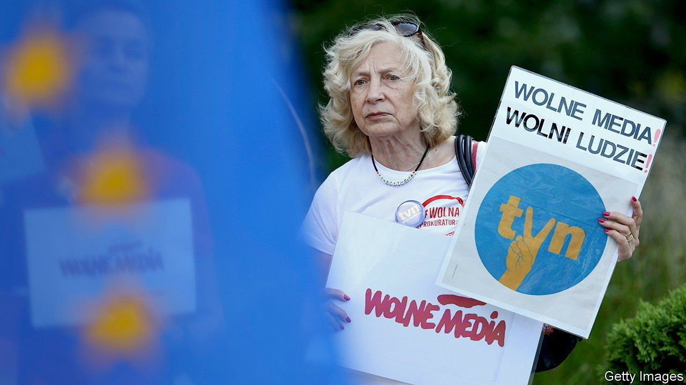

###### Unwelcome Discovery

# Poland’s proposed media rules threaten press freedom 

##### The independence of an American-owned television channel is in jeopardy 

 

> Aug 12th 2021 

LAW AND JUSTICE (PiS), the party that rules Poland, dislikes critics. Soon after coming to power in 2015, it took control of TVP, the public television broadcaster, and purged its management. Since then, Poland has slipped from 18th place in a World Press Freedom Index compiled by Reporters Without Borders, a non-profit group, to 64th, its lowest-ever ranking. Now PiS has turned its attention to TVN, a television station owned by Discovery, an American media giant. A bill limiting foreign ownership of media companies adopted on August 11th by the Sejm, the lower chamber of parliament, could force Discovery to sell. Liberals fear that Poland’s independent media are in jeopardy.

“The Polish media should be Polish,” says Jaroslaw Kaczynski, the ruling party’s chairman and the country’s de facto leader. “Repolonisation” has become a buzzword in all sorts of industries. In March PKN Orlen, a state-owned oil refiner, bought Polska Press, the country’s leading newspaper publisher, from its German owner. Senior editors were subsequently replaced.


Law and Justice’s latest target is TVN24, a news channel. Unlike TVP, it is critical of the government. It is also influential: its evening news was the most-watched news programme in Poland in the first half of 2021, with an audience share of almost 22%, just ahead of TVP’s rival offering.

The amendment to the broadcasting law proposes to bar entities from outside the European Economic Area (EEA) from owning more than a 49% stake in any Polish media firm. The party is defending “Polish interests”, says Marek Suski, the Law and Justice MP behind the proposed amendment. Critics warn that it is aimed at TVN24, whose licence expires in September and has not yet been renewed. If the amendment is adopted, Discovery may have to divest the channel.

The “ TVN law” could spell trouble for the ruling party, though. American officials, who have leapt to TVN’s defence in the past, are concerned. “Unfettered press is crucial for democracy,” tweeted Bix Aliu, America’s chargé d’affaires in Warsaw, in response to the draft legislation. It also added to the tensions that brought down the ruling coalition this week. Jaroslaw Gowin, a deputy prime minister and leader of Agreement, a pro-business party that was one of Law and Justice’s two junior coalition partners, was ejected from the government on August 10th. He had wanted an amendment to the media law that would allow ownership by companies in the OECD, a group of rich countries including America. He also opposed government-backed tax reforms.

The media-nobbling law must still pass the Senate, where Law and Justice lacks a majority. With the next parliamentary elections due in 2023, the party continues to lead in the polls, ahead of the centrist opposition. It has shrugged off criticism, including from the European Commission, which also complains about its subversion of the judiciary. Making Discovery sell TVN will harm relations with America. But Mr Kaczynski clearly values control over Polish media more. ■

