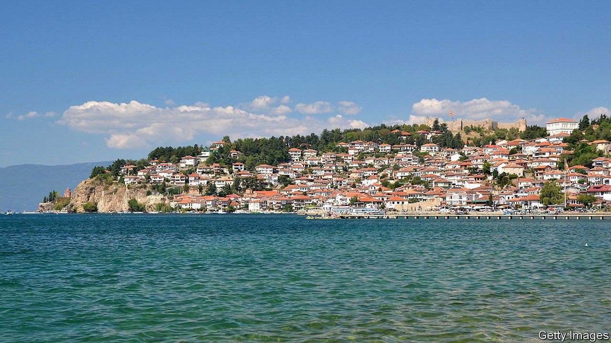
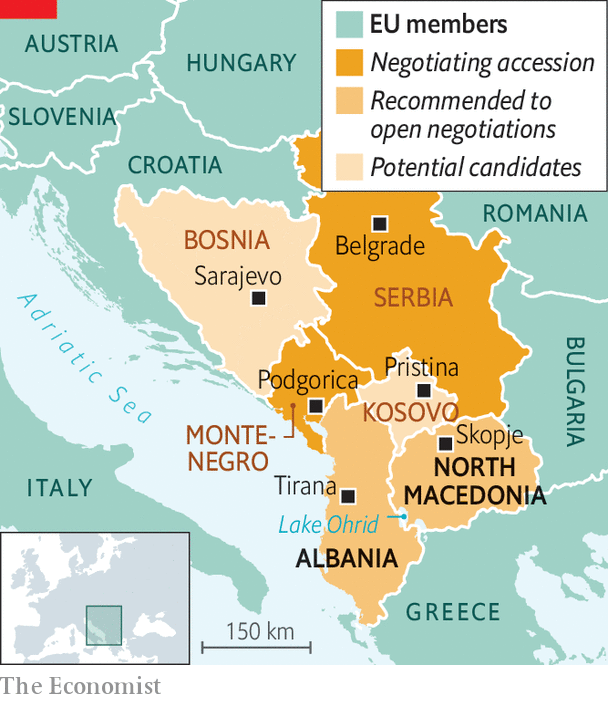

###### Knocking on the 27’s door

# Six Balkan nations keep trying to join the European Union 

##### The club seems reluctant to let them in 

 

> Aug 12th 2021 

ON THE MACEDONIAN shore of Lake Ohrid in July, a choir was practising Abba’s “Dancing Queen”, forever “looking out for a place to go”. In a hotel next door, the leaders of the six western Balkan countries that want to join the EU were also singing familiar tunes. It has been 18 years since the EU pledged to let them in once they fulfil its criteria. The process is alive, says Edi Rama, Albania’s prime minister, but “moving—not so much”.

Two years ago France and the Netherlands temporarily stalled accession for all of the so-called Western Balkan Six: Serbia, Kosovo, Bosnia-Herzegovina, Montenegro, Albania and North Macedonia. Now Bulgaria is blocking talks for North Macedonia and Albania. It demands Macedonian concessions on interpretations of history and language that have nothing to do with the EU‘s requirements. Albania is collateral damage because its negotiations are paired with its neighbour’s.


“We have perfected patience,” says Nikola Dimitrov, deputy prime minister of North Macedonia. For 27 years his country was dogged by a row with Greece, which objected to its former name of Macedonia. Mr Dimitrov helped negotiate a deal to change the name to North Macedonia. Now, by failing to stand up to Bulgaria, EU leaders are reneging. As for Kosovo, the EU made a number of demands in exchange for allowing its citizens visa-free travel. The Kosovars delivered in 2018; the EU‘s member states have not.

 


Miroslav Lajcak, the EU’s special representative, admits the bloc’s image has been “damaged” but notes that 68% of the Western Balkan Six’s trade is with the EU, which is also giving the region €9bn ($10bn) in aid over the next seven years. Others see grounds for gloom. One reason EU-moderated talks between Serbia and its former province of Kosovo are deadlocked, says a diplomatic source, is that the bloc becomes “powerless in the dialogue” if it breaks its promises. Among EU member states, many suspect that champions of enlargement, like Hungary, want to bring in autocratic Serbia to expand their “illiberal bloc”.

Outside powers are encroaching on the region. On July 10th Serbia’s free-trade agreement with the Russian-led Eurasian Economic Union came into force. That is incompatible with EU membership. In the meantime plans abound for what the Six should do next. Last year they agreed to form a common regional market. On July 29th Serbia, North Macedonia and Albania signed an agreement to implement some of its provisions, but Kosovo, Bosnia and Montenegro will not sign that deal.

Mr Rama chides his colleagues to stop using growing Russian, Chinese and Turkish investments in the region as a tool to put pressure on the EU (or as he put it, “If you don’t take me, there are some bitches that will”). He thinks that, rather than letting the EU’s paralysis slow the six down, they should get on with their own regional integration. But Kristof Bender of the European Stability Initiative, a think-tank in Berlin, is sceptical: “You want to be in a common market with larger, richer economies, not a few neighbours who are as poor and underdeveloped as you are.” ■

