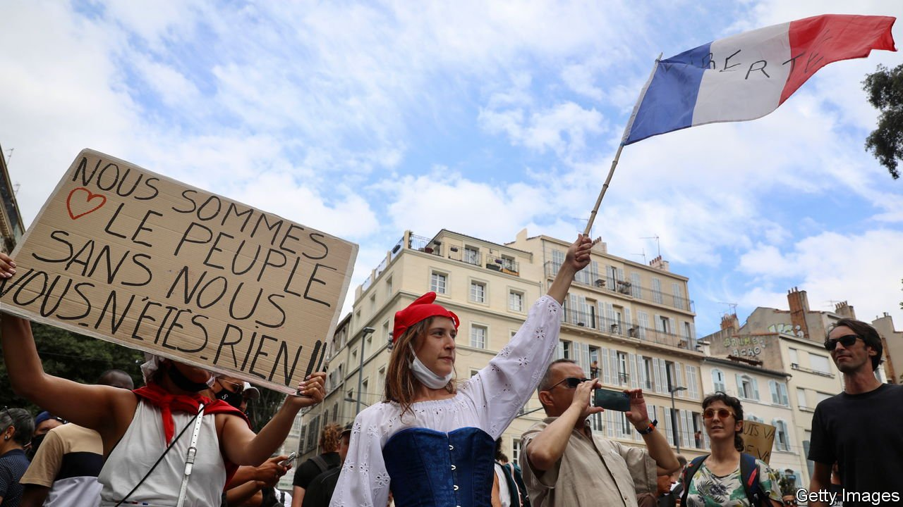
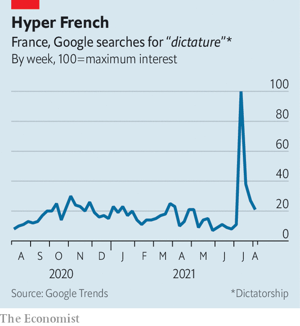

###### 1789 and all that

# Why so many French people fear dictatorship and civil war 

##### Apocalyptic piffle is not just for Anglophones 

 

> Aug 12th 2021 

VENTURE INTO the chat rooms of French cyberspace or onto the streets of Paris, and the impression this summer is of a country on the brink of totalitarian rule or civil collapse, or both. In July the word dictature (dictatorship) surged tenfold on Google, in anticipation of a new “health pass” introduced on August 9th by President Emmanuel Macron. This makes full vaccination (or a negative covid-19 test) a condition of access to restaurants, bars, trains and other places.

Nicolas Dupont-Aignan, a right-wing deputy, called the new pass sanitaire a “sanitary coup d’état”. Michèle Rivasi, a Green politician, called it “apartheid”. Protesters clutched placards with slogans such as “False pandemic, real dictatorship” and “Pass Nazitaire”, or photos of Mr Macron with a Hitler-style moustache. A few wore yellow stars on which was written “non-vaccinated”, eliciting widespread indignation. Joseph Szwarc, a 94-year-old Holocaust survivor, called the comparison “odious” and said he shed tears at the sight: “I wore the yellow star; I know what it was.”


In April and May the phrase guerre civile (civil war) spiked on Twitter, after retired right-wing generals wrote an open letter offering to step in to save the country should it slide into chaos. A poll suggested that 58% of the French backed the officers, and nearly half thought the army should step in on its own initiative.

 


Why is France so often convinced it is on the brink, and so prone to rhetorical hysteria? The country’s disjointed and rebellious history is one answer. “Are we in 1789?” is still a periodic headline in the press. And indeed, the prospect of disorder is not wholly fanciful. A culture of mass protest is deeper-rooted in France than in any other European country, and reasoned debate often gives way to factional theatrics and sabotage. Fifty years after the May ‘68 student uprising, gilets jaunes (yellow jackets) ransacked Paris. In July anti-vaxxers invaded a town hall in Chambéry, in the Alps, and vandalised vaccination centres.

Inflating fears of violence or totalitarianism may also suit some politicians. Many a French election campaign has been won on the promise of calm after chaos. Over four-fifths of the French say that feelings of “insecurity” will influence their vote at the presidential election next year, even though violent crime (sexual and domestic violence aside) has been falling for years and the murder rate is stable. Some 200,000 people grabbed headlines on August 7th by marching against the new health rules. Yet, after they were announced, over 8.5m quietly got vaccinated for the first time. As for allegations of dictatorship, Mr Macron put it this way: “If we empty words of their meaning, the risk is that we threaten our democracy itself.”

