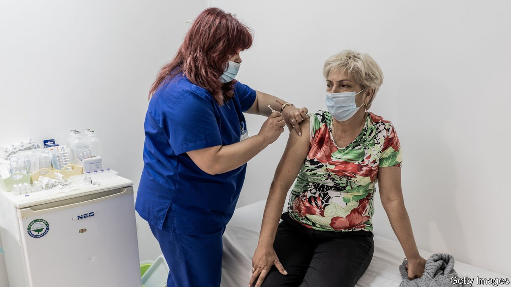
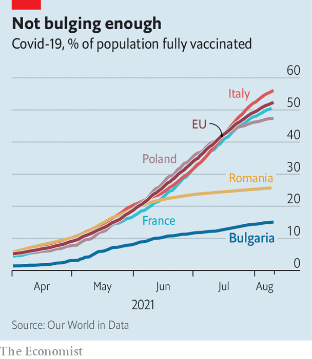

###### Slavic sceptics

# With just 15% fully jabbed, Bulgaria is giving away vaccine shots 

##### Demand is so low that many doses are about to expire 

 

> Aug 12th 2021 

ON THE MORNING of August 10th the head of public health for Sofia, Bulgaria’s capital, announced various restrictions on restaurants and entertainment venues to curb a surge of covid-19. A few hours later the national ministry of health said no such thing would happen, calling the announcement a bureaucratic mistake. Chaotic messaging is just one reason why Bulgaria has seen so much death during the pandemic, and is bracing for more.

Among 84 countries tracked by The Economist, Bulgaria ranks second (after Peru) on excess deaths per 100,000 people since the start of the pandemic, meaning deaths above the usual rate. After a summer lull, cases are rising again as the highly contagious Delta variant spreads. Hospitals are preparing for yet another onslaught. Only 15% of Bulgarians are fully vaccinated, the lowest rate in the EU, where the overall share is 52%.


Bulgarians who want to can easily get any of the four covid-19 vaccines approved in the EU. But demand has been so low that authorities are trying to sell or donate hundreds of thousands of doses that will expire soon to other countries.

 


Historically, Bulgarians have had little trust in official advice. Circumventing rules of all sorts is a national pastime. Many people are suspicious of the jabs because they are new; some think the virus does not exist, and that measures against the pandemic are a conspiracy. Only a handful of prominent politicians have had themselves vaccinated on television, or are urging people to get a jab.

That is partly because of political turbulence. Two rounds of elections this year have failed to produce a government. Neither Boyko Borisov, who served as prime minister for most of the past 12 years, nor the caretaker cabinet that replaced him after his government fell in April have mounted a serious public-information campaign to combat fake news about the vaccines. “Anyone who reads three articles on social media thinks he is an expert,” says Angel Kunchev, the country’s chief health inspector.

Watching Bulgarian television can leave you confused. A few covid-sceptical doctors are regularly invited on talk shows. Some advise people with medical conditions that would place them in priority vaccination groups in most countries against getting jabbed. About 30% of doctors and 60% of nurses are unvaccinated.

Dr Kunchev says this is partly because infectious diseases and immunology are barely covered in medical-school curriculums. As hospital admissions for covid-19 climb again, demand for vaccinations seems to be picking up. But, as with most of Bulgaria’s handling of the pandemic, the uptick is too little and too late. ■

Dig deeper

All our stories relating to the pandemic and the vaccines can be found on our . You can also find trackers showing ,  and the virus’s spread across  and .

