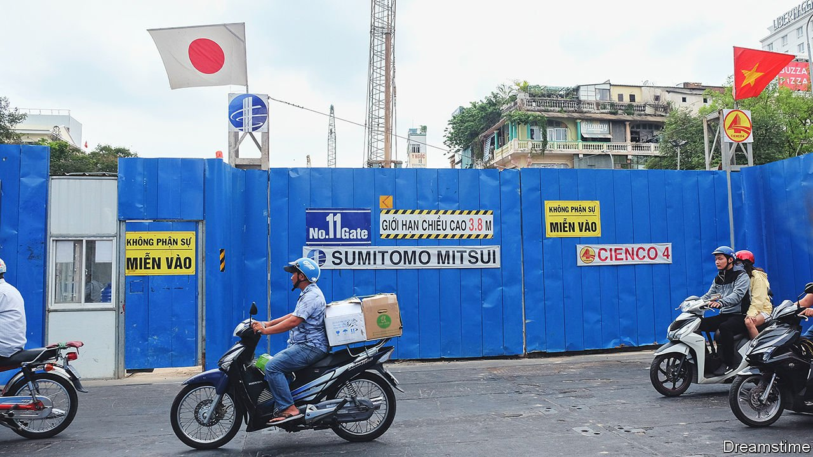
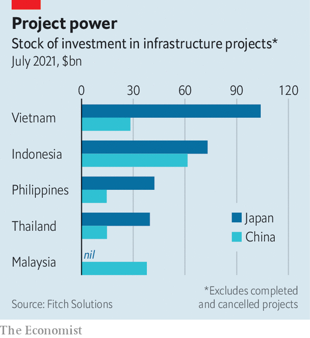

###### A quiet giant

# A glimpse into Japan’s understated financial heft in South-East Asia 

##### It is a bigger investor in the region’s infrastructure projects than China 

 

> Aug 14th 2021 

VIETNAM’S FIRST two rapid-transit rail lines are inching closer to completion, after years of delays. The projects, one in each of the country’s two largest cities, have become symbols not just of Vietnam’s modernisation, but of the duelling interests of Asia’s two biggest sources of infrastructure investment. Hanoi’s line has been funded by Chinese development assistance; Ho Chi Minh City’s was launched with help from the Japanese government.

Although China’s financial reach overseas attracts enormous attention, when it comes to infrastructure in South-East Asia, Japan is still very much the leader (see chart). In total, it has $259bn invested in unfinished projects in Indonesia, Malaysia, the Philippines, Thailand and Vietnam, according to Fitch Solutions, a data provider, compared with China’s $157bn. Both figures have declined since 2019, as the covid-19 pandemic has deterred greenfield infrastructure investment, but Japan’s lead has widened a bit.


The construction of Ho Chi Minh City’s Urban Railway Line 1 is a microcosm of the Japanese infrastructure offering abroad. Government and quasi-governmental agencies laid the groundwork for the country’s mammoth business groups. The project began almost nine years ago with early support from the Japan International Co-operation Agency, which facilitates most of the country’s overseas development assistance. Sumitomo Corporation, a sprawling private-sector conglomerate, won the construction contract as part of a consortium, Tokyo Metro has provided technical assistance, and Hitachi’s trains have been delivered to run on the line.

 


While America under President Joe Biden has been forthright about its ambition to challenge China’s Belt and Road Initiative (BRI), Japan has been reluctant to frame its pursuit of large infrastructure projects as a contest with China. Still, it is not hard to spot the change in strategy, particularly during former prime minister Abe Shinzo’s period in office. In 2015 the government launched the “Partnership for Quality Infrastructure” (PQI) with the Asian Development Bank and other investors, which promised to provide public and private capital worth $110bn for infrastructure projects in the region over the next five years (though progress in reaching this goal has not been closely tracked). Despite not calling out the BRI in public, the message behind Japan’s repeated emphasis on quality has not gone unheard in the region.

The PQI was explicitly made part of the country’s “Free and Open Indo-Pacific” strategy, launched in 2016, linking its foreign-policy objectives with its financial priorities. That same year, the Japan Bank for International Co-operation, which began life in 1950 as an export-promotion bank, saw its role amended to allow for greater financial risk-taking. In recent years it has pivoted towards financing overseas investment: in the year to March 2020 only 11% of the bank’s commitments were export loans, while 82% were overseas investment loans.

Japan has some distinct advantages compared with most Western economies, each of which goes some way to explaining the country’s relatively discreet financial heft. Simple proximity is one of them: Japan’s largest companies are deeply familiar with other Asian markets, which have made up a significant share of their international sales for decades. Japan exported more to the Association of South-East Asian Nations than American firms did in 2019, even though the American economy is more than four times the size of Japan’s.

Although the country cannot deploy private investment through large state-owned enterprises, as China does, relationships between the private sector and the government are much closer than in other capitalist economies, greasing the wheels of co-operation. Saori Katada of the University of Southern California notes that, in competing with China for regional infrastructure, Japan has reverted a little to its “Old Japan” strategy of the post-war boom, in which the private and public sectors worked seamlessly together. The partnership is far less heavy-handed than it was in the heyday of the “iron triangle”—the politically dominant Liberal Democratic Party, the apparatus of the state and the country’s business scions. But the legacy of a mercantilist attitude to foreign trade and investment is clear.

That blending and blurring of state and private investment objectives might once have produced consternation from Western governments, particularly when Japan was seen as Asia’s ascendant economic power. But the advent of the BRI and concerns about China’s economic influence in the region have changed priorities. As the only serious competitor to Beijing’s financial clout in the region, Japan’s overseas infrastructure heft is likely to be welcomed across much of the world—even if Tokyo doesn’t shout too loudly about it. ■

