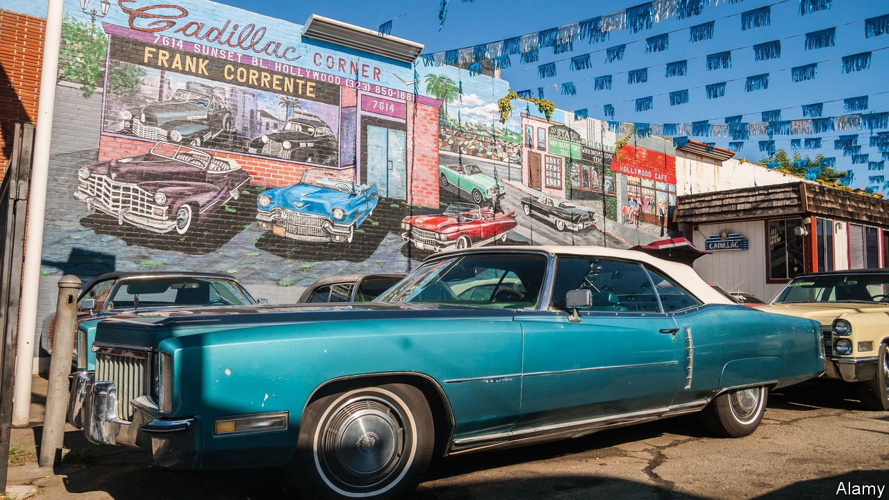

###### Beatable prices

# America’s inflation scare becomes less menacing 

##### Decelerating used-car prices suggest that the surge may be transitory 

 

> Aug 11th 2021 

THE USED-CAR salesman occupies a distinctive, if rather unflattering, place in American culture. In “The Grapes of Wrath”, John Steinbeck’s classic novel set in the Depression, sleazy salesmen prey on miserable farmers. “Cadillac Man”, a film from 1990, features a fast-talking merchant with a bevy of mistresses. These depictions, and many others, are unfair to most of the hard-working types on car lots. But in recent months such salesmen have occupied a distinctive and unflattering place in America’s economy, as avatars of worryingly rapid inflation.

When consumer prices rose by 5.4% in June compared with a year earlier, the fastest pace since 2008, used cars accounted for a third of the pickup. So analysts are paying unusually close attention to the market for used cars (or, as those selling them prefer to say, “pre-owned” vehicles). On August 11th the Bureau of Labour Statistics reported that annual headline inflation in July again hit 5.4%. But when you look under the hood, the gauge for used cars offers reassurance: prices levelled off, suggesting that the inflation scare may prove transitory.


The price surge in used cars has been indicative of the pressures building as businesses roar back from the depths of the pandemic, only to run headlong into shortages of everything from critical parts to staff. A dearth of semiconductors in the vehicle industry, itself a product of bunged-up supply chains, has had ripple effects. Without the microchips needed for electronic systems, carmakers have cut back production. Given the lack of new vehicles, would-be buyers have turned to the used market, leading to a spike in demand. But there has been a shortfall in supply at the same time, because existing owners have held on to their cars for longer than normal amid all the pandemic disruptions. The result: a 30% increase in used-car prices between April and June.

 


Similar dynamics have pushed up prices for home furniture, airline tickets and clothing. Alarming as that might sound, the fact that these increases were all tied to the lopsided recovery from the pandemic was taken as evidence by many analysts that the jump in inflation may be a passing phenomenon. Sure enough, the data from July lent credence to that view. Airline fares fell slightly, as did the cost of furniture. Prices for clothing and used cars were basically unchanged. The overall consumer-price index rose by 0.5% month-on-month in July, down from 0.9% in June. The slowdown in core inflation, stripping out food and energy, was even sharper (although, in annualised terms, it was still well above the Federal Reserve’s 2% target).

The ebbing of inflation is, for now, a vindication for the Fed. Although it has hinted that it may begin to wind down its ultra-loose monetary policy this year (by reducing its monthly bond purchases), most Fed officials think it will only start raising interest rates in 2023—a patience potentially at odds with high inflation. The Fed, to be sure, is hardly alone. A decline in Treasury yields in recent months in part reflects investors’ falling inflation expectations, in addition to concerns over the continued economic drag from the pandemic.

Nevertheless, it is too soon to sound the all-clear. Unlike cars or couches, which are not exactly everyday purchases, some recurring expenditures look a little headier. The price of shelter, which includes rents paid by tenants and “imputed” rents for home-owners, rose by 0.4% in July from June, and could rise further as universities and offices open up. Economists at Citigroup, a bank, pointed to yet another big increase in restaurant prices. This, they said, was a clear sign that a tight labour market is pushing up wages and feeding through to higher prices.

Moreover, used cars may yet drive back into the spotlight. At a showroom in Bethesda, Carlos Correa, an affable salesman, explains that his company normally has three lots full of cars. Now, though, they are down to two, which are still mostly empty. The levelling-off in prices is, he thinks, explained by tepid summer demand. “It’s usually quiet this time of year,” he says. Autumn could turn up the heat on prices again. ■

