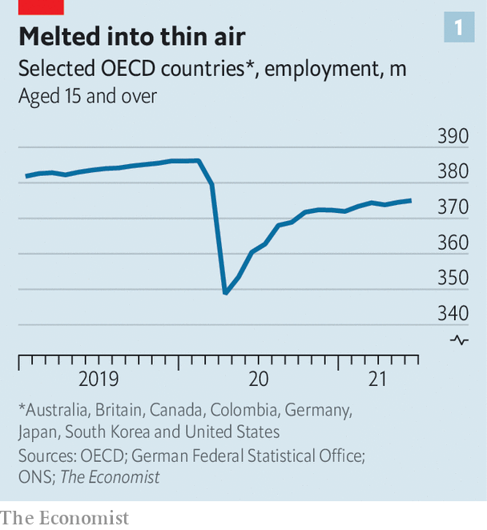
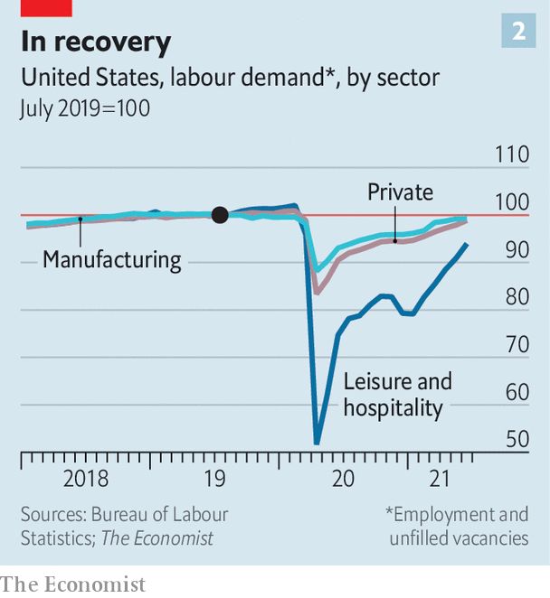
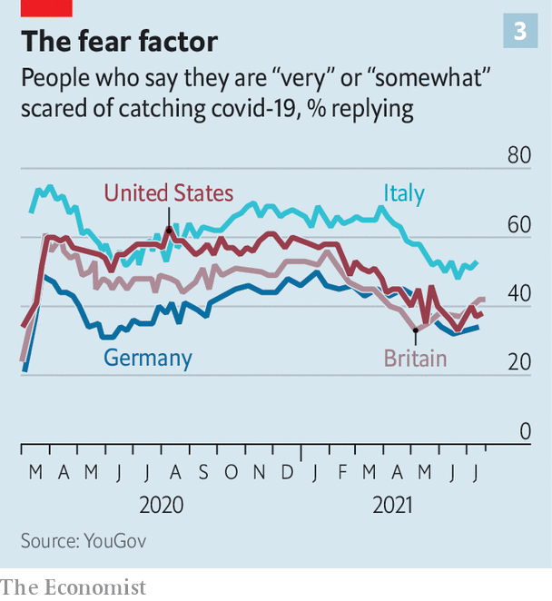

###### A curse on both your houses

# Will the rich world’s worker deficit last? 

##### It will depend on whether the people who have left the workforce can be lured back 

 

> Aug 10th 2021 

AMERICA’S LATEST jobs report was both encouraging and sobering. The world’s largest economy added 943,000 jobs in July. That is the best tally in nearly a year—but even at this pace employment  with its pre-crisis level until early 2022, six months after output regained its peak. Jobs in the rest of the rich world, too, are likely to take a while to return to pre-pandemic highs. Demand for workers is still lower than it was before covid-19 struck; and, more important, people have withdrawn from the world of work.

Before the pandemic the rich world enjoyed an extraordinary . In 2019 a higher share of people over the age of 15 was in the labour force—ie, either in work or looking for it—than at any point since at least 1990. The working-age employment rate (the share of 16- to 64-year-olds in a job) was at an all-time high in over half of rich countries.


Now labour markets are surprising in the opposite direction. Harmonised statistics are published with a long lag, but our best guess, based on data from eight countries, is that employment in the rich world is 3% below its pre-pandemic high (see chart 1). That points to a deficit of about 18m people—a huge waste of talent, not to mention a hit to tax revenues.

 


What explains the gap? One potential explanation is that there is too little demand for labour. A rough measure of the need for workers involves adding the total number of people already employed to the number of unfilled vacancies (see chart 2). Even in America, with its roaring economy, this gauge has yet to fully recover: despite record high vacancies, it is 2% below its pre-crisis level. Some firms, such as those in manufacturing, have healthy-ish demand for workers, but in leisure and hospitality demand is still 6% below its pre-pandemic level.

 


Covid-19 restrictions, such as travel bans, surely play a role in explaining weak demand. In Paris plenty of hotels remain closed. Your correspondent recently suffered the indignity of having to board a red-eye from JFK airport entirely sober because all the airport bars were still shut.

Some economists see insufficient spending as a cause of subdued labour demand. In three-quarters of rich countries the “fiscal impulse”, a measure of the oomph government spending gives the economy, is expected to turn negative this year. Yet it seems unlikely that governments can close the worker deficit simply by spending more. Compare America and the EU. In the spring of 2020 aggregate working hours in both economies tanked. America then passed gargantuan stimulus packages, while European governments chose more modest measures. The recovery in working hours since then has been only marginally better in America—not much extra labour for a lot of extra cash.

This suggests that the worker deficit is not just about demand. The supply of workers may have fallen by more, limiting the jobs recovery. The share of people in the workforce in the rich world has fallen sharply since the pandemic began and, we estimate, is about 1.5 percentage points below its peak. Other indicators also point to a scarcity of workers. Wages, for instance, are growing fairly strongly.

To understand whether the worker deficit will ease, then, you must consider why labour supply has fallen. Three broad explanations stand out: disruption owing to the spread of covid-19; the impact of welfare policy and pensions; and changes to attitudes wrought by the pandemic.

Take disruption first. It is commonly believed that school closures have made it impossible for parents, particularly mothers, to take a job. The evidence for this is mixed, though. Analysis by Jason Furman, Melissa Kearney and Wilson Powell III concludes that extra joblessness among mothers of young children accounts for a “negligible” share of America’s employment deficit. Despite talk of a “shecession” early in the pandemic, in most rich countries the worker deficit for men remains larger.

Disruption to migration may be a more plausible cause of the shortfall. Before the pandemic immigration drove workforce growth. Then countries slammed borders shut to contain cases. Today lower visa issuance in America accounts for about a fifth of its worker deficit. Australia is losing migrants on net for the first time since records began in the 1950s.

Fear of the virus may also have disrupted labour supply. Even in highly vaccinated countries a large share of people worry about contracting covid-19 (see chart 3). This surely puts some people off working in high-contact sectors such as hospitality.

 


Lower labour supply might also reflect the impact of welfare policies such as handouts and pensions—our second category of reasons. Frothy stockmarkets may have boosted the value of some pension pots, prompting people to start their golf-club membership earlier than expected. That seems to have been the case in America: recent research by Goldman Sachs, a bank, finds that “excess retirees” account for about a quarter of the decline in the country’s participation rate.

In other places, however, the share of 55- to 64-year-olds in the workforce has gone up. Research by the OECD, a rich-country think-tank, has shown that in many countries pension-fund returns were meagre in 2020, perhaps because some fund managers sold at the bottom of the market in the spring. Canadian funds’ real returns, at 1.9%, were one-third of America’s; in Australia they were negative. Small wonder that in both places the participation of older workers has risen.

For younger people, meanwhile, generous benefit payments introduced in 2020, an element of bonanza stimulus packages, may have blunted the need to find work. Although many of these are now being withdrawn, people might have used past handouts to accumulate savings, which might delay their return to work. According to our analysis households in the rich world have built up additional funds worth a tenth of annual consumer spending.

The third broad reason for lower labour supply relates to shifting attitudes. One intriguing possibility is that the pandemic has made people value work less. Many report to surveys that they treasure family time more than they did. A shift in work preferences would be a seismic event; but it is frustratingly hard to measure whether it is actually happening. A clue, however, comes from Britain, which tracks people who say they want to work fewer hours, even if their pay falls. Normally economic downturns prompt reported “overemployment” to collapse. But not in this one.

Bring all this together, and the extent to which the worker deficit endures seems likely to depend in part on how long the disruption and the fear caused by the pandemic last. Rising wages might lure some of those who left the workforce back into jobs. But the longer the pandemic goes on, the harder it becomes for those who left to return, and the more likely it is that new habits stick. The worker deficit might be here for some time. ■

