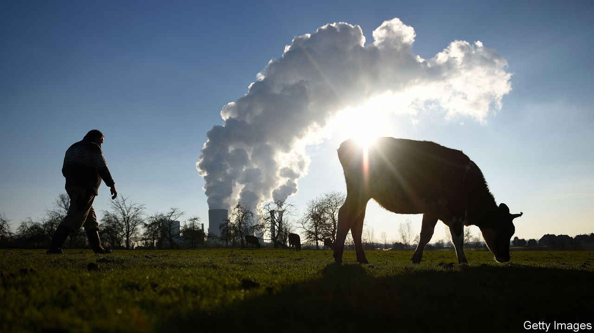
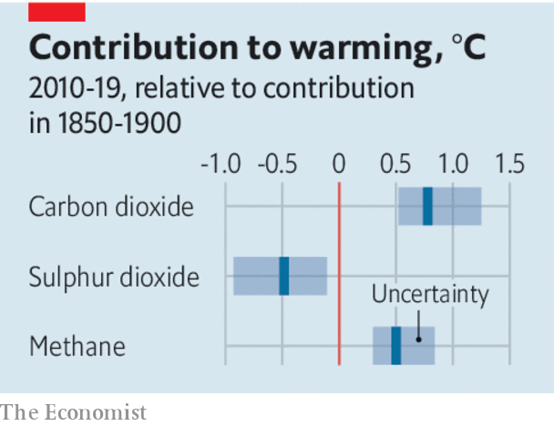

###### Not all about the carbon

# Carbon dioxide is by far the most important driver of climate change 

##### But methane matters, too 

 

> Aug 14th 2021 

THE HEADLINE of the latest pronouncement from the Intergovernmental Panel on Climate Change (IPCC) on the physical science of climate change is the finding that, even if the world cuts emissions by more than governments are promising, it is still “more likely than not” that Earth will be 1.5°C warmer by around 2050 than it was in the late 19th century.

That is important, and frightening, but hardly shocking. The aim of letting the world warm no more than 1.5°C, agreed on in Paris six years ago, is one to which many countries, notably the small-island states for which sea-level rise is an existential threat, are deeply committed. But many observers believe it stringent almost to the point of impossibility.


Another conclusion in the IPCC report, though, may come as news to many. If carbon-dioxide emissions were the only means by which humans were changing the climate, 1.5°C of warming would have already come about. As it is, other human emissions matter, too. Among the most important are sulphate aerosols: tiny particles produced by the combustion of coal and some sorts of oil that float in the air, sully the lungs, kill millions—and also, by reflecting away incoming sunlight, cool Earth.

 


The IPCC reckons that sulphates have provided a net cooling of 0.4-0.5°C since the late 19th century, and that this is a large part of the reason why that period has seen only 1.1°C of warming. But the sulphates’ influence is on the wane. In order to improve air quality, and thereby save lives, sulphur is now removed from almost all liquid fuels at the refining stage and increasingly scrubbed from the flues of coal-fired power stations, even in China. This clearing of the air is stripping away some of the noxious cooling. Speedy reduction in fossil-fuel use will remove the rest of it—thus, ironically, allowing the effects of the carbon dioxide already in the atmosphere to be felt all the more keenly.

In 2006 Paul Crutzen, a pre-eminent atmospheric chemist, suggested that there might be a way to save people’s lungs while still keeping them cool. In the lower atmosphere, where industry dumps them, sulphate particles are short-lived. In the stratosphere they last much longer. Putting a relatively sparse layer of sulphates into the stratosphere could thus provide the same amount of cooling as today’s lower-atmosphere smogs while doing almost no direct harm.

Crutzen’s intervention spurred renewed interest in the idea of intentionally interfering with incoming sunlight, a possibility known as “solar geoengineering”. It is an interest of which the IPCC is wary. Solar geoengineering has no role in the scenarios the panel uses to talk about future climates. As a result its new report, like its predecessors, discusses the idea only in broad terms. In doing so it notes, correctly, that the idea has significant drawbacks. But it also allows that  might, in principle, be used to create significant global cooling much more promptly than reducing carbon-dioxide emissions ever could.

Both the drawbacks and the potential provide good reason for researching geoengineering more thoroughly and systematically. But it would be wrong to think it a quick, easy or necessarily desirable response. Perhaps the biggest worry is that its seeming promise would be used as an excuse for inaction on carbon-dioxide emissions. A world where geoengineering was used simply to cover up, increasingly imperfectly, the effects of ever higher greenhouse-gas levels would be a fearsomely unstable one.

A more palatable approach to offsetting the diminishing effects of sulphate pollution, enthusiastically endorsed by the IPCC, is to redouble efforts to reduce emissions of another climate-changing by-product of human civilisation. Methane is a more powerful greenhouse gas than carbon dioxide, but one which lasts in the atmosphere for only about a decade. Reduce methane emissions and you soon reduce methane levels; reduce methane levels and you reduce global warming.

Its rising atmospheric concentration shows that today’s efforts to abate methane emissions are not up to the job. Happily, there is much more that can be done. Emissions from the energy industry could be more tightly regulated almost everywhere. Because methane is valuable, some would pay for themselves. Reducing emissions from landfill sites is not terribly difficult either. Livestock would burp less with the right feed supplements. Eliminating emissions would be hard; but quite steep reductions are entirely possible.

Carbon dioxide remains the heart of the climate problem. Exploring the possibilities, practicalities and dangers of solargeoengineering remains a good idea. But it is on methane emissions that progress can be made most quickly. And the world is getting ever hotter. Methane should be given priority on the agenda at the COP26 climate summit this November.

For more coverage of climate change, register for The Climate Issue, our fortnightly , or visit our 

