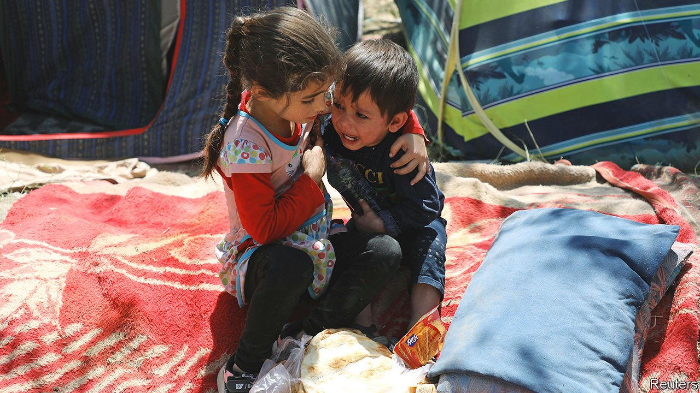

###### Last chance

# It might still be possible to save Afghanistan 

##### But America is refusing to try 

 

> Aug 11th 2021 

“A NEGATIVE OUTCOME, a Taliban automatic military takeover, is not a foregone conclusion,” Mark Milley, America’s most senior soldier, intoned last month while reiterating America’s support for the embattled Afghan government. General Milley is right: such a takeover is not quite inevitable, despite the departure of American troops. But it is growing more likely by the day—in large part because America, whatever its generals say, is doing too little to help.

Ideally, America would not be withdrawing its forces at all. For several years, with only a few thousand troops who sustained few casualties, it had managed to maintain a stalemate between the Afghan government and the Taliban, thanks largely to air power. Yet last year, when Donald Trump was president, America struck a deal with the Taliban. In exchange for a promise from the militants not to harbour international terrorists, it undertook to withdraw from Afghanistan completely. Never mind that the insurgents refused any kind of ceasefire; never mind that they offered nothing more than indirect negotiations with the American-backed government in Kabul; Mr Trump wanted a quick end to the 20-year deployment, and President Joe Biden has stuck by that callous decision.


America’s rush for the exit has allowed the Taliban to drop the pretence of negotiations and redouble their campaign to . The insurgents did not control any of the 34 provincial capitals last week. They have since seized ten. Three of the country’s biggest cities, Herat, Kandahar and Mazar-i-Sharif, are under attack. America no longer has any military aircraft based in Afghanistan able to repel such assaults. Instead, it is dispatching them from distant bases in the Gulf and carriers in the Arabian Sea—a much less effective arrangement. And many of the mechanics who were helping maintain the Afghan air force’s planes have left with the Americans, further reducing the government’s firepower.

That has led to a rout which, if it continues, will be a disaster. When the Taliban last ran the country, in the 1990s, they kept girls out of school, confined women to their homes and beat anyone who listened to music or wore the wrong clothes. They have not changed much since then. In areas they now control, they are murdering civil servants and NGO workers, and ordering families to hand over single women to “marry” their troops.

A revived Taliban emirate will not just abuse Afghans; it will spread misery around the region. Afghanistan is already the world’s biggest producer of heroin, a business the Taliban happily tax. It also exports millions of refugees, especially to neighbouring Pakistan and Iran. Extremist violence is another export. An offshoot of the Taliban killed tens of thousands of Pakistanis during a bloody terrorist campaign that took years to quell. America’s humiliation may be pleasing to some in the region, but the pleasure will be short-lived.

Yet instead of joining forces to curb the Taliban, regional powers are bickering and jostling for advantage. And instead of finding ways to help the Afghan government, America is backing away fast. On August 10th Mr Biden declared that, in effect, it was up to the Afghan army to fight for itself.

If it is really left to cope on its own, the government will indeed collapse. But America might yet be able to stave that off without reinstating a permanent garrison. It could deploy special forces on brief sorties to bolster the Afghan army, for instance. It could expand the use of carriers to provide air support, or lean on neighbouring countries to allow at least temporary access to American aircraft. Above all, Mr Biden could signal that he does not intend to abandon Afghanistan to its fate—an impression that is doing more than anything else to hasten the Taliban’s advance. Over the past 20 years America has not managed to turn Afghanistan into a flourishing democracy, but it can still stop it from reverting to a violent theocracy. ■

