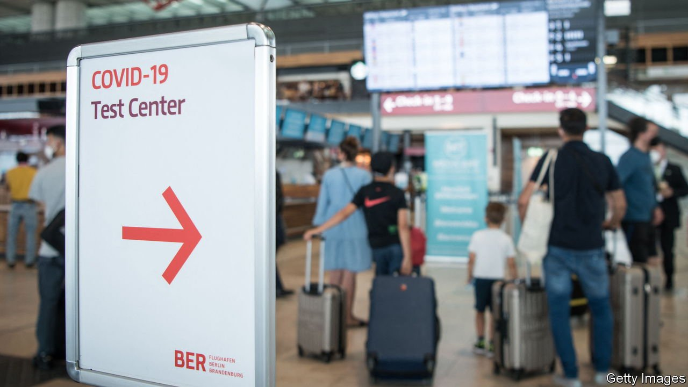

###### Open up

# Most covid-19 travel restrictions should be scrapped 

##### The rules are ineffective, illiberal and often useless 

 

> Aug 14th 2021 

FOR A LUCKY few, the mid-20th century was a golden age of air travel: there was plenty of room and the cabin crew were attentive. Back then foreign trips were glamorous and mass tourism was unknown. Sound familiar?

Because of covid-19,  is once again the preserve of a happy few. International tourist arrivals are down by 85% from pre-pandemic days. Nearly a third of the world’s borders remain closed. Many of the remainder are open only to those who have been vaccinated or can afford tests. For those who dream of a return to the old days, this might sound appealing. For the rest of humanity, it is a scourge.


Before the pandemic, travel accounted for 4.4% of GDP and nearly 7% of employment in rich countries. In tourist hotspots such as Thailand and the Caribbean the share was much higher. Business travellers helped their employers conquer new markets, while simultaneously creating jobs for concierges and cabbies. Foreign students subsidised their native-born classmates, brought a different perspective to campus and took new ideas back to their homelands. Last year some 280m people lived outside the country of their birth. Border closures often made it impossible for them to visit their loved ones. Some bade farewell to dying parents over WhatsApp.

Today’s travel restrictions are supposed to protect natives from imported covid. Yet they do a poor job of it. A few countries, mostly islands and dictatorships, have managed to keep out the virus through truly draconian restrictions. Even this has come at a cost in terms of reducing pressure to be vaccinated quickly. Only 21% of New Zealanders over 12 are fully vaccinated, for example, compared with 68% of Britons. Countries that put their faith in isolation are thus finding it hard to reopen.

Most countries have land borders and voters. For them isolation was never feasible. Instead, they have adopted a confusing, illogical mess of rules. America bars travellers from Britain and the European Union, its closest allies and trade partners, and also two of the most vaccinated big places in the world, while admitting those from South-East Asia, where the Delta variant is rampant. Thailand bans entry from some countries and requires all other travellers to submit to a two-week quarantine. Yet of 21,038 cases identified on August 10th, only 19 were imported. Once a variant of the virus has started to spread in the local population, infections double every couple of weeks. Entry bans make very little difference to the total caseload.

Many countries are starting to ease entry for vaccinated travellers. This is a good idea, but it has been incompetently executed. Some countries are needlessly fussy about the jabs they recognise. Britain, which has injected its citizens with some 5m doses of the AstraZeneca vaccine made in India, refuses to exempt from quarantine Indians inoculated with the same potion. It has donated doses to other countries but will not exempt people jabbed with them. For a while, China allowed entry only to those dosed with Chinese-made shots.

There is a better way of regulating global travel. The first principle is to default to open borders. This does not mean a free-for-all, but any restrictions should be limited, temporary and aimed at slowing the import of new variants—rather than the impossible mission of stopping it altogether. Once such variants are established in the destination country, as Delta is pretty much everywhere, restrictions are redundant and should be scrapped.

The second is for all countries to accept vaccines approved by the World Health Organisation. Few people have a choice about which vaccine they receive; banning only those Filipinos who received the Russian Sputnik V jab while accepting those with Pfizer in their arms turns travel into a lottery. Discriminating against people on the basis of something over which they have no choice is unfair. It also undermines the global vaccination effort by making some vaccines seem second-class.

The third is to ensure that rules are transparent and universal. Too often, political expediency trumps science. If Western countries are seen to favour each other while keeping out the rest of the world, the rest of the world will notice and remember.

The right to move around is one of the most precious of all freedoms. It should be curtailed only when limits will clearly save lives. It should be restored as soon as it is safe. In most cases that means now. ■

Dig deeper

All our stories relating to the pandemic and the vaccines can be found on our . You can also find trackers showing ,  and the virus’s spread across  and .

