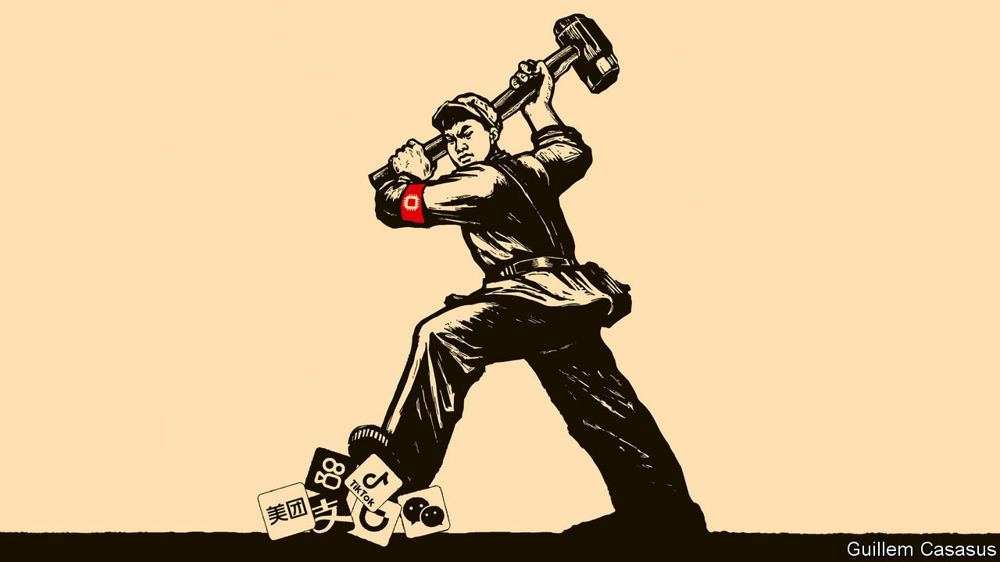

###### Unruly response

# Xi Jinping’s assault on tech will change China’s trajectory 

##### It is likely to prove self-defeating 

 

> Aug 14th 2021 

OF ALL CHINA’S achievements in the past two decades, one of the most impressive is the rise of its technology industry. Alibaba hosts twice as much e-commerce activity as Amazon does. Tencent runs the world’s most popular super-app, with 1.2bn users. China’s tech revolution has also helped transform its long-run economic prospects at home, by allowing it to leap beyond manufacturing into new fields such as digital health care and artificial intelligence (AI). As well as propelling China’s prosperity, a dazzling tech industry could also be the foundation for a challenge to American supremacy.

That is why President Xi Jinping’s assault on his country’s $4trn tech industry is so startling. There have been over 50 regulatory actions against scores of firms for a dizzying array of alleged offences, from antitrust abuses to data violations. The threat of government bans oand fines has weighed on share prices, costing investors around $1trn.

Mr Xi’s immediate goal may be to humble tycoons and give regulators more sway over unruly digital markets. But , the Communist Party’s deeper ambition is to redesign the industry according to its blueprint. China’s autocrats hope this will sharpen their country’s technological edge while boosting competition and benefiting consumers.

Geopolitics may be spurring them on, too. Restrictions on access to components made with American technology have persuaded China that it needs to be more self-reliant in critical areas like semiconductors. Such “hard tech” may benefit if the crackdown on social media, gaming firms and the like steers talented engineers and programmers its way. However the assault is also a giant gamble that may end up doing long-term damage to enterprise and economic growth.

Twenty years ago China hardly seemed on the threshold of a technological miracle. Silicon Valley dismissed pioneers such as Alibaba as copycats, until they leapt ahead of it in e-commerce and digital payments. Today 73 Chinese digital firms are worth over $10bn. Most have Western investors and foreign-educated executives. A dynamic venture-capital ecosystem keeps churning out new stars. Of China’s 160 “unicorns” (startups worth over $1bn), half are in fields such as AI, big data and robotics.

In contrast to Vladimir Putin’s war on Russia’s oligarchs in the 2000s, China’s crackdown is not about insiders fighting over the spoils. Indeed, it echoes concerns that motivate regulators and politicians in the West: that digital markets tend towards monopolies and that tech firms hoard data, abuse suppliers, exploit workers and undermine public morality.

Stronger policing was overdue. When China opened up, the party kept a stifling grip on finance, telecoms and energy but allowed tech to let rip. Its digital pioneers used this near absence of regulation to grow astonishingly fast. Didi, which provides transport, has more users than America has people.

However, the big digital platforms also exploited their freedom to trample smaller firms. They stop merchants from selling on more than one platform. They deny food-delivery drivers and other gig workers basic benefits. The party wants to put an end to such misconduct. It is an ambition that many investors support.

The question is how? China is about to become a policy laboratory in which an unaccountable state wrestles with the world’s biggest firms for control of the 21st century’s essential infrastructure. Some data, which the government says is a “factor of production”, like land or labour, may pass into public ownership. The state may enforce interoperability between platforms (so that, say, WeChat cannot continue to block rivals). Addictive algorithms may be more rigorously policed. All this would hurt profits, but might make markets work better.

But make no mistake, the crackdown on China’s unruly tech is also a demonstration of the party’s untrammelled power. In the past its priorities often fell victim to vested interests, including corrupt insiders, and it was constrained by its need to court foreign capital and create employment. Now the party feels emboldened, issuing new rules at a furious pace and enforcing them with fresh zeal. China’s regulatory immaturity is on full display. Just 50 or so people staff its main anti-monopoly agency but they can destroy business models at the stroke of a pen. Denied due process, companies must grin and bear it.

China’s leaders have spent decades successfully defying Western lectures on liberal economics. They may see their clampdown on the technology industry as a refinement of their policy of state capitalism—a blueprint for combining prosperity and control in order to keep China stable and the party in power. Indeed, as China’s population starts to decline,  through state direction, including by automating factories and forming urban mega-clusters.

Yet the attempt to reshape Chinese tech could easily go wrong. It is likely to raise suspicion abroad, hampering the country’s ambitions to sell services and set global tech standards worldwide in the 21st century, as America did in the 20th. Any drag on growth would be felt far beyond China’s borders.

A bigger risk is that the crackdown will dull the entrepreneurial spirit within China. As the economy shifts from making things towards services, spontaneous risk-taking, backed by sophisticated capital markets, will become more important. Several of China’s leading tech tycoons have pulled back from their companies and public life. Wannabes will think twice before trying to emulate them, not least because the crackdown has jacked up the cost of capital.

Startup slowdown

China’s biggest tech firms now trade at an average discount of 26% per dollar of sales relative to American firms. Startups, such as the minnows taking ride-hailing business from Didi with mapping apps, have been nibbling at the government’s main targets. Far from being emboldened by the crackdown, they are likely to feel exposed. Economic development is largely about creative destruction. China’s autocratic leaders have shown that they can manage the destruction. Whether this tech tumult will also foster creativity remains much in doubt. 