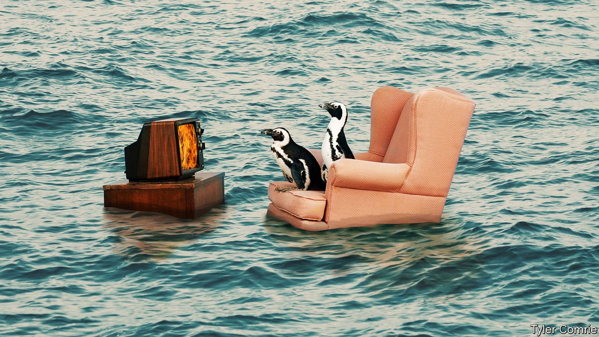

###### On risk and vaccines, science fiction, climate change, lending, beer, rainfall

# Letters to the editor 

##### A selection of correspondence 

 

> Aug 14th 2021 


Dealing with risk

Your attempt to shed light on who refuses vaccines gave a dismissive conclusion that one way to increase take up of the jab is to focus on “information-dissemination for the uneducated” (“”, July 31st). Research on the psychology of risk perception by Paul Slovic and others has revealed that how we perceive and respond to potential danger is far more a matter of how we feel about the facts than the facts alone. So the first step in dealing with vaccine refusal is not merely knowing who is refusing vaccination based on shallow demographics, but why.


Ever since the modern era of vaccines there has always been either vaccine hesitancy, a more mild form of concern about vaccines, or outright stubborn anti-vaccine refusal. Some refuse because humans are generally more wary about risks when we don’t trust the source of the threat. Many refuse because in the main we are more wary of anything artificial than natural. And germane to the political trends you identified, the most adamant vaccine resistance has always come from those who, like most of us to some degree, are more wary of a risk when it is imposed on us.

Wisely designed risk-communication campaigns crafted to build trust by demonstrating an understanding of and respect for people’s feelings have been shown to moderate vaccine hesitancy in many cases. But only social and legal sanctions against the most adamant vaccine refusers, invoked in the name of the common good, have had any real effect on that group.

DAVID ROPEIK

Retired instructor in risk communication at Harvard

Concord, Massachusetts

 


The future of war

For an interesting take on the ability of an artificial intelligence to develop war strategy (“”, July 3rd), I recommend Robert Heinlein’s “The Moon is a Harsh Mistress”. The novel describes how a sentient computer develops the military tactics needed for a lunar colony to secure independence.

ROBERT CHECCHIO

Dunellen, New Jersey

 


A global challenge

The erroneous assumption that adaptation to climate change is mostly a domestic affair serving domestic interests was repeated in your recent leader (). Just like a virus, climate risk can easily cross borders through international trade and supply chains, capital flows, human mobility and natural resources shared between countries, both regionally and globally. Likewise, actions to adapt to climate change can have effects far beyond the jurisdiction of the country implementing them.

A recent study led by INFRAS, a Swiss consultancy firm, for the German Environment Agency valued the economic risk of climate-induced disruptions in German trade alone as greater than the combined economic risk of all direct climate-change impacts within Germany’s national borders. In Senegal in 2008, the price of rice tripled following a chain reaction that began when India halted its exports of the grain in response to poor harvest forecasts during a drought. It led to rioting on the streets of Dakar.

Cross-border connections such as these show that adaptation is in fact a global challenge. Current approaches to adaptation planning, based on local or national risk assessments, fall short of what is needed to effectively manage climate risk in our interconnected world. Worse, one country’s adaptation efforts could all too easily redistribute climate risk to another country, rather than reduce the risk outright.

Governments and companies should therefore adopt a trans-boundary rather than a domestic perspective on climate risk to address the full scope and nature of adaptation, create opportunities for international co-operation, and pave the way towards lasting global resilience.

RICHARD KLEIN

Stockholm Environment Institute

Bonn, Germany

Solar radiation modification (SRM), also referred to as solar geoengineering, presents a risk-risk conundrum: would the world be better off with or without it? There are already divisions on whether or not it should even be researched, let alone whether or not it should be used. Although the forthcoming sixth assessment report of the Intergovernmental Panel on Climate Change is expected to provide useful new information, and may begin to answer some of these questions, many more need to be answered before decisions could be made whether or not srm should be part of any climate response strategy.

SRM is not a substitute for mitigation. At best, it could supplement efforts while temporarily cooling the planet, and possibly stave off potential planetary tipping points. But the longer the world delays the massive mitigation needed, the more likely it will face this admittedly frightening decision.

Solar radiation modification would be the most global endeavour undertaken by humanity if it ever decided to do so. The United Nations is the only truly global organisation where governments can address issues that cut across traditional sectors and national boundaries including the potential benefits and risks, as well as the governance challenges posed by SRM. The earlier this happens, the more likely the world will avoid potentially dangerous outcomes.

JANOS PASZTOR

Executive director

Carnegie Climate Governance Initiative

Former UN Assistant Secretary-General on Climate Change

Geneva

 


Giving credit

“” (July 17th) touched on how fintech firms are “rebundling” by adding new products as a key feature of their investment. It is certainly clear that despite amassing huge user bases, many fintech startups have found it a challenge to turn a profit and are turning to rebundling to solve this problem. With these added services come greater engagement and stronger customer loyalty.

Lending is going to be important in this rebundling activity, given its potential profit pool for fintechs as they mature. Despite the success stories from Western markets, the true innovation here will be in places like India and Latin America. Access to credit is often disparate, leaving many consumers underserved and markets ripe for innovation and opportunity.

Investors would do well to remember this when considering where they place their next big bet.

FADY ABDEL-NOU

Global head of M&amp;A and investments

PayU

Hong Kong

 


Sober drinking

Regarding innovations in non-alcoholic beer (“”, July 10th), in 1988 Brooks Firestone and Hale Fletcher brought an alcohol-free beer to market. It was brewed without alcohol, hence there was no need to remove it and with it the taste. It was a hit. Unfortunately, the big brewers, seeking a PR halo effect by encouraging responsible drinking, used their dominant power to squeeze them out of the market, but the cat was out of bag, and the market for tasty non-alcoholic beer grew. Adam Firestone, Brooks’s son, and David Walker used the Firestone equipment to produce the first of their alcohol craft brews under the Firestone-Walker label, which is celebrating 25 years of success.

PETER NAYLOR

Santa Barbara

What on earth is the point of an alcohol-free pub (“F”, July 31st)? Why spend an evening drinking there? If you are teetotal then sitting in a place that resembles an establishment where people drink alcohol seems to me to be nothing but unnecessarily perverse.

STEFAN BADHAM

Portsmouth

How to count the rain

A Belgian reader, commenting on the undoubted attractions of his country, unfortunately perpetuated a long-standing but inaccurate myth about the rainy climate in Ireland (, July 17th). He said that Ireland has 225 rain days a year, in contrast to 199 in Belgium. However, the 225-day figure only applies to the damp Atlantic-facing west coast of Ireland. The overall figure for the rest of the country is much lower and in Dublin it is only 155 days a year (in Berlin it is 167). Rainfall in Ireland also tends to be what we call soft; it might be wet all day but the total rainfall amount is quite small.

Among some of the many Belgians who have been attracted to the sometimes chaotic but uniquely easy-going, albeit drizzly, lifestyle in Ireland was a chef from Ypres called Zenon Geldof. You might have heard of his grandson, Bob, whose middle name is also Zenon.

DENIS MURPHY

Abergavenny, Monmouthshire

