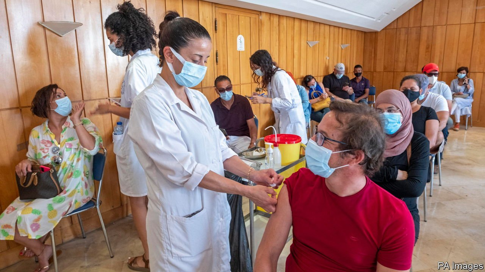

###### Of coups and jabs

# A flood of vaccines for Tunisia as foreigners vie for influence 

##### Both Gulf states and western donors want to sway a beleaguered Arab democracy 

 

> Aug 12th 2021 

WHAT A DIFFERENCE a month makes. In July, during the Eid al-Adha holiday, Tunisia’s health minister opened covid-19 vaccine centres to all adults. The centres were blindsided by his announcement. Large crowds queued for hours, only to be turned away when doses ran out.

The shambles was emblematic of the government’s failure to deal with the pandemic. By August 7th just 17% of Tunisia’s 12m people had received at least one dose. Though case numbers have fallen from their peak in July, the death rate, more than 10 per 1m people, ranks among the world’s worst. Hospitals are full.


On August 8th, though, the government called Tunisians back for another drive. This time workers jabbed more than 551,000 arms—almost 5% of the population—in a single day. Two things had changed since the botched earlier attempt.

First was the arrival of millions of doses from abroad. Saudi Arabia sent 1m last month and the United Arab Emirates (UAE) 500,000 more. America delivered 1m doses of the Moderna jab. France, Tunisia’s former colonial ruler, sent 1m as well. All told Tunisia has received 6m doses, says the president, Kais Saied, enough to fully vaccinate a quarter of its people.

Second was Mr Saied’s decision to assume emergency powers on July 25th, when he sacked the prime minister and suspended parliament. It is unclear if he will return power to parliament, call for talks with politicians, unions and other groups or take further steps, such as calling a referendum to change the political system. The glut of vaccines and the political upheaval are related: both are reflections of a struggle for influence in the only country where democracy took root after the Arab spring.

Many Tunisians, fed up with their moribund economy, have greeted the president’s self-coup with cheers or shrugs. GDP shrank by 8.6% last year. Unemployment is 18%—and 30% for graduates. Parliament was paralysed by petty squabbles.

Saudi Arabia and the UAE, for their part, are enthusiastic. They have long been unhappy about the influence of Ennahda, a moderate Islamist party with the largest bloc of seats in parliament, and have sought to undermine it. Television channels in the UAE, for example, devote ample airtime to Abir Moussi, a demagogue who rails against Islamists (she ran for president in 2019 but won just 4% of the vote).

Neither country has much influence in far-off Tunisia, which has limited ties to the Gulf. But both see an opportunity to gain some thanks to the pandemic and the resulting economic crisis. Since Mr Saied sidelined parliament both the Saudi foreign minister and an adviser to the UAE’s president have visited him to show their support. Many Tunisians believe they dangled the prospect of further aid.

Western countries worry Mr Saied will weaken Tunisia’s democracy, but seem unsure how to react. Since 2011 the EU has sent Tunisia more than €2bn in grants. America has given more than $1bn, and in June pledged $499m over five years for infrastructure. Compared with what other Arab countries receive, these are sizeable sums: annual aid from rich countries to Tunisia amounted to almost 3% of GDP last year, against less than 1% for Egypt or Morocco.

Compared with the size of Tunisia’s problems, though, these amounts are puny. The country’s debt-to-GDP ratio has more than doubled over the past decade, to an estimated 95%. The cost of servicing those loans equals 7% of GDP. There has been some talk in Washington of using American aid as leverage over Mr Saied. But it is probably too small to sway him—particularly if Gulf states can match anything withheld by the West.

The inscrutable Mr Saied, a political outsider elected as a protest against Tunisia’s incapable parties, has offered few hints of where he will take the country. He will have to juggle the competing demands of civil-society activists and politicians wary of his plans; a weak economy that cannot cope with instability; and foreign powers with very different visions of Tunisia’s future. The vaccine drive bought him a moment of goodwill. It may not last. ■

